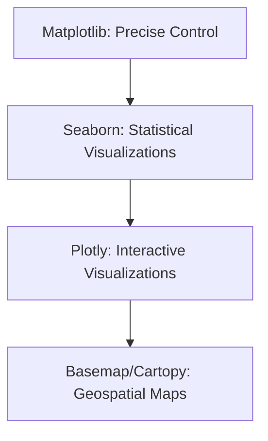

## 4.3. Data Visualization Frameworks



### 1. Matplotlib Architecture
Matplotlib uses two main styling approaches:
1. **Functional Style (Pyplot)**: Automatically manages figures and axes behind the scenes. Good for quick, simple plots.
2. **Object-Oriented Style**: Explicitly creates figure and axis objects. This is the recommended approach for complex, customizable multi-plot layouts.

```python
import matplotlib.pyplot as plt

# Recommended Object-Oriented Interface
fig, ax = plt.subplots(figsize=(6, 4))
ax.plot([1, 2, 3], [10, 20, 30], label="Trend")
ax.set_title("O-O Style Plot")
ax.set_xlabel("X-Axis")
ax.set_ylabel("Y-Axis")
ax.legend()
plt.show()
```

### 2. Seaborn (Statistical Visualizations)
Built on top of Matplotlib, Seaborn simplifies the creation of complex statistical charts (like heatmaps, violins, and pairplots) and integrates directly with Pandas DataFrames.

### 3. Plotly (Interactive Charts)
Plotly is an interactive visualization library that allows users to zoom, pan, and hover over data points in real time. It is widely used for building web dashboards.

### 4. Basemap (Geospatial Mapping)
An extension for Matplotlib that plots geographic coordinates onto map projections. Note: Basemap is being transitioned to **Cartopy** for modern geospatial applications, but is still used for legacy projects.

---
