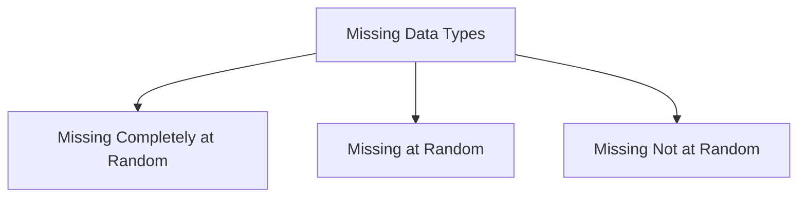

# Chapter 5: Data Cleaning and Preprocessing

## 5.1. Handling Missing Data

Data collected from real-world systems often contains missing or incomplete values. Identifying why data is missing is key to choosing the right strategy for handling it.

### 1. Missing Data Mechanisms
* **Missing Completely at Random (MCAR)**: The probability of a value being missing is entirely independent of any other variable in the dataset.
  * *Example*: A physical survey sheet is lost in transit.
* **Missing at Random (MAR)**: The probability of missingness is related to other observed variables, but not to the missing value itself.
  * *Example*: Men are statistically less likely to fill out depression surveys, but the missingness is related to the observed gender variable, not their actual level of depression.
* **Missing Not at Random (MNAR)**: The missingness depends directly on the unobserved value itself.
  * *Example*: Patients with extremely high incomes choose not to disclose their financial data on health forms.

---

### 2. Imputation Strategies

| Strategy | When to Use | Advantages | Disadvantages |
| :--- | :--- | :--- | :--- |
| **Drop Records (`dropna`)** | Minimal missingness (< 5%), MCAR data. | Simple, maintains clean distributions if MCAR. | Reduces sample size, introduces bias if data is MAR or MNAR. |
| **Mean / Median Imputation** | Symmetric (Mean) or Skewed (Median) numerical data. | Easy to compute, preserves sample size. | Artificially reduces variance, distorts correlations. |
| **Mode Imputation** | Categorical features. | Good for non-numerical categories. | Can overrepresent the majority class, altering relationships. |
| **Forward / Backward Fill** | Time-series datasets. | Preserves sequential trends. | Can propagate outdated values if gaps are wide. |
| **KNN Imputation** | Multi-dimensional datasets with correlated features. | High precision, preserves multi-variable relationships. | Computationally expensive ($O(n^2)$), sensitive to scale. |

---