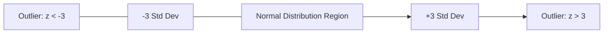
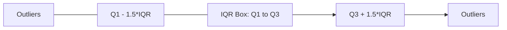

## 5.2. Data Consistency and Outlier Treatment

### 1. Data Type Coercion
Ensure all columns are set to their correct data types. Use coercion to gracefully handle conversion failures (which are replaced with `NaN`).

```python
# Convert messy text columns to numeric, replacing invalid strings with NaN
df['BloodPressure'] = pd.to_numeric(df['BloodPressure'], errors='coerce')
```

### 2. Identifying and Removing Duplicates
Duplicate records can skew statistics and bias model training. Use `duplicated()` to identify identical rows and `drop_duplicates()` to remove them.

```python
# Identify and remove duplicate records, keeping the first occurrence
df_cleaned = df.drop_duplicates(keep='first')

# Remove duplicates based on specific primary keys (e.g., PatientID)
df_unique_patients = df.drop_duplicates(subset=['PatientID'], keep='last')
```

---

### 3. Outlier Detection Methodologies

#### Z-Score Method (Parametric)
Calculates how many standard deviations a data point lies away from the mean. It assumes the data is normally distributed.

$$z = \frac{x - \mu}{\sigma}$$

Anomalies are typically defined as points with a Z-score absolute value greater than 3 ($|z| > 3$), representing the outer 0.3% of the distribution.



#### Interquartile Range (IQR) Method (Non-Parametric)
A robust outlier detection method that does not assume a normal distribution. It uses quartiles to establish upper and lower boundaries:

$$\text{IQR} = Q_3 - Q_1$$

$$\text{Lower Bound} = Q_1 - 1.5 \times \text{IQR}$$

$$\text{Upper Bound} = Q_3 + 1.5 \times \text{IQR}$$

Values outside these boundaries are classified as outliers.



---

### 4. Outlier Handling Techniques
* **Trimming**: Dropping outlier rows entirely. This is appropriate if outliers are caused by clear data entry errors.
* **Winsorization (Capping)**: Replacing outliers with the maximum or minimum boundary values (e.g., mapping values above the 99th percentile to the 99th percentile value).
* **Log Transformation**: Applying a log transform to compress right-skewed distributions, reducing the leverage of extreme values.
* **Imputation**: Treating outliers as missing values and imputing them using mean, median, or KNN imputation.

---