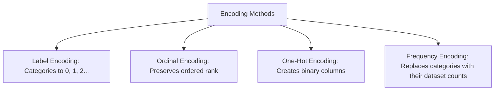

## 5.3. Text Cleaning and Categorical Encoding

### 1. Text Data Standardization
Standardize text columns by converting characters to lowercase, stripping whitespace, removing special characters, and converting accented characters to standard ASCII:

```python
from unidecode import unidecode

def clean_text_column(series: pd.Series) -> pd.Series:
    # Convert to lowercase, strip trailing spaces, and normalize accents
    return series.astype(str).str.lower().str.strip().apply(unidecode)
```

---

### 2. Categorical Encoding Visual Comparison



#### Label Encoding vs. Ordinal Encoding
* **Label Encoding**: Map categories to arbitrary integers (e.g., Male $\rightarrow$ 0, Female $\rightarrow$ 1). Use primarily for binary targets or unordered categories.
* **Ordinal Encoding**: Maps categories to ordered integers to preserve their natural rank (e.g., Small $\rightarrow$ 0, Medium $\rightarrow$ 1, Large $\rightarrow$ 2).

#### One-Hot Encoding
Creates a new binary (0 or 1) column for each category in a feature. Use for nominal variables (categories with no natural order).

*To avoid the **dummy variable trap** (high multicollinearity), drop one of the generated columns by setting `drop_first=True`.*

#### Frequency / Count Encoding
Replaces categories with their overall frequency in the dataset. This is useful for high-cardinality features (variables with many unique categories, like zip codes or product IDs), as it avoids creating hundreds of one-hot columns.

---