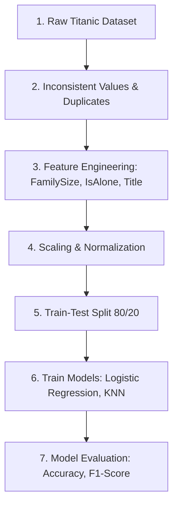

## 5.6. Tutorial 5 Project. Titanic Data Pipeline and Modeling

### Problem Statement
Using Seaborn's raw Titanic dataset, construct an end-to-end data cleaning, feature engineering, categorical encoding, scaling, and validation model pipeline.



#### Step 1: Initial Exploration
Load the dataset using `sns.load_dataset('titanic')`, inspect its dimensions, data types, and check for missing values or extreme outliers.

#### Step 2: Data Cleaning
Drop highly redundant columns: `deck` (high percentage of missing values), `embark_town` (redundant with `embarked`), `alive` (redundant with the target `survived`), and `who` (redundant with `sex` and `age`).

#### Step 3: Feature Engineering
* Combine siblings/spouses and parents/children into a new feature: `FamilySize` = `sibsp` + `parch` + 1.
* Create a binary flag: `IsAlone` = 1 if `FamilySize` == 1, otherwise 0.
* Extract patient honorifics (Titles: Mr, Mrs, Miss, Master, etc.) from names if available, or map them from raw data.

#### Step 4: Encoding & Scaling
Apply standard preprocessing: One-hot encode nominal columns, ordinal encode ranked columns, and apply standard scaling to numerical features.

#### Step 5: Modeling and Performance Evaluation
Split the preprocessed dataset into an 80/20 train-test split. Train a **Logistic Regression** and a **K-Nearest Neighbors (KNN)** classifier, and evaluate their performance using precision, recall, and F1-score.

---

### Complete Python Pipeline Implementation

```python
import pandas as pd
import numpy as np
import seaborn as sns
from sklearn.model_selection import train_test_split
from sklearn.preprocessing import StandardScaler, OneHotEncoder
from sklearn.impute import SimpleImputer
from sklearn.linear_model import LogisticRegression
from sklearn.neighbors import KNeighborsClassifier
from sklearn.metrics import accuracy_score, classification_report, confusion_matrix

# 1. Ingest Raw Titanic Dataset
df_raw = sns.load_dataset('titanic')

# 2. Data Cleaning and Feature Selection
# Drop highly redundant or mostly missing columns
drop_cols = ['deck', 'embark_town', 'alive', 'who', 'class']
df_clean = df_raw.drop(columns=drop_cols)

# Handle Missing Values in Target and Categorical Rows
# Fill missing age with the median, embarked with the mode
age_imputer = SimpleImputer(strategy='median')
df_clean['age'] = age_imputer.fit_transform(df_clean[['age']])

emb_imputer = SimpleImputer(strategy='most_frequent')
df_clean['embarked'] = emb_imputer.fit_transform(df_clean[['embarked']])

# 3. Feature Engineering
df_clean['FamilySize'] = df_clean['sibsp'] + df_clean['parch'] + 1
df_clean['IsAlone'] = np.where(df_clean['FamilySize'] == 1, 1, 0)

# Drop raw components that were combined into FamilySize
df_clean.drop(columns=['sibsp', 'parch'], inplace=True)

# 4. Encoding Categorical Variables
# Apply one-hot encoding to nominal features: 'sex', 'embarked'
categorical_cols = ['sex', 'embarked']
df_model = pd.get_dummies(df_clean, columns=categorical_cols, drop_first=True, dtype=int)

# Map Boolean values to binary integers (0 or 1)
bool_cols = ['adult_male', 'alone']
for col in bool_cols:
    df_model[col] = df_model[col].astype(int)

# Extract features (X) and target (y)
X = df_model.drop(columns=['survived'])
y = df_model['survived']

# 5. Train-Test Split (80/20 Split)
X_train, X_test, y_train, y_test = train_test_split(X, y, test_size=0.2, random_state=42, stratify=y)

# 6. Feature Scaling
numerical_features = ['age', 'fare', 'FamilySize']
scaler = StandardScaler()

# Fit and transform the training features, transform test features
X_train_scaled = X_train.copy()
X_test_scaled = X_test.copy()

X_train_scaled[numerical_features] = scaler.fit_transform(X_train[numerical_features])
X_test_scaled[numerical_features] = scaler.transform(X_test[numerical_features])

# 7. Model Training and Evaluation

# Model 1: Logistic Regression
log_reg = LogisticRegression(max_iter=500, random_state=42)
log_reg.fit(X_train_scaled, y_train)
y_pred_lr = log_reg.predict(X_test_scaled)

# Model 2: K-Nearest Neighbors (KNN)
knn = KNeighborsClassifier(n_neighbors=5)
knn.fit(X_train_scaled, y_train)
y_pred_knn = knn.predict(X_test_scaled)

# Display Results
print("=== Logistic Regression Classifier Performance ===")
print(f"Accuracy Score: {accuracy_score(y_test, y_pred_lr):.4f}")
print("Classification Report:")
print(classification_report(y_test, y_pred_lr))

print("\n=== K-Nearest Neighbors Classifier Performance ===")
print(f"Accuracy Score: {accuracy_score(y_test, y_pred_knn):.4f}")
print("Classification Report:")
print(classification_report(y_test, y_pred_knn))
```

---
