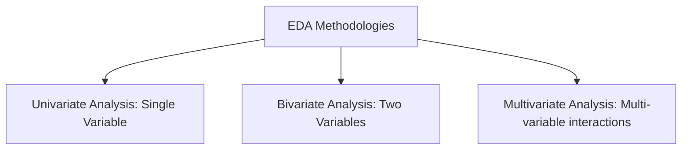
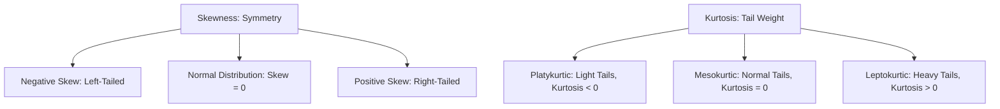

# Chapter 6: Exploratory Data Analysis

## 6.1. Exploratory Data Analysis Principles

Exploratory Data Analysis (EDA) is the process of examining a dataset to understand its key characteristics, detect anomalies, test hypotheses, and uncover relationships between variables before building predictive models.

---

### 1. Statistical Properties: Skewness and Kurtosis

#### Skewness
Measures the asymmetry of a dataset's distribution around its mean.
* **Positive Skew (Right-Tailed)**: The tail on the right side of the distribution is longer or fatter. The mean is typically greater than the median.
  * *Handling*: Apply log, square root, or Box-Cox transformations.
* **Negative Skew (Left-Tailed)**: The tail on the left side of the distribution is longer or fatter. The mean is typically less than the median.
* **Symmetric Distribution**: Skewness value $\approx 0$.

#### Kurtosis
Measures the "tailedness" of a distribution, indicating the frequency of extreme values (outliers).
* **Leptokurtic (Kurtosis > 0)**: Heavy tails and a sharp peak, indicating a higher frequency of outliers.
* **Platykurtic (Kurtosis < 0)**: Light tails and a flatter peak, indicating a lower frequency of outliers.
* **Mesokurtic (Kurtosis $\approx$ 0)**: Tail shape matches a normal distribution.

---

### 2. Multi-Variable Analysis

#### Univariate Analysis
Evaluates the distribution of a single variable in isolation.
* *Numerical Visualizations*: Histograms, density plots (KDE), boxplots.
* *Categorical Visualizations*: Bar charts, count plots, pie charts.

#### Bivariate Analysis
Explores relationships and correlations between two variables.
* **Numerical vs. Numerical**: Scatter plots, line charts, correlation coefficients.
* **Numerical vs. Categorical**: Boxplots, violin plots, bar charts of grouped averages.
* **Categorical vs. Categorical**: Cross-tabulations, stacked bar charts, mosaic plots.

#### Multivariate Analysis
Examines interactions between three or more variables simultaneously to uncover complex patterns (e.g., using color hue, sizing markers, or plotting multi-chart grids).
* *Methods*: Pairplots, facet grids, correlation heatmaps, 3D scatter plots.

---

### 3. Core Correlation Coefficients

#### Pearson Correlation ($r$)
Measures the strength and direction of a **linear** relationship between two continuous variables:

$$r = \frac{\text{Cov}(X, Y)}{\sigma_X \sigma_Y}$$

* *Value Range*: $[-1, 1]$.
* *Assumption*: Assumes a linear relationship and normally distributed data. Sensitive to outliers.

#### Spearman Rank Correlation ($\rho$)
A non-parametric correlation metric that evaluates the **monotonic** relationship between variables by comparing their ranked values.

* *Value Range*: $[-1, 1]$.
* *Use Case*: Does not assume normally distributed data and is highly robust to outliers. Use when relationships are non-linear but consistent in direction.

#### Kendall's Tau ($\tau$)
A rank-based correlation metric that measures the strength of association based on concordant and discordant pairs.

* *Use Case*: Highly robust for small datasets with ordinal categories.