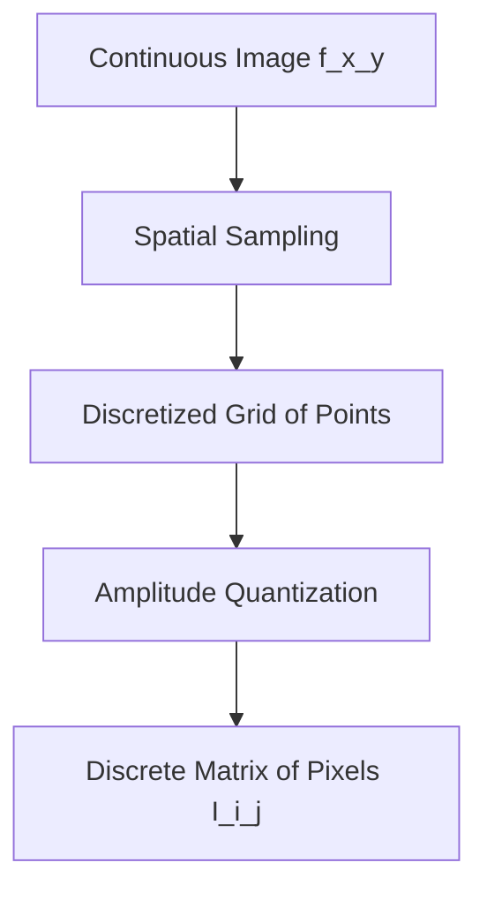

## 1. Digital Image Definition and Representation

### Mathematical Definition of an Image
A continuous physical image can be modeled as a two-dimensional continuous light intensity function:

$$f(x, y) \in \mathbb{R}^+$$

where $(x, y)$ represent the spatial coordinates in a two-dimensional Euclidean plane ($\mathbb{R}^2$), and the value of $f$ at any coordinate point $(x, y)$ is proportional to the intensity (brightness or luminance) of the image at that point. Because light is a form of physical energy, the intensity value is bounded:

$$0 < f(x, y) < \infty$$

### Digitization: Sampling and Quantization
To convert a continuous physical image $f(x, y)$ into a digital format that can be stored and processed by computers, two discretization steps are required:

1. **Sampling (Spatial Discretization):** This process digitizes the coordinate values $(x, y)$. The continuous coordinate space is divided into a discrete grid of points. The sampling rate determines the spatial resolution of the image.
2. **Quantization (Amplitude Discretization):** This process digitizes the continuous intensity values $f(x, y)$ into a finite set of discrete values. The intensity range is mapped to a discrete set of levels, typically represented as integers.

### Discrete Matrix Representation
After sampling and quantization, a digital image is represented as a two-dimensional matrix of size $M \times N$, where $M$ is the number of rows (height) and $N$ is the number of columns (width):

$$I(i, j) = \begin{pmatrix} 
I(0,0) & I(0,1) & \dots & I(0,N-1) \\
I(1,0) & I(1,1) & \dots & I(1,N-1) \\
\vdots & \vdots & \ddots & \vdots \\
I(M-1,0) & I(M-1,1) & \dots & I(M-1,N-1)
\end{pmatrix}$$

Each individual element in this matrix is called a **pixel** (picture element). The indices $(i, j)$ denote the discrete row and column positions of the pixel within the grid, and the scalar or vector value stored at $I(i, j)$ represents the quantized color or intensity of that pixel.

For a standard 8-bit grayscale image, the intensity of each pixel is represented by a single integer value $I(i, j) \in [0, 255]$, where `0` represents absolute black and `255` represents absolute white.
