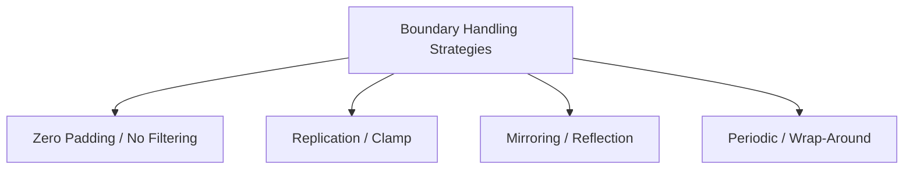

## 5. Image Convolution and Boundary Effects

### Discrete 2D Convolution Formulation
In image processing, linear spatial filtering is implemented using 2D discrete convolution. Let $f(x, y)$ be an input image of size $M \times N$, and let $h(i, j)$ be a spatial filter kernel (also called a mask or template) of size $2K+1 \times 2L+1$. The output filtered image $g(x, y)$ is defined mathematically as:

$$g(x, y) = f(x, y) * h(x, y) = \sum_{i=-K}^{K} \sum_{j=-L}^{L} f(x - i, y - j) h(i, j)$$

> **Important Distinction:** In many practical deep learning frameworks and image libraries, the operation performed is technically **cross-correlation** rather than convolution. Cross-correlation does not flip the kernel:
> $$g(x, y) = \sum_{i=-K}^{K} \sum_{j=-L}^{L} f(x + i, y + j) h(i, j)$$
> For symmetric kernels (like Gaussian or Laplacian filters), the mathematical results of convolution and cross-correlation are identical.

### Mathematical Walkthrough of a 2D Convolution Step
Let's compute the convolution output $g(x, y)$ for a target pixel at position $(x, y)$ with an input local image neighborhood and a $3 \times 3$ kernel.

#### Step 1: Flip the Kernel (if performing mathematically exact convolution)
If our kernel is:

$$h(i, j) = \begin{pmatrix} w_1 & w_2 & w_3 \\ w_4 & w_5 & w_6 \\ w_7 & w_8 & w_9 \end{pmatrix}$$

Flipping both horizontally and vertically yields:

$$h_{\text{flipped}}(i, j) = \begin{pmatrix} w_9 & w_8 & w_7 \\ w_6 & w_5 & w_4 \\ w_3 & w_2 & w_1 \end{pmatrix}$$

#### Step 2: Overlap and Perform Element-wise Multiplication
Align the center of the flipped kernel $w_5$ with the input pixel $f(x, y)$:

$$g(x, y) = w_9 f(x-1, y-1) + w_8 f(x-1, y) + w_7 f(x-1, y+1) + w_6 f(x, y-1) + w_5 f(x, y) + \dots$$

```text
Image Neighborhood:                      Flipped Mask Weights:
f(x-1, y-1)  f(x-1, y)  f(x-1, y+1)           w_9   w_8   w_7
f(x, y-1)    f(x, y)    f(x, y+1)      ×      w_6   w_5   w_4
f(x+1, y-1)  f(x+1, y)  f(x+1, y+1)           w_3   w_2   w_1
```

### Boundary (Edge) Effects and Padding Solutions
When applying a kernel of size $W \times H$ to an image near its outer borders, the kernel extends beyond the boundaries of the image, where pixel values are undefined.



* **Zero Padding (Constant Padding):** The missing out-of-boundary values are filled with zeros:
  
  $$f(x, y) = 0 \quad \text{for } x < 0 \text{ or } x \ge M$$
  
  *Pros:* Simple to implement.  
  *Cons:* Introduces artificial dark borders (high-frequency edges) that distort high-pass filters.

* **Replication (Clamp Padding):** Out-of-boundary values are filled by replicating the nearest edge pixel:
  
  $$f(-1, y) = f(0, y)$$

* **Mirroring (Reflection Padding):** The image is reflected across its outer border:
  
  $$f(-1, y) = f(1, y)$$
  
  *Pros:* Preserves intensity continuity, minimizing boundary artifacts.
