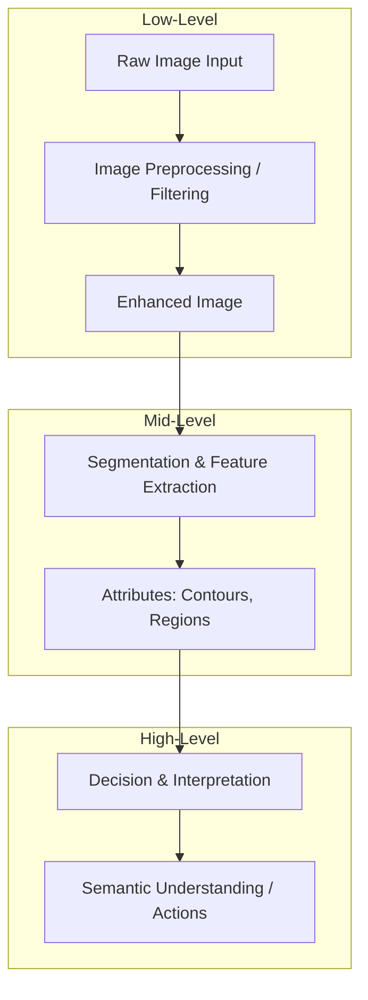

## 6. Three Levels of Image Processing

Image processing and computer vision systems are traditionally divided into three levels of abstraction, categorized by their input and output representations.

### 1. Low-Level Processing (Bas niveau)
* **Inputs:** Raw pixels.
* **Outputs:** Pixels.
* **Objective:** Improve image quality, reduce noise, or convert the image into a more suitable format.
* **Key Tasks:** Noise reduction (spatial/frequency filtering), contrast enhancement, binarization, morphological filtering, image restoration.

### 2. Mid-Level Processing (Niveau intermédiaire)
* **Inputs:** Pixels.
* **Outputs:** Attributes, segments, vectors, or boundaries.
* **Objective:** Extract structural features and group pixels into meaningful entities.
* **Key Tasks:** Image segmentation, contour extraction, region classification, shape description, connected component labeling.

### 3. High-Level Processing (Haut niveau)
* **Inputs:** Extracted features, attributes, and regions.
* **Outputs:** Decisions, labels, predictions, or physical actions.
* **Objective:** Emulate human vision by making decisions based on the extracted image content.
* **Key Tasks:** Object recognition, facial identification, scene classification, anomaly detection, semantic feature matching.
