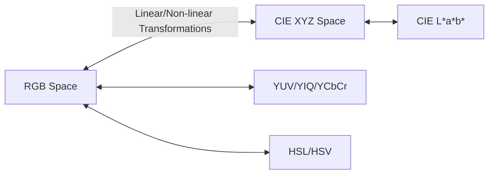

## 2. Spatial Resolution and Color Spaces

### Understanding Resolution and its Metrics
The representation of a physical object in a digital image is governed by two forms of resolution:

1. **Spatial Resolution:** The density of pixels per unit area. It is typically measured in **DPI (Dots Per Inch)** or **PPI (Pixels Per Inch)**, where $1 \text{ inch} = 2.54 \text{ cm}$. High spatial resolution means more pixels per unit area, resulting in sharper transitions and finer details. Low spatial resolution leads to pixelation (the visible grid effect).
2. **Quantization Resolution (Bit Depth):** The number of bits used to represent the intensity or color value of each pixel. If an image is quantized using $k$ bits, the number of gray levels $L$ is:

$$L = 2^k$$

For example, a $1$-bit image represents a binary image ($L=2$), whereas an $8$-bit image represents a standard grayscale image ($L=256$).

### Classical Color Models and Transformations

To mathematically represent color, different color spaces (or coordinate systems) are used depending on the physical medium (displays, printing, human perception, or processing efficiency).

#### RGB (Red, Green, Blue)
An additive color model based on tri-chromatic theory. Colors are represented as vectors in a 3D Cartesian cube:

$$\mathbf{C}(i, j) = \begin{pmatrix} R(i, j) \\ G(i, j) \\ B(i, j) \end{pmatrix}$$

where $R, G, B \in [0, 255]$ for an 8-bit channel (totaling 24 bits per pixel, yielding $16.7 \times 10^6$ distinct colors).

#### CMY / CMYK (Cyan, Magenta, Yellow, Key/Black)
A subtractive color model used in printing. Cyan, magenta, and yellow are the exact complements of red, green, and blue, respectively. The conversion from normalized RGB to CMY is:

$$\begin{pmatrix} C \\ M \\ Y \end{pmatrix} = \begin{pmatrix} 1 \\ 1 \\ 1 \end{pmatrix} - \begin{pmatrix} R \\ G \\ B \end{pmatrix}$$

To save ink and improve the density of dark tones, a Key (black) channel is added:

$$K = \min(C, M, Y)$$

$$C' = \frac{C - K}{1 - K}, \quad M' = \frac{M - K}{1 - K}, \quad Y' = \frac{Y - K}{1 - K}$$

#### YUV / YIQ / YCbCr (Luminance and Chrominance)
These spaces separate the luminance (brightness, $Y$) from the chrominance (color information, $U, V$ or $Cb, Cr$). This separation is critical for image compression (e.g., JPEG, MPEG) and broadcasting, as the human visual system is far more sensitive to variations in brightness than in color. 

The standard transformation from RGB to YCbCr (ITU-R BT.601) is given by:

$$\begin{pmatrix} Y \\ Cb \\ Cr \end{pmatrix} = \begin{pmatrix} 0.299 & 0.587 & 0.114 \\ -0.1687 & -0.3313 & 0.5 \\ 0.5 & -0.4187 & -0.0813 \end{pmatrix} \begin{pmatrix} R \\ G \\ B \end{pmatrix} + \begin{pmatrix} 0 \\ 128 \\ 128 \end{pmatrix}$$

#### HSL / HSV (Hue, Saturation, Lightness / Value)
These models align more closely with human perception of color. 
* **Hue ($H$):** Represents the pure color dominant wavelength (expressed as an angle $[0, 360^\circ]$).
* **Saturation ($S$):** The purity or vividness of the color ($S \in [0, 1]$).
* **Value/Brightness ($V$ or $L$):** The intensity of the light ($V \in [0, 1]$).

#### CIE XYZ and CIE L\*a\*b\*
* **CIE XYZ:** A device-independent color space developed by the CIE in 1931 to model standard human color vision.
* **CIE L\*a\*b\*:** A perceptually uniform color space where:
  * $L^*$ represents lightness.
  * $a^*$ represents the green-to-red axis.
  * $b^*$ represents the blue-to-yellow axis.
  The Euclidean distance between two color vectors in $L^*a^*b^*$ corresponds directly to the color differences perceived by humans.
