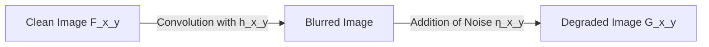

## 1. Image Degradations and Noise Models

### Mathematical Model of Degradation
An observed degraded digital image $G(x, y)$ can be modeled mathematically as the result of a degradation system $H$ and an additive noise term $\eta(x, y)$ acting on the original clean image $F(x, y)$:

$$G(x, y) = H\{F(x, y)\} + \eta(x, y)$$

If $H$ is a linear, space-invariant process (such as motion blur or atmospheric distortion), the degradation can be modeled as a spatial convolution:

$$G(x, y) = F(x, y) * h(x, y) + \eta(x, y)$$

where $h(x, y)$ is the **Point Spread Function (PSF)** of the degradation system.

### Common Spatial Noise Models
Noise is introduced during image acquisition (sensor heating, low lighting) or transmission (electronic interference).

#### 1. Additive Gaussian Noise
This model represents electronic circuit noise and sensor noise under low-light conditions. The noise values at each pixel are drawn from a zero-mean Gaussian distribution:

$$p(z) = \frac{1}{\sqrt{2\pi}\sigma} \exp\left( -\frac{(z - \mu)^2}{2\sigma^2} \right)$$

where $z$ represents the intensity variation, $\mu$ is the mean (typically $0$), and $\sigma$ is the standard deviation.

#### 2. Multiplicative Noise (Speckle Noise)
Common in coherent imaging systems like radar (SAR) or ultrasound. The noise is proportional to the local signal intensity:

$$G(x, y) = F(x, y) \cdot \eta(x, y)$$

#### 3. Impulse Noise (Salt-and-Pepper Noise)
This model represents transmission errors, bad pixels, or dust particles on the sensor. Pixels are randomly replaced by minimum or maximum intensity values:

$$P(z) = \begin{cases} 
P_a & \text{for } z = a \quad \text{(pepper, black: 0)} \\ 
P_b & \text{for } z = b \quad \text{(salt, white: 255)} \\
1 - (P_a + P_b) & \text{for unchanged pixels}
\end{cases}$$

### Quantifying Restoration Quality: MSE and PSNR
To evaluate the performance of a denoising algorithm, we compare the restored image $\hat{F}$ with the original clean reference image $F$.

#### Mean Squared Error (MSE)
The average squared difference between the restored and reference images:

$$\text{MSE}(F, \hat{F}) = \frac{1}{M \times N} \sum_{i=0}^{M-1} \sum_{j=0}^{N-1} [F(i, j) - \hat{F}(i, j)]^2$$

#### Peak Signal-to-Noise Ratio (PSNR)
The ratio between the maximum possible power of the signal and the power of corrupting noise, expressed in decibels (dB):

$$\text{PSNR} = 10 \log_{10} \left( \frac{I_{\text{max}}^2}{\text{MSE}(F, \hat{F})} \right) = 20 \log_{10} \left( \frac{I_{\text{max}}}{\sqrt{\text{MSE}(F, \hat{F})}} \right)$$

where $I_{\text{max}}$ is the maximum possible pixel value (e.g., $255$ for an 8-bit image).
* A high PSNR (typically $>30\text{ dB}$) indicates a restored image of high visual quality.
* If $\text{MSE} \to 0$, then $\text{PSNR} \to \infty$.
