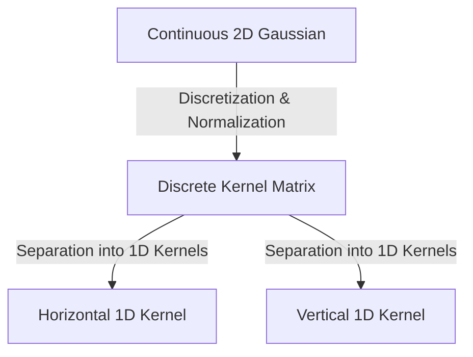

## 2. Linear Filtering in the Spatial Domain

Linear filtering operations are implemented by convolving the image with a spatial mask.

### 1. Mean (Box) Filter
A low-pass filter used for smoothing and noise reduction. It replaces each pixel value with the average intensity of its local neighborhood. A standard $3 \times 3$ normalized box filter is defined as:

$$H_{\text{mean}} = \frac{1}{9} \begin{pmatrix} 1 & 1 & 1 \\ 1 & 1 & 1 \\ 1 & 1 & 1 \end{pmatrix}$$

#### Trade-offs
* **Pros:** Highly efficient, easy to compute.
* **Cons:** Blurs sharp edges and fine details. It is also ineffective at handling impulse (salt-and-pepper) noise, as outlier values distort the computed mean.

---

### 2. Gaussian Filter
The Gaussian filter is a rotationally symmetric low-pass filter. It weights neighboring pixels based on their distance from the central pixel, preserving details better than a box filter.

The continuous 2D Gaussian function is defined as:

$$G(x, y) = \frac{1}{2\pi\sigma^2} \exp\left( -\frac{x^2 + y^2}{2\sigma^2} \right)$$



To create a discrete $5 \times 5$ Gaussian kernel with $\sigma = 1.4$, we sample the continuous function at integer coordinates $(x, y) \in [-2, 2] \times [-2, 2]$ and normalize the sum to $1$:

$$H_{\text{Gauss}} = \frac{1}{115} \begin{pmatrix} 
2 & 4 & 5 & 4 & 2 \\ 
4 & 9 & 12 & 9 & 4 \\ 
5 & 12 & 15 & 12 & 5 \\ 
4 & 9 & 12 & 9 & 4 \\ 
2 & 4 & 5 & 4 & 2 
\end{pmatrix}$$

#### The Principle of Kernel Separability
An important mathematical property of the 2D Gaussian function is its **separability**. A 2D Gaussian can be factored into the product of two 1D Gaussian functions:

$$G(x, y) = G_1(x) \cdot G_2(y) = \left( \frac{1}{\sqrt{2\pi}\sigma} \exp\left( -\frac{x^2}{2\sigma^2} \right) \right) \times \left( \frac{1}{\sqrt{2\pi}\sigma} \exp\left( -\frac{y^2}{2\sigma^2} \right) \right)$$

Convolving an image with a separable 2D filter of size $W \times W$ can be decomposed into two consecutive 1D convolutions: first convolving the rows with a $1 \times W$ horizontal kernel, then convolving the columns of the result with a $W \times 1$ vertical kernel.

```text
2D Convolution (Standard):
[ Image ]  ⊗  [ W × W Kernel ]  ===>  Requires W² multiplications per pixel.

Separated Convolution:
[ Image ]  ⊗  [ 1 × W Kernel ]  ===>  [ Intermediate ]  ⊗  [ W × 1 Kernel ]
This reduces the computational cost to 2W multiplications per pixel.
```

*For a $5 \times 5$ kernel:* Standard 2D convolution requires **25** multiplications per pixel, whereas separable convolution requires only $5 + 5 =$ **10** multiplications, significantly improving processing speed.
