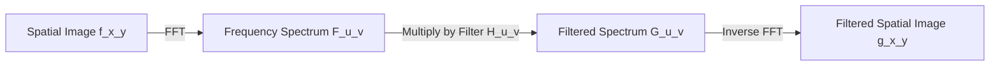

## 4. Frequency Domain Filtering

Filtering in the frequency domain is based on the **Convolution Theorem**, which states that spatial convolution is mathematically equivalent to element-wise multiplication in the frequency domain:

$$f(x, y) * h(x, y) \iff F(u, v) \cdot H(u, v)$$

### Discrete Fourier Transform (DFT)
For an $N \times N$ digital image, the Discrete Fourier Transform $F(u, v)$ is defined as:

$$F(u, v) = \sum_{x=0}^{N-1} \sum_{y=0}^{N-1} f(x, y) e^{-i 2\pi \left( \frac{ux + vy}{N} \right)}$$

The Inverse Discrete Fourier Transform (IDFT) reconstructs the spatial image:

$$f(x, y) = \frac{1}{N^2} \sum_{u=0}^{N-1} \sum_{v=0}^{N-1} F(u, v) e^{i 2\pi \left( \frac{ux + vy}{N} \right)}$$

### Frequency Domain Filters
* **Low-Pass Filter (LPF):** Attenuates high frequencies while passing low frequencies. It removes high-frequency noise but blurs edges.
* **High-Pass Filter (HPF):** Attenuates low frequencies while passing high frequencies. It highlights sharp transitions and edges but increases noise.
* **Band-Reject (Notch) Filter:** Attenuates a specific range of frequencies. This is highly effective for removing periodic patterns or structured noise.
