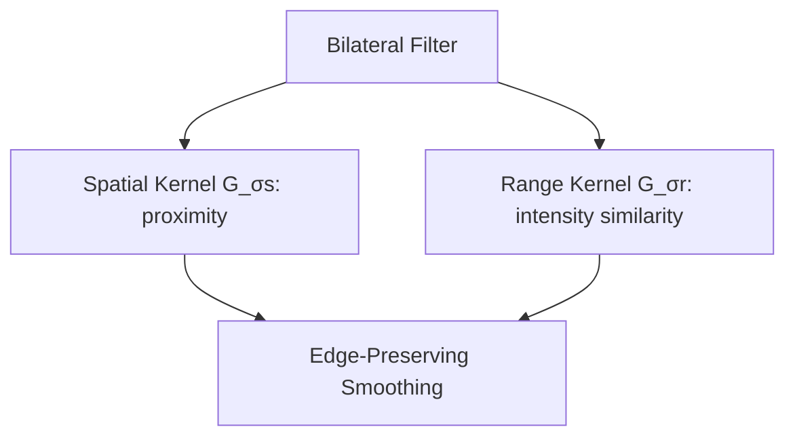
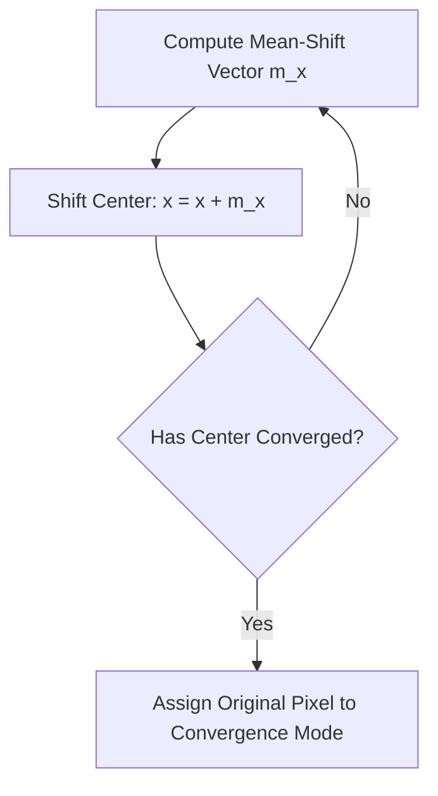

## 5. Advanced Filtering Techniques

These advanced algorithms are designed to denoise images while preserving sharp, meaningful edges and transitions.

### 1. Bilateral Filter
The bilateral filter is a non-linear, edge-preserving smoothing filter. While standard Gaussian filtering only considers the spatial distance between pixels, the bilateral filter considers both **spatial proximity** and **radiometric similarity** (intensity differences).



The filtered intensity value at pixel $p$ is defined as:

$$I_{\text{filtered}}(p) = \frac{1}{W_p} \sum_{q \in S} I(q) G_{\sigma_s}(\|p - q\|) G_{\sigma_r}(|I(p) - I(q)|)$$

where:
* $S$ is the neighborhood centered at $p$.
* $G_{\sigma_s}(\|p - q\|) = \exp\left( -\frac{\|p - q\|^2}{2\sigma_s^2} \right)$ is the **spatial domain kernel**, which decreases with spatial distance $\|p - q\|$.
* $G_{\sigma_r}(|I(p) - I(q)|) = \exp\left( -\frac{|I(p) - I(q)|^2}{2\sigma_r^2} \right)$ is the **range domain kernel**, which decreases with intensity difference $|I(p) - I(q)|$.
* $W_p$ is the normalization factor ensuring the filter weights sum to $1$:

$$W_p = \sum_{q \in S} G_{\sigma_s}(\|p - q\|) G_{\sigma_r}(|I(p) - I(q)|)$$

#### Analysis of Parameters
* **$\sigma_s$ (Spatial Parameter):** Larger values smooth larger features.
* **$\sigma_r$ (Range Parameter):** Larger values allow the filter to combine pixels with wider intensity differences, making it behave more like a standard Gaussian filter. If $\sigma_r$ is small, pixels across a sharp edge (which have large intensity differences) are not averaged, preserving the boundary.

---

### 2. Anisotropic Diffusion (Perona-Malik Equation)
Anisotropic diffusion removes image noise through a scale-space process described by a non-linear Partial Differential Equation (PDE). Unlike standard isotropic diffusion (which behaves like Gaussian blurring and degrades edges), anisotropic diffusion adapts the diffusion rate based on the local image gradient.

The continuous diffusion equation proposed by Perona and Malik (1990) is:

$$\frac{\partial I}{\partial t} = \text{div}\Big( c\big(\|\nabla I\|\big) \nabla I \Big)$$

where $\text{div}$ is the divergence operator, $\nabla I$ is the spatial gradient, and $c\big(\|\nabla I\|\big)$ is the **diffusion coefficient function**.

Perona and Malik proposed two functions for the diffusion coefficient:

$$1. \ c\big(\|\nabla I\|\big) = \exp\left( -\left(\frac{\|\nabla I\|}{K}\right)^2 \right)$$

This function favors high-contrast edges over low-contrast ones.

$$2. \ c\big(\|\nabla I\|\big) = \frac{1}{1 + \left(\frac{\|\nabla I\|}{K}\right)^2}$$

This function favors wider regions over sharper, high-contrast borders.

The parameter $K$ controls the sensitivity to edges. 
* In homogeneous areas where the gradient is low ($\|\nabla I\| \to 0$), $c\big(\|\nabla I\|\big) \to 1$, leading to isotropic smoothing.
* At sharp boundaries where the gradient is high ($\|\nabla I\| \gg K$), $c\big(\|\nabla I\|\big) \to 0$, stopping the diffusion process and preserving the edge.

---

### 3. Mean-Shift Filtering
Mean-Shift is a non-parametric clustering and segmentation algorithm. It treats pixel intensity and spatial coordinates as a multi-dimensional probability density function and iteratively shifts each pixel toward the local mode (the peak of the density function).

For each pixel at position $x$, the Mean-Shift vector $m(x)$ is calculated as:

$$m(x) = \frac{\sum_{x_i \in S_h} x_i g\left( \big\|\frac{x - x_i}{h}\big\|^2 \right)}{\sum_{x_i \in S_h} g\left( \big\|\frac{x - x_i}{h}\big\|^2 \right)} - x$$

where:
* $S_h$ is a high-dimensional sphere of radius $h$ centered at $x$.
* $g(s) = -k'(s)$ is the derivative of the selected kernel profile.



This iterative shifting groups pixels with similar intensities and spatial coordinates, producing a flattened, segmented image with sharp boundaries and no noise.

---

### 4. Gabor Filter
A linear filter whose impulse response is a Gaussian function modulated by a sinusoidal plane wave. It is highly effective for texture analysis and edge detection, matching the spatial frequency and orientation selectivity of the human visual system.

The complex 2D Gabor filter function is defined as:

$$G(x, y; \lambda, \theta, \psi, \sigma, \gamma) = \exp\left( -\frac{x'^2 + \gamma^2 y'^2}{2\sigma^2} \right) \exp\left( i \left( 2\pi\frac{x'}{\lambda} + \psi \right) \right)$$

where:

$$x' = x \cos\theta + y \sin\theta, \quad y' = -x \sin\theta + y \cos\theta$$

* **$\theta$:** The orientation of the parallel stripes of the Gabor function.
* **$\lambda$:** The wavelength of the sinusoidal factor (controls the frequency scale).
* **$\psi$:** The phase offset.
* **$\sigma$:** The standard deviation of the Gaussian envelope.
* **$\gamma$:** The spatial aspect ratio (defines the ellipticity of the support).

---

### 5. Nagao Adaptive Edge-Preserving Filter
The Nagao filter is designed to smooth flat regions without blurring edges. It operates by analyzing a $5 \times 5$ window centered on pixel $P$. The window is divided into nine overlapping sub-regions of $7$ pixels each, oriented in different directions around the center.

```text
Nagao Sub-regions (9 sectors of 7 pixels each):
   [1] [1] [1]              [2] [2]                  [3] [3]
   [1] [P] [1]          [2] [P] [2]              [3] [P] [3]
   [1] [1] [1]      [2] [2]                  [3] [3]
   Sector 1            Sector 2 (Diagonal)      Sector 3 (Horizontal)
```

The filter evaluates the variance of each sub-region:
1. For each of the nine sub-regions $R_i \ (i=1 \dots 9)$, compute the local mean $\mu_i$ and variance $\sigma_i^2$.
2. Identify the sub-region with the lowest variance:
   
   $$R_{\text{target}} = \arg\min_{i} (\sigma_i^2)$$

3. Replace the central pixel's value with the mean of this target sub-region:
   
   $$P_{\text{new}} = \mu_{\text{target}}$$

#### Why This Works
The sub-region with the lowest variance is the most homogeneous, meaning it does not cross an edge. By replacing the central pixel with the average of this region, the filter performs smoothing within the region while avoiding averaging across boundaries, keeping edges sharp.
