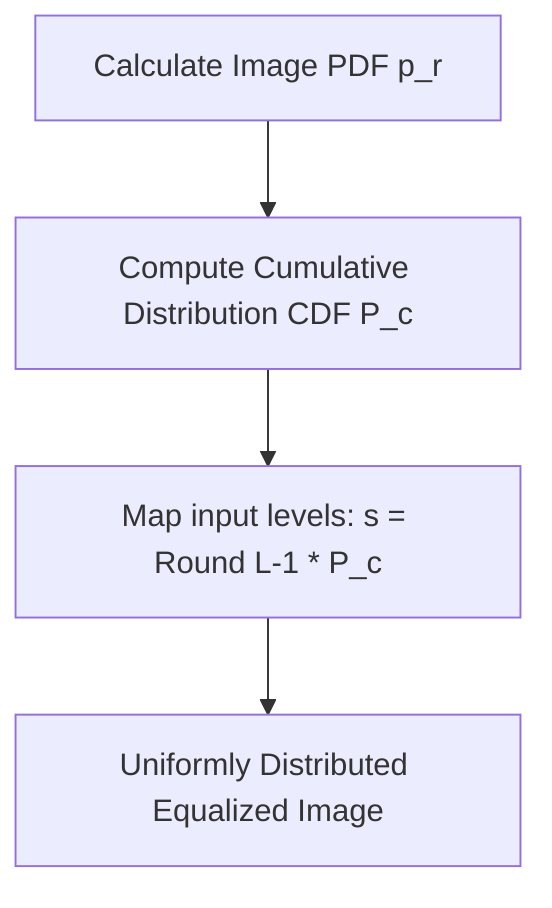

## 6. Contrast Enhancement

### 1. Contrast Stretching (Expansion Dynamique)
If an image is captured under poor lighting conditions, its gray levels may span only a narrow range $[X_{\text{min}}, X_{\text{max}}]$ within the full dynamic range $[Y_{\text{min}}, Y_{\text{max}}]$. Contrast stretching linearly maps these intensities to the full range using a transformation function:

$$Y(i, j) = \alpha + \beta X(i, j)$$

To stretch the intensity values to the standard range $[0, 255]$, the formula is:

$$Y(i, j) = \frac{255}{X_{\text{max}} - X_{\text{min}}} \left( X(i, j) - X_{\text{min}} \right)$$

To handle outliers, we can clip values that fall outside the target bounds:

$$Y(i, j) = \begin{cases} 
0 & \text{if } Y(i, j) < 0 \\ 
255 & \text{if } Y(i, j) > 255 \\ 
Y(i, j) & \text{otherwise} 
\end{cases}$$

---

### 2. Global Histogram Equalization (HE)
This non-linear method redistributes pixel intensities to produce a uniform histogram, spreading out high-density intensity ranges and improving overall contrast.

#### Step-by-Step Derivation

**Step 1:** Calculate the probability density function (PDF) for each intensity level $r_k$:

$$p_r(r_k) = \frac{n_k}{N}, \quad k = 0, 1, \dots, L-1$$

**Step 2:** Compute the Cumulative Distribution Function (CDF):

$$T(r_k) = (L-1) \sum_{j=0}^{k} p_r(r_j) = \frac{L-1}{N} \sum_{j=0}^{k} n_j$$

**Step 3:** Map the original gray level $r_k$ to the new equalized value $s_k$ by rounding to the nearest integer:

$$s_k = \text{round}\Big( T(r_k) \Big)$$
