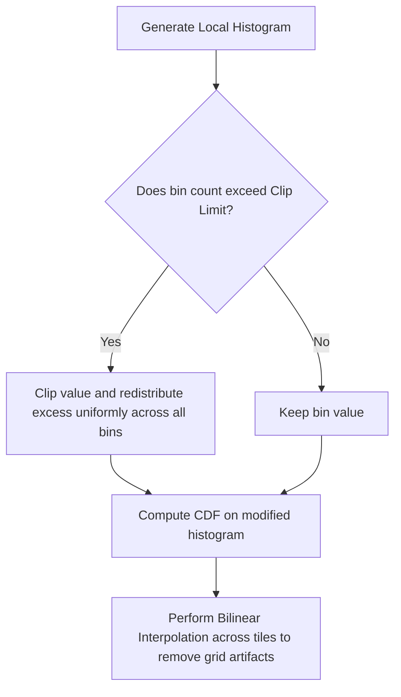

## 7. Adaptive and Local Contrast Methods

### 1. Adaptive Histogram Equalization (AHE)
Standard global histogram equalization uses a single mapping function across the entire image, which can over-amplify noise or fail to improve contrast in local regions with varying lighting conditions.

Adaptive Histogram Equalization addresses this by computing the histogram and mapping function within a moving localized window (e.g., $8 \times 8$ or $16 \times 16$ pixels) centered at each pixel.

#### Step-by-Step Algorithm
1. Define a sliding neighborhood window $S$ of size $W \times W$.
2. Center the window at pixel coordinate $(x, y)$.
3. Compute the local histogram and cumulative distribution function (CDF) for the pixels within $S$.
4. Equalize the intensity of the central pixel $f(x, y)$ using this local CDF.
5. Move the window to the next pixel and repeat.

#### Limitations
While AHE improves local contrast, it can over-amplify noise in homogeneous regions where the local variance is low.

---

### 2. Contrast Limited Adaptive Histogram Equalization (CLAHE)
CLAHE addresses AHE's noise amplification problem by clipping high peaks in the local histogram before computing the CDF.

#### Step-by-Step Algorithm

**Step 1: Tile Division**  
Divide the image into non-overlapping grid blocks called tiles (commonly $8 \times 8$ pixels).

**Step 2: Histogram Clipping**  
Compute the histogram for each tile. If any bin exceeds a predefined threshold called the **Clip Limit** ($N_{\text{clip}}$), the excess pixels are clipped. The total excess $E_{\text{total}}$ is calculated as:

$$E_{\text{total}} = \sum_{h=0}^{L-1} \max(0, H(h) - N_{\text{clip}})$$

The excess $E_{\text{total}}$ is then redistributed uniformly across all histogram bins:

$$H_{\text{redistributed}}(h) = \min\left( H(h), N_{\text{clip}} \right) + \frac{E_{\text{total}}}{L}$$

**Step 3: Equalization**  
Compute the cumulative distribution function (CDF) on this clipped, redistributed histogram to determine the mapping function for each tile.

**Step 4: Bilinear Interpolation**  
To prevent visible seams and grid artifacts between adjacent tiles, the intensity of each pixel is determined using bilinear interpolation of the mapping functions from the four nearest neighboring tiles.
