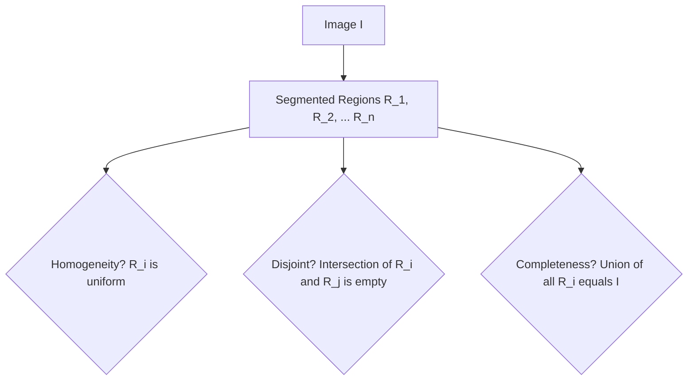

## 1. Foundations of Segmentation

Image segmentation partitions an image into $n$ distinct, homogeneous regions that correspond to physical objects or structures.

### Mathematical Conditions
A valid segmentation must satisfy the following five formal conditions:

1. **Completeness:** The union of all partitioned regions must equal the entire image domain $I$:
   
   $$\bigcup_{i=1}^{n} R_i = I$$

2. **Disjointness:** The partitioned regions must not overlap:
   
   $$R_i \cap R_j = \varnothing \quad \text{for all } i \neq j$$

3. **Homogeneity:** All pixels within a region $R_i$ must satisfy a uniform property predicate $P(R_i)$ (e.g., similar intensity, color, or texture):
   
   $$P(R_i) = \text{True} \quad \text{for all } i$$

4. **Separability:** Any two adjacent regions $R_i$ and $R_j$ must have different properties, meaning their union does not satisfy the homogeneity predicate:
   
   $$P(R_i \cup R_j) = \text{False} \quad \text{for adjacent } R_i, R_j$$

5. **Connectivity:** Each partitioned region $R_i$ must be a connected component:
   
   $$R_i \text{ is a connected set of pixels.}$$
