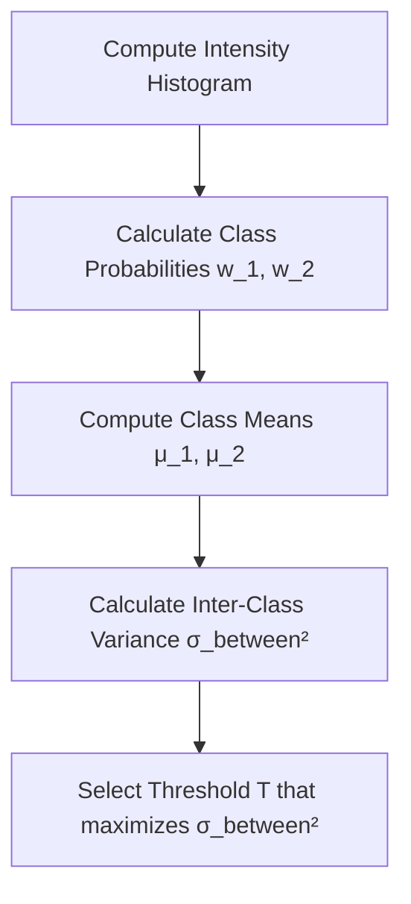
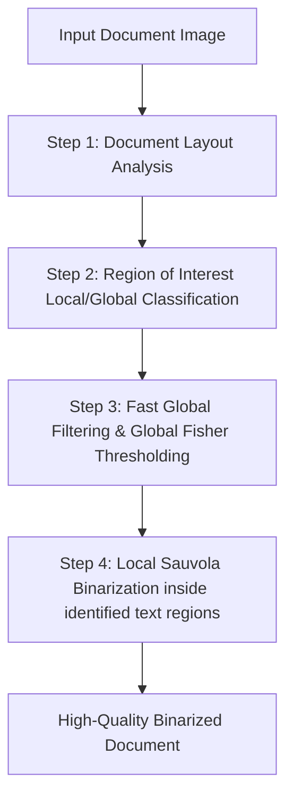

## 4. Binarization and Advanced Thresholding

Binarization maps a grayscale image $f(x, y)$ to a binary image $g(x, y) \in \{0, 1\}$ using a threshold $T$:

$$g(x, y) = \begin{cases} 1 & \text{if } f(x, y) \ge T \\ 0 & \text{otherwise} \end{cases}$$

### 1. Global Thresholding: Otsu's Method
Otsu's method calculates an optimal global threshold by maximizing the variance between two pixel classes: the foreground ($C_1$) and the background ($C_2$).

#### Step-by-Step Derivation

**Step 1:** Calculate the normalized histogram probabilities $p_i$ for each gray level $i \in [0, L-1]$:

$$p_i = \frac{n_i}{N}$$

**Step 2:** For a candidate threshold $t$, define the cumulative probabilities (weights) of the background class $C_1$ and foreground class $C_2$:

$$\omega_1(t) = \sum_{i=0}^{t} p_i, \quad \omega_2(t) = \sum_{i=t+1}^{L-1} p_i = 1 - \omega_1(t)$$

**Step 3:** Calculate the mean intensity values for each class:

$$\mu_1(t) = \frac{1}{\omega_1(t)} \sum_{i=0}^{t} i \cdot p_i, \quad \mu_2(t) = \frac{1}{\omega_2(t)} \sum_{i=t+1}^{L-1} i \cdot p_i$$

The global mean of the entire image is:

$$\mu_G = \sum_{i=0}^{L-1} i \cdot p_i = \omega_1(t)\mu_1(t) + \omega_2(t)\mu_2(t)$$

**Step 4:** Calculate the inter-class variance $\sigma_B^2(t)$:

$$\sigma_B^2(t) = \omega_1(t) \big(\mu_1(t) - \mu_G\big)^2 + \omega_2(t) \big(\mu_2(t) - \mu_G\big)^2 = \omega_1(t)\omega_2(t)\big(\mu_1(t) - \mu_2(t)\big)^2$$

**Step 5:** Find the optimal threshold $T^*$ that maximizes this variance:

$$T^* = \arg\max_{0 \le t \le L-1} \Big( \sigma_B^2(t) \Big)$$

---

### 2. Local Adaptive Thresholding: Niblack's Method
Global thresholding fails when an image has non-uniform lighting, such as shadows or gradients across the page. Local methods calculate a unique threshold for each pixel based on the statistics of its local neighborhood.

Niblack's method computes a threshold $T(x, y)$ within a sliding window of size $W \times W$ centered at coordinate $(x, y)$:

$$T(x, y) = m(x, y) + k \cdot s(x, y)$$

where:
* $m(x, y)$ is the local mean intensity within the window.
* $s(x, y)$ is the local standard deviation within the window.
* $k$ is a user-defined scaling parameter (typically $k \in [-0.1, -0.2]$ for dark text on a light background).

---

### 3. Local Adaptive Thresholding: Sauvola's Method
Sauvola's method improves upon Niblack's by scaling the threshold based on the local dynamic range of the standard deviation. This prevents noise amplification in flat, homogeneous regions.

The local threshold $T(x, y)$ is defined as:

$$T(x, y) = m(x, y) \cdot \left[ 1 + k \cdot \left( \frac{s(x, y)}{R} - 1 \right) \right]$$

where:
* $m(x, y)$ and $s(x, y)$ are the local mean and standard deviation.
* $R$ is the maximum dynamic range of the standard deviation (for an 8-bit grayscale image, $R = 128$).
* $k$ is a scaling parameter (typically $k \in [0.2, 0.5]$).

#### Why This Works
* In high-contrast areas (such as near text strokes), $s(x, y) \approx R$, so the threshold remains close to the local mean $m(x, y)$, producing clean boundaries.
* In homogeneous, low-contrast background areas, $s(x, y) \to 0$, which lowers the threshold significantly below the mean. This prevents background noise and texture from being falsely detected as foreground.

---

### 4. Gaceb's Mixed Binarization Approach (2006)
Developed to process complex document images with non-uniform lighting, stains, and faded text, this hybrid approach combines the strengths of global and local binarization techniques.

#### Step-by-Step Pipeline

**Step 1: Spatial Block Decomposition**  
Divide the document image into rectangular blocks of varying sizes.

**Step 2: Global Background Analysis**  
Apply global Fisher discriminant analysis to identify obvious background and high-contrast regions.

**Step 3: Local Text Line Extraction**  
Within regions containing complex patterns or degradation, extract localized text strokes using a cumulative gradient approach.

**Step 4: Adaptive Local Binarization**  
Apply Sauvola's local thresholding only inside the active text regions identified in Step 3. This preserves fine character details while keeping homogeneous background areas clean.
