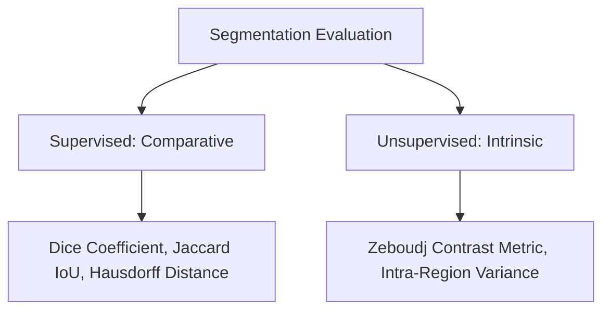

## 7. Evaluation Metrics for Image Segmentation

To measure the accuracy of a segmentation algorithm, its output is compared against a gold-standard reference image called the **Ground Truth**.

### 1. Supervised Evaluation Metrics

Let $A$ represent the segmented region produced by the algorithm, and let $B$ represent the Ground Truth region.

#### Dice Similarity Coefficient (DSC)
Measures the overlap between the two regions:

$$\text{Dice}(A, B) = \frac{2 |A \cap B|}{|A| + |B|}$$

The Dice coefficient ranges from $0$ (no overlap) to $1$ (perfect match).

#### Jaccard Index (Intersection over Union, IoU)
The ratio of the intersection area to the union area of the two regions:

$$\text{Jaccard}(A, B) = \frac{|A \cap B|}{|A \cup B|}$$

#### Relationship between Dice and Jaccard

$$\text{Dice} = \frac{2 \cdot \text{Jaccard}}{1 + \text{Jaccard}}$$

#### Hausdorff Distance ($d_H$)
Measures the maximum distance between the boundary points of the segmented region $A$ and the ground truth boundary $B$. This metric is highly sensitive to boundary deviations and outliers:

$$d_H(A, B) = \max \Big( \sup_{a \in A} \inf_{b \in B} \|a - b\|, \ \sup_{b \in B} \inf_{a \in A} \|a - b\| \Big)$$

---

### 2. Unsupervised Evaluation Metrics
Unsupervised metrics evaluate the quality of a segmentation without a ground truth reference by measuring intrinsic properties of the segmented regions, such as homogeneity and contrast.

#### Zeboudj Contrast Metric
Evaluates the quality of segmentation by measuring the contrast between adjacent regions relative to the homogeneity within those regions. A high score indicates well-defined, distinct segments.

#### Intra-Region Variance
Measures the sum of intensity variances within each segmented region, weighted by the region's area:

$$\text{UM}(R) = \sum_{i=1}^{n} \frac{|R_i|}{|I|} \sigma^2(R_i)$$

A lower intra-region variance indicates more homogeneous segments.
