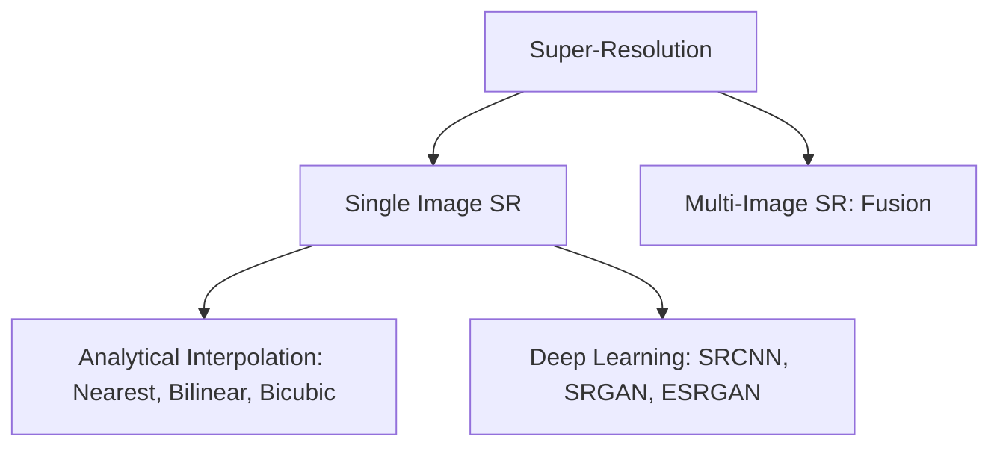
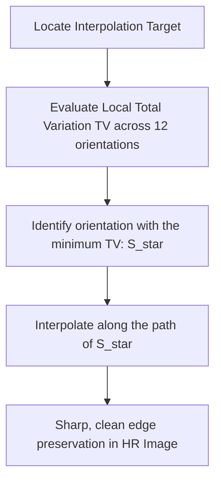
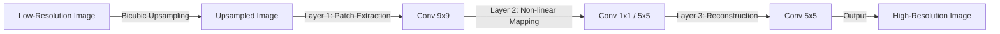
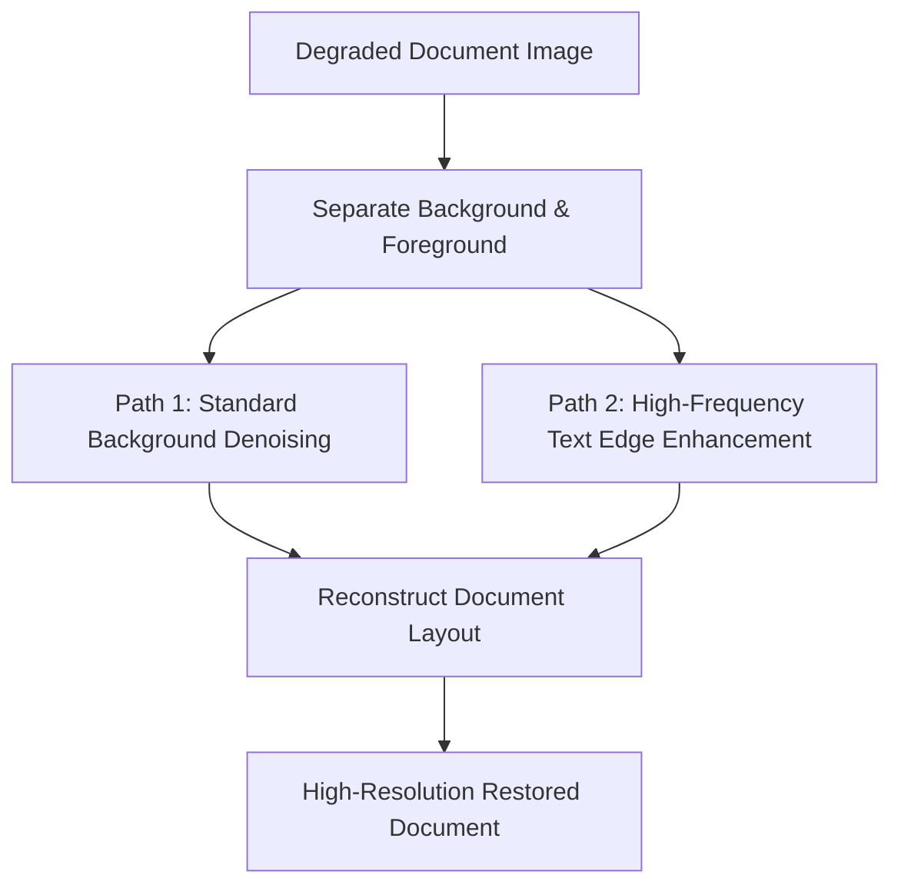

## 6. Image Super-Resolution

Super-Resolution (SR) reconstructs a high-resolution (HR) image from one or more low-resolution (LR) observations.

### 1. Classical Interpolation Techniques

#### Nearest-Neighbor Interpolation
Assigns each pixel in the upsampled grid the value of the nearest pixel in the original image.
* **Limitation:** Highly efficient but produces blocky results and jagged edges (aliasing).

#### Bilinear Interpolation
Computes the value of an unknown pixel $P(x, y)$ by performing linear interpolation along both axes using the four nearest known pixels:

$$Q_{11}(x_1, y_1), \quad Q_{21}(x_2, y_1), \quad Q_{12}(x_1, y_2), \quad Q_{22}(x_2, y_2)$$

The interpolation formula is:

$$\begin{aligned}
f(x, y) \approx \frac{1}{(x_2-x_1)(y_2-y_1)} \Big[ 
& f(Q_{11})(x_2 - x)(y_2 - y) + f(Q_{21})(x - x_1)(y_2 - y) \\
+ & f(Q_{12})(x_2 - x)(y - y_1) + f(Q_{22})(x - x_1)(y - y_1) 
\Big]
\end{aligned}$$

* **Limitation:** Produces smoother results than nearest-neighbor but blurs high-frequency details and sharp edges.

#### Bicubic Interpolation
Computes the value of an unknown pixel using a weighted average of the $16$ nearest pixels on a $4 \times 4$ grid:

$$P(x, y) = \sum_{i=-1}^{2} \sum_{j=-1}^{2} P_{i, j} W(x - i) W(y - j)$$

The weight function $W(d)$ is defined by **Keys' cubic spline kernel**:

$$W(d) = \begin{cases} 
(a + 2)|d|^3 - (a + 3)|d|^2 + 1 & \text{for } 0 \le |d| \le 1 \\ 
a|d|^3 - 5a|d|^2 + 8a|d| - 4a & \text{for } 1 < |d| \le 2 \\ 
0 & \text{otherwise} 
\end{cases}$$

where $a$ is a scaling parameter (typically set to $-0.5$ or $-0.75$).
* **Pros:** Preserves sharp transitions and fine details much better than bilinear interpolation.

---

### 2. Edge-Adaptive Interpolation: Contour Stencils (Getreuer 2009)
Standard interpolation techniques ignore edge directions, which can blur boundaries and introduce artifacts. Edge-adaptive methods, such as Contour Stencils, estimate the local orientation of edges before interpolating to ensure transitions remain sharp.

#### Step-by-Step Mathematical Algorithm

**Step 1: Total Variation (TV) Estimation**  
For a candidate orientation stencil $S$, calculate the local Total Variation (TV) over a set of neighboring pixels:

$$\text{TV}_c(S) = \frac{1}{|S|} \sum_{e \in \text{edges}(S)} w_e |v_{\alpha_e} - v_{\beta_e}|$$

where $v_{\alpha_e}$ and $v_{\beta_e}$ are the intensities of the pixels connected by edge $e$, and $w_e$ is a spatial weighting factor.

**Step 2: Direction Selection**  
Evaluate the TV across twelve distinct stencil orientations. Identify the optimal orientation $S^*$ that minimizes the local variation:

$$S^* = \arg\min_{S \in \Sigma} \Big( \text{TV}_c(S) \Big)$$

**Step 3: Directional Interpolation**  
Interpolate the missing pixel values along the path of $S^*$. By interpolating parallel to the edge rather than across it, the algorithm prevents blurring and preserves sharp boundaries.

---

### 3. Deep Learning Super-Resolution Models

#### SRCNN (Super-Resolution Convolutional Neural Network)
The first deep learning model for super-resolution. It uses a three-layer convolutional neural network to learn the mapping from low-resolution to high-resolution patches.

#### SRGAN (Super-Resolution Generative Adversarial Network)
SRGAN uses Generative Adversarial Networks (GANs) to generate realistic, high-frequency details. It incorporates a **Perceptual Loss** function that combines content loss (measured in the feature space of a pre-trained VGG network) and adversarial loss, producing sharper and more natural-looking textures than pixel-wise loss functions (like MSE).

#### ESRGAN (Enhanced SRGAN)
Improves upon SRGAN by:
* Introducing the **Residual-in-Residual Dense Block (RRDB)**, which increases network capacity and stability.
* Removing Batch Normalization layers to reduce computational overhead and eliminate artifacts.
* Using a **Relativistic Discriminator**, which estimates the probability that an image is more realistic than real data, rather than classifying it as simply real or fake.

---

### 4. Bi-ESRGAN: Dual-Deep Transfer Learning for Document Images (Kezzoula & Gaceb, 2023)
Developed specifically for document restoration, this specialized architecture improves upon standard ESRGAN by using a dual-path pipeline to process structural text and background details separately.

* **Foreground Path:** Focuses on extracting and sharpening text strokes, preserving the legibility of characters.
* **Background Path:** Focuses on denoising, removing stains, and flattening non-uniform lighting.
* **Fusion:** Combines the outputs of both paths to produce a high-resolution, clean, and legible document image.
