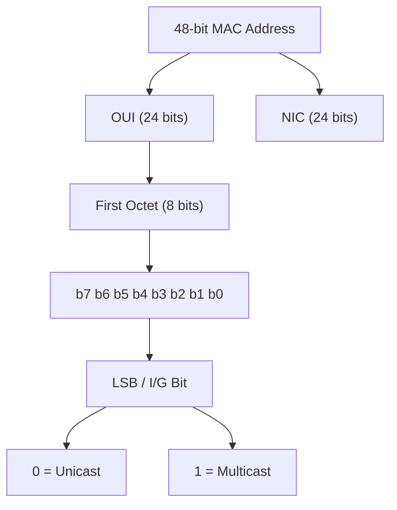

### 1.1 MAC Address Classification & Identification

A Media Access Control (MAC) address is a 48-bit (6-octet) physical identifier typically written in hexadecimal notation (e.g., `XX:XX:XX:XX:XX:XX` or `XX-XX-XX-XX-XX-XX`).

#### The LSB Rule for Address Type Determination
To classify a MAC address, analyze the **Least Significant Bit (LSB)**—also referred to as the **Individual/Group (I/G) bit**—of the **first octet**:
* **Unicast:** The LSB of the first octet is `0`. This designates a frame destined for a single, specific network interface.
* **Multicast:** The LSB of the first octet is `1`. This designates a frame destined for a group of devices.
* **Broadcast:** All 48 bits are set to `1` (`FF:FF:FF:FF:FF:FF`).

#### Hexadecimal Extraction Technique
Convert only the second hexadecimal digit of the first octet to binary. If this digit is even, the address is Unicast; if it is odd, it is Multicast.

$$\text{First Octet: } [H_1 H_2]$$

$$H_2 \in \{0, 2, 4, 6, 8, A, C, E\} \implies \text{LSB} = 0 \implies \text{Unicast}$$

$$H_2 \in \{1, 3, 5, 7, 9, B, D, F\} \implies \text{LSB} = 1 \implies \text{Multicast}$$

#### Concrete Analytical Examples

* **Address A: `01-00-5E-AB-CD-EF`**
  * First octet: `01`
  * Hex digit `1` in binary: `0001` (LSB is `1`)
  * Classification: **Multicast** (specifically, the standard OUI prefix for IPv4 multicast mapping)

* **Address B: `00-00-25-47-EF-CD`**
  * First octet: `00`
  * Hex digit `0` in binary: `0000` (LSB is `0`)
  * Classification: **Unicast**

* **Address C: `11-52-AB-9B-DC-12`**
  * First octet: `11`
  * Hex digit `1` in binary: `0001` (LSB is `1`)
  * Classification: **Multicast**

* **Address D: `00-01-4B-B4-A2-EF`**
  * First octet: `00`
  * Hex digit `0` in binary: `0000` (LSB is `0`)
  * Classification: **Unicast**

#### Source MAC Validity Constraint
A **Source MAC address** in an Ethernet frame header must **always be a Unicast address**. A multicast or broadcast address (where the LSB of the first octet is `1`) cannot generate or transmit frames. 

* *Exam Application:* If asked whether a list of MAC addresses can appear in the "Source Address" field of an Ethernet frame, disqualify any address where the first octet ends in an odd hexadecimal value (e.g., `01-...` or `11-...`).