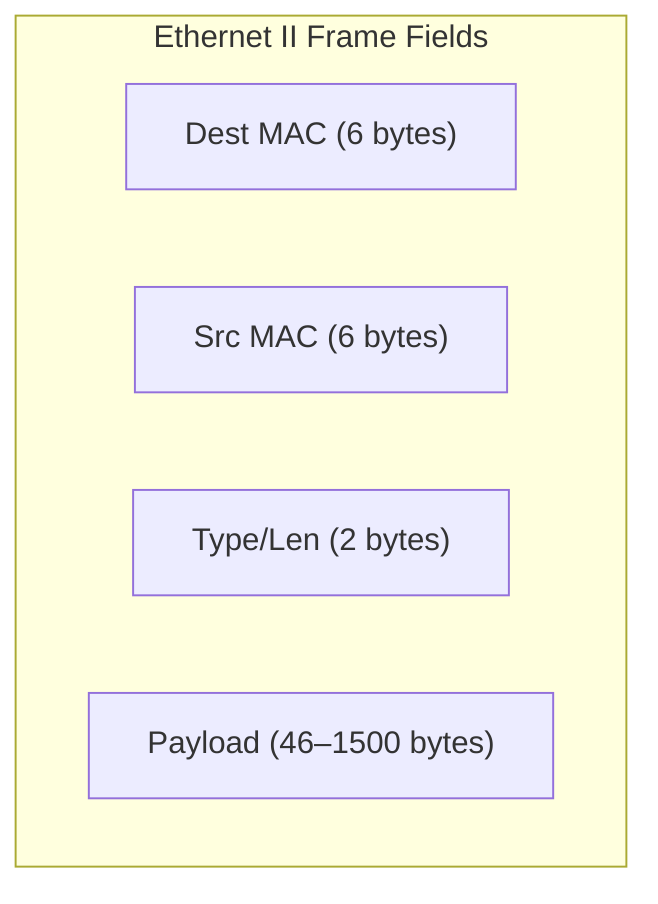

### 1.2 Ethernet Frame Structure & Header Decoding

An Ethernet II frame (excluding the Preamble and Frame Check Sequence) has a minimum length of 64 bytes and a maximum length of 1518 bytes.



#### Parsing Field Margins

1. **Destination MAC (Bytes 1–6):** The hardware address of the receiving interface or group.
2. **Source MAC (Bytes 7–12):** The hardware address of the transmitting interface (must be unicast).
3. **EtherType (Bytes 13–14):** Identifies the network layer protocol encapsulated within the payload. Common values include:
   * `0x0800` $\implies$ IPv4
   * `0x0806` $\implies$ ARP (Address Resolution Protocol)
   * `0x86DD` $\implies$ IPv6
4. **Data / Payload (Bytes 15 to $N$):** The encapsulated packet. If the payload is smaller than 46 bytes, it is padded to meet the minimum Ethernet frame size.

#### Walkthrough: Parsing a Raw Frame Capture

```
ffff ffff ffff 09ab 14d8 0548 0806 0001
0800 0604 0001 09ab 14d8 0548 7d05 300a
0000 0000 0000 7d12 6e03
```

* **Destination MAC:** `ffff ffff ffff` (Broadcast address)
* **Source MAC:** `09-ab-14-d8-05-48` (Unicast address)
* **EtherType:** `0806` (Decodes to **ARP**)
* **Payload:** Starts at byte 15 (`0001 0800 0604...`). This represents the ARP payload (Hardware type: Ethernet, Protocol type: IPv4, etc.).