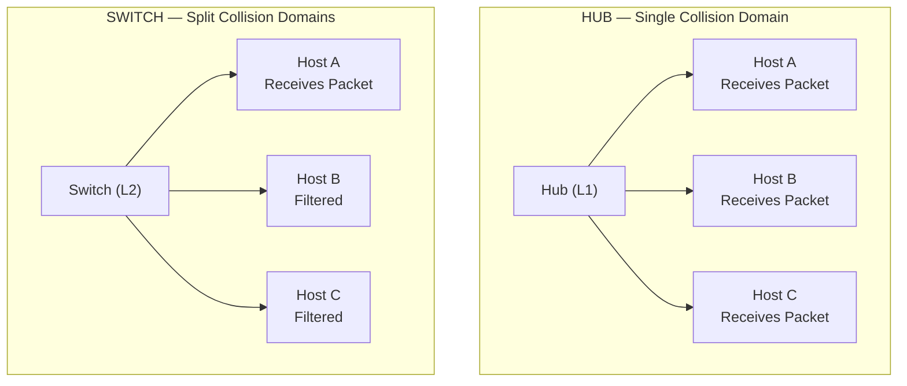

### 1.3 Layer 2 Network Infrastructure: Hubs vs. Switches

#### Structural and Operational Differences
* **Hub (Layer 1 Physical Device):** 
  * Acts as a multiport repeater.
  * Does not parse physical or logical addresses.
  * Floods incoming signals out of all ports except the port of entry.
  * **Domain Status:** All connected ports reside within a **single collision domain** and a **single broadcast domain**.
* **Switch (Layer 2 Data Link Device):**
  * Inspects frame headers and dynamically learns MAC-to-port mappings.
  * Unicasts frames directly to the destination port, filtering traffic to other ports.
  * Floods frames only during broadcast transmission, multicast propagation, or when the destination MAC is unknown (unicast flooding).
  * **Domain Status:** Every individual port resides in its own **isolated collision domain**. All ports share a **single broadcast domain**.

#### Port Status Indications in Cisco Switches
During initial physical connection or configuration changes, switch ports transition through Spanning Tree Protocol (STP) phases:
* **Orange/Amber Link Light:** Indicates the port is in an STP transition state (Listening or Learning). This phase lasts approximately 30 seconds to prevent layer 2 loops while the switch processes BPDUs.
* **Green Link Light:** Indicates the port is in the STP Forwarding state and is fully operational.