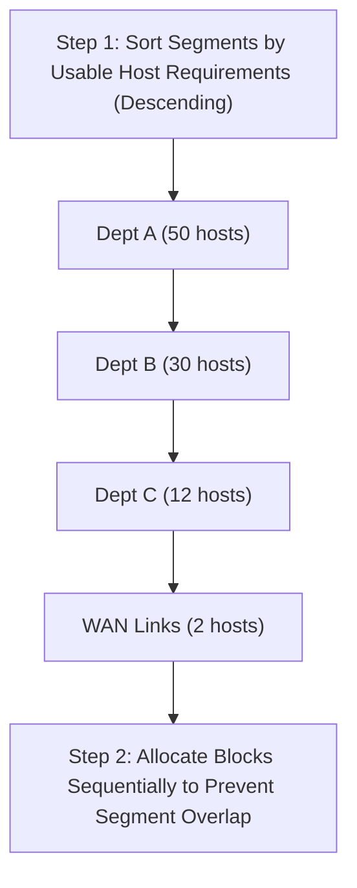

### 2.3 Variable-Length Subnet Masking (VLSM)

VLSM enables efficient address allocation by tailoring subnet masks to the specific size requirements of each segment.

#### Step-by-Step Design Protocol
1. **Sort Segment Requirements:** Order segments by the number of required host addresses in descending order (largest to smallest).
2. **Account for Overheads:** For each segment, add **2 addresses** to the host requirement to account for the Network ID and the Broadcast Address.
3. **Calculate Host Bits ($h$):** Determine the smallest integer $h$ that satisfies the host requirement:
   $$2^h - 2 \ge \text{Required Usable Hosts}$$
4. **Define Subnet Mask:** Set the new subnet prefix length:
   $$\text{Prefix} = 32 - h$$
5. **Allocate Addresses:** Assign the subnet address starting from the base network boundary, then increment the next subnet's starting address by the block size ($2^h$).

#### Practical Case Study: Corporate Addressing Optimization
*Given Block:* `192.168.40.0/24` (256 total addresses).
*Segment Requirements:*
* Siège-LAN1: 50 hosts
* Siège-LAN2: 50 hosts
* Agence1-LAN1: 30 hosts
* Agence1-LAN2: 12 hosts
* Point-to-Point WAN Link: 2 hosts

##### Step-by-Step Execution

##### 1. Siège-LAN1 (Requirement: 50 Hosts)
* Usable host check: $2^h - 2 \ge 50 \implies h = 6$ ($2^6 - 2 = 62$ usable hosts).
* Prefix: $32 - 6 = /26$ (Subnet Mask: `255.255.255.192`).
* Allocation:
  * **Subnet Address:** `192.168.40.0/26`
  * **First Usable:** `192.168.40.1`
  * **Last Usable:** `192.168.40.62`
  * **Broadcast:** `192.168.40.63`

##### 2. Siège-LAN2 (Requirement: 50 Hosts)
* Usable host check: $2^h - 2 \ge 50 \implies h = 6$ ($2^6 - 2 = 62$ usable hosts).
* Prefix: `/26` (Subnet Mask: `255.255.255.192`).
* Allocation (starts immediately after the previous subnet's broadcast):
  * **Subnet Address:** `192.168.40.64/26`
  * **First Usable:** `192.168.40.65`
  * **Last Usable:** `192.168.40.126`
  * **Broadcast:** `192.168.40.127`

##### 3. Agence1-LAN1 (Requirement: 30 Hosts)
* Usable host check: $2^h - 2 \ge 30 \implies h = 5$ ($2^5 - 2 = 30$ usable hosts).
* Prefix: $32 - 5 = /27$ (Subnet Mask: `255.255.255.224`).
* Allocation:
  * **Subnet Address:** `192.168.40.128/27`
  * **First Usable:** `192.168.40.129`
  * **Last Usable:** `192.168.40.158`
  * **Broadcast:** `192.168.40.159`

##### 4. Agence1-LAN2 (Requirement: 12 Hosts)
* Usable host check: $2^h - 2 \ge 12 \implies h = 4$ ($2^4 - 2 = 14$ usable hosts).
* Prefix: $32 - 4 = /28$ (Subnet Mask: `255.255.255.240`).
* Allocation:
  * **Subnet Address:** `192.168.40.160/28`
  * **First Usable:** `192.168.40.161`
  * **Last Usable:** `192.168.40.174`
  * **Broadcast:** `192.168.40.175`

##### 5. WAN Link (Requirement: 2 Hosts)
* Usable host check: $2^h - 2 \ge 2 \implies h = 2$ ($2^2 - 2 = 2$ usable hosts).
* Prefix: $32 - 2 = /30$ (Subnet Mask: `255.255.255.252`).
* Allocation:
  * **Subnet Address:** `192.168.40.176/30`
  * **First Usable:** `192.168.40.177`
  * **Last Usable:** `192.168.40.178`
  * **Broadcast:** `192.168.40.179`