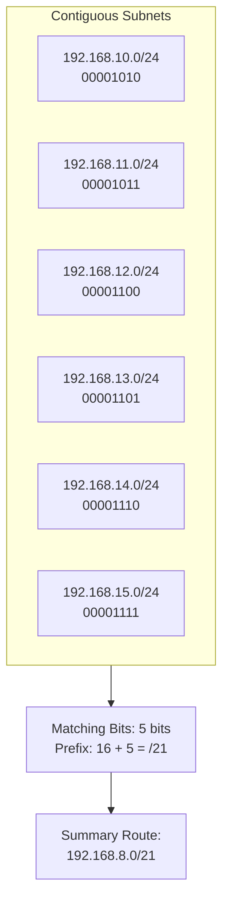

### 2.4 Route Summarization (Aggregation)

Route summarization reduces the size of routing tables by consolidating multiple contiguous subnet routes into a single summary address.

#### Summarization Algorithm
1. Convert the subnets' changing octets into binary.
2. Align the binary representations and count the matching bits from left to right.
3. The summary network address is formed by keeping the matching bits and setting all remaining bits to `0`.
4. The prefix length of the summary route is equal to the number of matching bits.

#### Summarization Example
*Given Subnets:*
* `192.168.10.0/24`
* `192.168.11.0/24`
* `192.168.12.0/24`
* `192.168.13.0/24`
* `192.168.14.0/24`
* `192.168.15.0/24`

Convert the third octet of each network address to binary:
* $10 = \mathbf{00001}010_2$
* $11 = \mathbf{00001}011_2$
* $12 = \mathbf{00001}100_2$
* $13 = \mathbf{00001}101_2$
* $14 = \mathbf{00001}110_2$
* $15 = \mathbf{00001}111_2$

* **Matching Bits:** The first 5 bits of the third octet are identical (`00001`).
* **Calculate Prefix:** $8 \text{ (first octet)} + 8 \text{ (second octet)} + 5 \text{ (matching bits)} = 21$ bits (`/21`).
* **Determine Summary Address:** Setting the remaining 3 bits of the third octet to `0` yields `00001000` ($8_{10}$).
  * **Summary Route:** `192.168.8.0/21` (Mask: `255.255.248.0`).