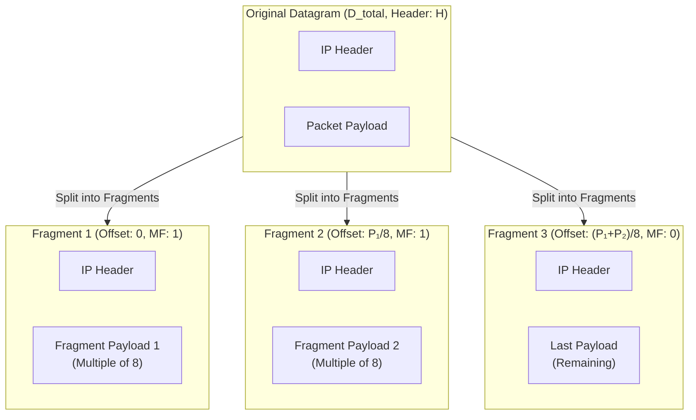

### 3.2 Fragmentation Mathematics & Calculations

When a packet's size exceeds the Maximum Transmission Unit (MTU) of an outbound interface, routers split its payload across multiple smaller packets.

#### Mathematical Steps for Fragmentation

1. **Isolate Payload Size ($D_{\text{data}}$):**
   $$D_{\text{data}} = D_{\text{original}} - H$$
   *(Where $H = \text{Header Size} = \text{IHL} \times 4$)*

2. **Determine Maximum Payload per Fragment ($P_{\text{max}}$):**
   The payload size of all intermediate fragments **must** be a multiple of 8 bytes.
   $$P_{\text{max}} = \left\lfloor \frac{\text{MTU} - H}{8} \right\rfloor \times 8$$

3. **Calculate Number of Fragments ($N_{\text{frag}}$):**
   $$N_{\text{frag}} = \lceil D_{\text{data}} / P_{\text{max}} \rceil$$

4. **Calculate Parameters for Each Fragment $i$ ($0 \le i < N_{\text{frag}}$):**
   * **Payload Size ($P_i$):**
     * For intermediate fragments ($i < N_{\text{frag}} - 1$): $P_i = P_{\text{max}}$
     * For the final fragment ($i = N_{\text{frag}} - 1$): $P_i = D_{\text{data}} - (i \times P_{\text{max}})$
   * **Total Packet Length ($L_i$):**
     $$L_i = P_i + H$$
   * **More Fragments Flag ($\text{MF}_i$):**
     * For intermediate fragments: $\text{MF}_i = 1$
     * For the final fragment: $\text{MF}_i = 0$
   * **Fragment Offset ($\text{FO}_i$):**
     $$\text{FO}_i = \frac{i \times P_{\text{max}}}{8}$$