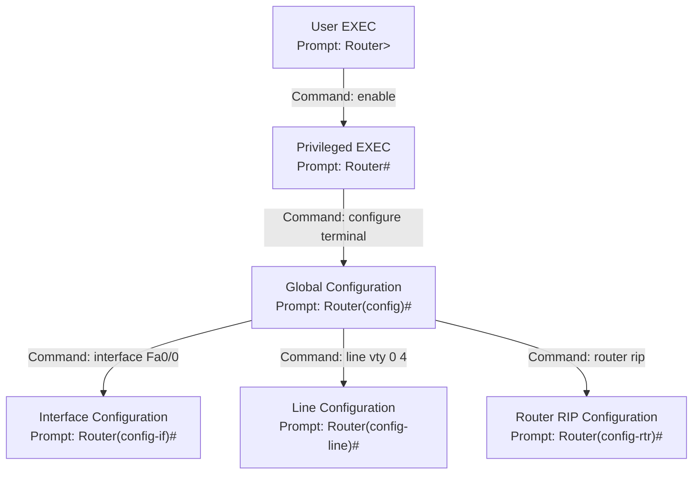

### 4.1 CLI Executive Modes & Prompts

Cisco IOS uses a hierarchical command-line structure. Each mode provides access to a specific set of commands.

```mermaid
flowchart TD
    UE["User EXEC<br/>Prompt: Router>"]
    UE -->|"Command: enable"| PE["Privileged EXEC<br/>Prompt: Router#"]
    PE -->|"Command: configure terminal"| GC["Global Configuration<br/>Prompt: Router(config)#"]
    GC -->|"Command: interface Fa0/0"| IC["Interface Configuration<br/>Prompt: Router(config-if)#"]
    GC -->|"Command: line vty 0 4"| LC["Line Configuration<br/>Prompt: Router(config-line)#"]
    GC -->|"Command: router rip"| RC["Router RIP Configuration<br/>Prompt: Router(config-rtr)#"]
```
