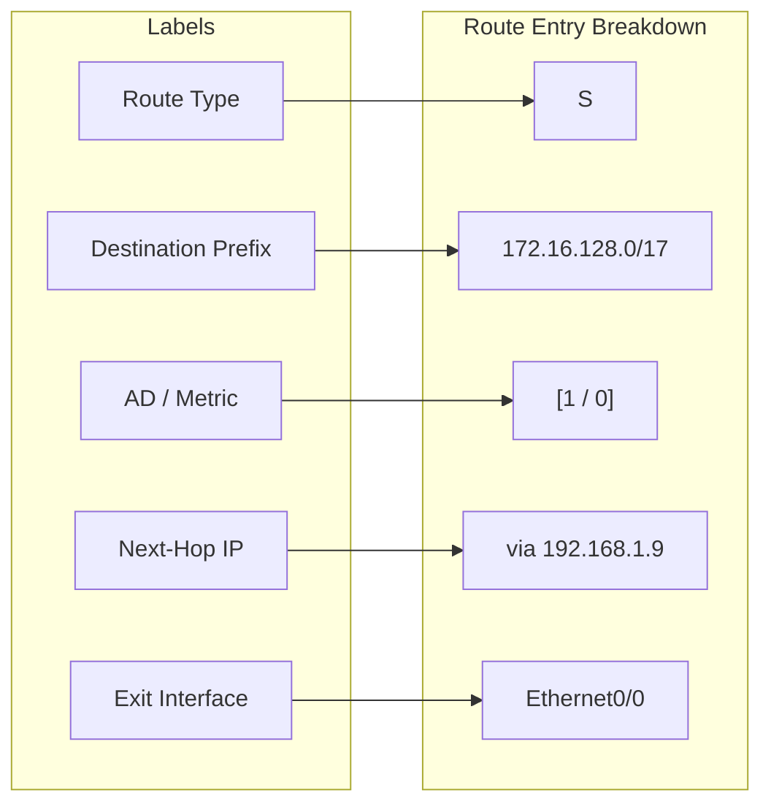

### 5.1 Route Entries & Administrative Distance

A router makes forwarding decisions by looking up the destination IP address in its routing table. 

#### Administrative Distance (AD)
AD represents the trustworthiness of a route source. If a router learns multiple paths to the same destination from different sources, it installs the path with the **lowest AD** in the routing table.

| Route Source | Default AD |
| :--- | :---: |
| **Directly Connected** | $0$ |
| **Static Route** | $1$ |
| **OSPF** | $110$ |
| **RIP** | $120$ |

#### Route Lookup Logic
When forwarding a packet, the router parses its routing table and selects the route that matches the destination IP address with the **longest prefix length** (longest match rule).