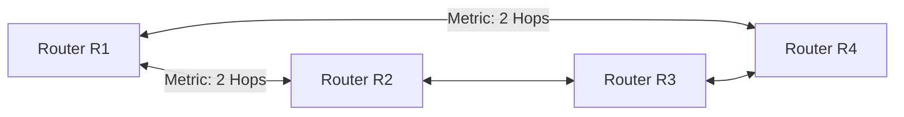

### 5.3 Distance-Vector Routing: RIPv2

The Routing Information Protocol (RIP) is a classless distance-vector routing protocol.



#### Operational Mechanics
* **Metric:** Uses **Hop Count** (the number of routers along the path). The maximum metric value is 15; a hop count of 16 represents an unreachable destination.
* **Routing Updates:** Routers periodically broadcast or multicast (`224.0.0.9`) their entire routing table to directly connected neighbors every 30 seconds.
* **Route Aggregation:** Classless routing updates are supported by disabling classful automatic summarization.

#### RIP Configuration Reference
```ios
-- Enable RIP Routing Process
R1(config)# router rip

-- Enforce Version 2 (Required for VLSM/Classless Routing)
R1(config-router)# version 2

-- Disable Classful Auto-Summarization
R1(config-router)# no auto-summary

-- Associate Networks (RIP advertises interfaces matching classful networks)
R1(config-router)# network 192.168.1.0
R1(config-router)# network 10.0.0.0

-- Configure Passive Interfaces
R1(config-router)# passive-interface fastethernet 0/0
```
*Note:* The `passive-interface` command prevents the router from transmitting periodic RIP routing updates out of the specified interface (saving local network bandwidth and securing the local segment), while still allowing RIP to advertise that interface's subnet to other routing neighbors.