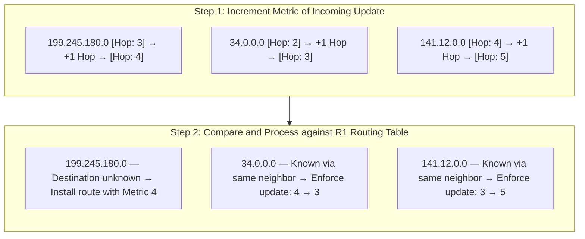

### 5.4 RIP Route Table Update Logic

When a router running RIP receives a routing update from a neighbor:
1. Increment the metric (hop count) of all incoming route entries by 1.
2. Compare each route entry in the update against the router's current routing table:
   * **New Route:** If the destination subnet is not in the routing table, install the route.
   * **Better Metric:** If the destination subnet exists and the update offers a lower metric, replace the existing route.
   * **Same Next Hop:** If the destination subnet exists and the update is received from the **same neighbor** that originally advertised the route, overwrite the existing route with the new metric, even if the new metric is higher.
   * **Worse Metric (Different Neighbor):** If the destination subnet exists but the update is from a different neighbor and has a higher metric, discard the update.

#### Detailed Update Walkthrough
*Given R1 Starting Routing Table:*
* `134.33.0.0/16` | Metric: 1 | Next Hop: Directly Connected
* `145.108.0.0/16` | Metric: 1 | Next Hop: Directly Connected
* `0.0.0.0/0` | Metric: 1 | Next Hop: `134.33.12.1` via local interface
* `34.0.0.0/8` | Metric: 4 | Next Hop: `145.108.1.9`
* `141.12.0.0/16` | Metric: 3 | Next Hop: `145.108.1.9`

*Update Received from Neighbor `145.108.1.9`:*
* `199.245.180.0/24` | Metric: 3
* `34.0.0.0/8` | Metric: 2
* `141.12.0.0/16` | Metric: 4

*Execution:*

1. **Increment all incoming metrics:**
   * `199.245.180.0/24` metric becomes $3 + 1 = 4$
   * `34.0.0.0/8` metric becomes $2 + 1 = 3$
   * `141.12.0.0/16` metric becomes $4 + 1 = 5$

2. **Evaluate routes against R1's current routing table:**
   * **`199.245.180.0/24`:** Not present in R1's table. Add the route.
     * *New Table Entry:* `199.245.180.0/24` | Metric: 4 | Next Hop: `145.108.1.9`
   * **`34.0.0.0/8`:** Present in R1's table (current metric: 4, next hop: `145.108.1.9`). The update offers a better metric (3 < 4). Update the route.
     * *New Table Entry:* `34.0.0.0/8` | Metric: 3 | Next Hop: `145.108.1.9`
   * **`141.12.0.0/16`:** Present in R1's table (current metric: 3, next hop: `145.108.1.9`). The update is from the same neighbor (`145.108.1.9`), so R1 **must** accept the update, even though the new metric is worse (5 > 3). Update the route.
     * *New Table Entry:* `141.12.0.0/16` | Metric: 5 | Next Hop: `145.108.1.9`

*Resulting R1 Routing Table:*
* `134.33.0.0/16` | Metric: 1 | Next Hop: Directly Connected
* `145.108.0.0/16` | Metric: 1 | Next Hop: Directly Connected
* `0.0.0.0/0` | Metric: 1 | Next Hop: `134.33.12.1`
* `34.0.0.0/8` | Metric: 3 | Next Hop: `145.108.1.9`
* `141.12.0.0/16` | Metric: 5 | Next Hop: `145.108.1.9`
* `199.245.180.0/24` | Metric: 4 | Next Hop: `145.108.1.9`