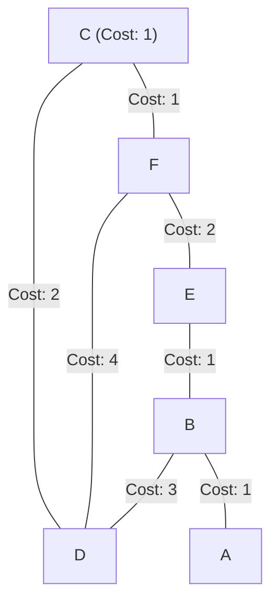
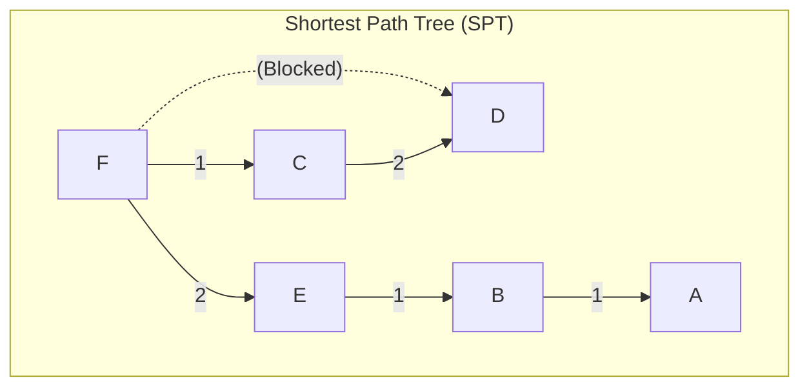

### 5.5 Link-State Routing: OSPF & Dijkstra's Algorithm

Open Shortest Path First (OSPF) is a link-state routing protocol. Instead of exchanging distance-vector metrics, OSPF routers build a complete topological map of the network (the Link-State Database, or LSDB) and run Dijkstra's Shortest Path First (SPF) algorithm locally to calculate the shortest path to each destination.

#### Walkthrough: Dijkstra's Algorithm from Node F
Calculate the shortest path and build the routing table for Node F using the following network links and costs:

* **F to C:** Cost 1
* **F to E:** Cost 2
* **F to D:** Cost 4
* **C to D:** Cost 2
* **E to B:** Cost 1
* **B to A:** Cost 1
* **B to D:** Cost 3

##### Step-by-Step Shortest Path Calculation

##### Step 1: Initialize Candidate Lists
* **Tentative (T):** Unconfirmed paths under evaluation.
* **Permanent (P):** Confirmed shortest paths.

$$\text{Initialize: } P = \{ [F, 0, -] \}, \quad T = \{ [C, 1, C], [E, 2, E], [D, 4, D] \}$$

##### Step 2: Select Lowest Cost in T
The path to Node C has the lowest cost (1). Move Node C to the Permanent list.

$$P = \{ [F, 0, -], [C, 1, C] \}$$

Evaluate paths to neighbors of the newly confirmed node (C):
* Can we reach Node D via Node C with a lower cost?
  $$\text{Cost to D via C} = \text{Cost}(C) + \text{Cost}(C \to D) = 1 + 2 = 3$$
  Since $3 < 4$ (the current cost to Node D in $T$), update Node D's entry in the Tentative list:

$$T = \{ [E, 2, E], [D, 3, C] \}$$

##### Step 3: Select Lowest Cost in T
The path to Node E has the lowest cost (2). Move Node E to the Permanent list.

$$P = \{ [F, 0, -], [C, 1, C], [E, 2, E] \}$$

Evaluate paths to neighbors of the newly confirmed node (E):
* Path to Node B:
  $$\text{Cost to B} = \text{Cost}(E) + \text{Cost}(E \to B) = 2 + 1 = 3$$
  Add Node B to the Tentative list:

$$T = \{ [D, 3, C], [B, 3, E] \}$$

##### Step 4: Select Lowest Cost in T
The paths to Node D and Node B are tied with a cost of 3. Move both Node D and Node B to the Permanent list.

$$P = \{ [F, 0, -], [C, 1, C], [E, 2, E], [D, 3, C], [B, 3, E] \}$$

Evaluate paths to neighbors of the newly confirmed nodes:
* Path to Node A via Node B:
  $$\text{Cost to A} = \text{Cost}(B) + \text{Cost}(B \to A) = 3 + 1 = 4$$
  Add Node A to the Tentative list:

$$T = \{ [A, 4, E] \}$$

##### Step 5: Finalize
Move Node A to the Permanent list.

$$P = \{ [F, 0, -], [C, 1, C], [E, 2, E], [D, 3, C], [B, 3, E], [A, 4, E] \}$$

##### Resulting Node F Routing Table

| Destination Node | Shortest Path | Total Path Cost | Next-Hop Interface / IP |
| :---: | :--- | :---: | :---: |
| **C** | $F \to C$ | **1** | Direct Interface to C |
| **D** | $F \to C \to D$ | **3** | Direct Interface to C |
| **E** | $F \to E$ | **2** | Direct Interface to E |
| **B** | $F \to E \to B$ | **3** | Direct Interface to E |
| **A** | $F \to E \to B \to A$ | **4** | Direct Interface to E |