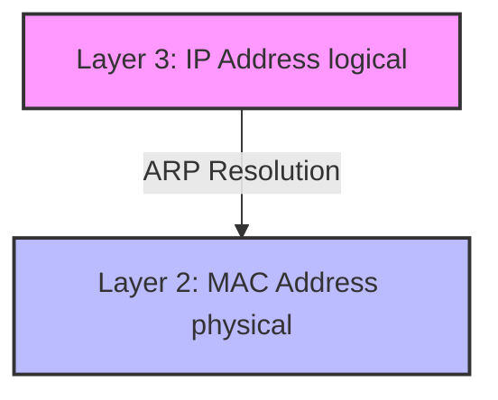
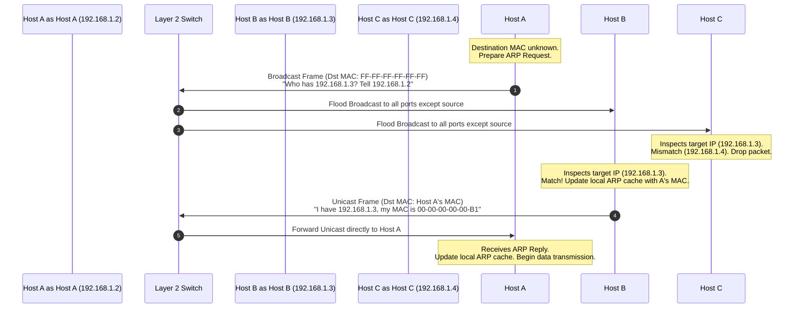

### 1.4 Address Resolution Protocol (ARP) Deep Dive

#### 1. Conceptual Foundation: Mapping L3 to L2 Addresses
For an IP host to transmit data over a local physical medium, it must encapsulate the Layer 3 IP datagram into a Layer 2 Data Link frame. While the Layer 3 header uses logical IP addresses to identify source and destination endpoints globally, the Layer 2 frame header must use physical MAC addresses to identify the interfaces directly connected to the local physical medium. 

The Address Resolution Protocol (ARP) acts as the operational bridge between these two layers in IPv4 networks, resolving dynamic Layer 3 logical IP addresses into Layer 2 physical MAC addresses.

---

#### 2. The ARP Transaction Lifecycle: Request and Reply

When a source host (Host A) needs to communicate with another host (Host B) on the same local subnet, it first checks its own local ARP cache. If no mapping exists for Host B's IP address, the host initiates the ARP transaction lifecycle.

##### Step 1: The ARP Request (Broadcast)
* **Initiation:** Host A creates an ARP Request packet containing:
  * **Sender Hardware Address:** Host A's MAC Address (e.g., `00:00:00:00:00:03`)
  * **Sender Protocol Address:** Host A's IP Address (`192.168.1.2`)
  * **Target Hardware Address:** Unknown (typically set to `00:00:00:00:00:00` or ignored)
  * **Target Protocol Address:** Host B's IP Address (`192.168.1.3`)
* **Layer 2 Encapsulation:** The ARP Request is encapsulated in an Ethernet II frame:
  * **Source MAC Address:** Host A's MAC Address
  * **Destination MAC Address:** The Layer 2 Broadcast Address (`FF:FF:FF:FF:FF:FF`)
  * **EtherType:** `0x0806` (designating ARP)
* **Propagation:** The local switch receives the broadcast frame and floods it out of all physical ports except the incoming port.

##### Step 2: Receiver Processing
* **Host C (Non-Target):** Receives the broadcast frame, decapsulates the Ethernet header, and reads the ARP payload. It compares the target IP address (`192.168.1.3`) with its own IP address (`192.168.1.4`). Because they do not match, Host C drops the packet without taking action.
* **Host B (Target):** Receives the broadcast frame, decapsulates it, and detects an IP match. Host B first updates its own local ARP cache with an entry for Host A (`192.168.1.2` $\to$ `00:00:00:00:00:03`) to optimize future communications.

##### Step 3: The ARP Reply (Unicast)
* **Formulation:** Host B creates an ARP Reply packet containing:
  * **Sender Hardware Address:** Host B's MAC Address (e.g., `00:00:00:00:00:B1`)
  * **Sender Protocol Address:** Host B's IP Address (`192.168.1.3`)
  * **Target Hardware Address:** Host A's MAC Address (`00:00:00:00:00:03`)
  * **Target Protocol Address:** Host A's IP Address (`192.168.1.2`)
* **Layer 2 Encapsulation:** The packet is encapsulated in a unicast Ethernet II frame:
  * **Source MAC Address:** Host B's MAC Address
  * **Destination MAC Address:** Host A's MAC Address
* **Propagation:** Because the destination is unicast, the switch forwards the frame directly to Host A's port. Host A then receives the frame, extracts Host B's MAC address, updates its local ARP cache, and transmits the pending IPv4 data.

---

#### 3. ARP Cache vs. Switch MAC Address Tables
A common point of confusion in network engineering is the difference between an **ARP Cache (or ARP Table)** and a **Switch MAC Address Table (CAM Table)**. They operate at different layers, on different devices, for different purposes.

| Dimension | ARP Cache (ARP Table) | MAC Address Table (CAM Table) |
| :--- | :--- | :--- |
| **Primary Device** | Layer 3 devices (Hosts, Routers, Layer 3 Switches). | Layer 2 devices (Switches, Bridges). |
| **Layer of Operation**| Layer 2.5 / Layer 3. | Layer 2 (Data Link). |
| **Core Mapping** | Maps logical **IP Addresses** to physical **MAC Addresses**. | Maps physical **MAC Addresses** to physical **Switch Ports**. |
| **Purpose** | Used to determine the destination hardware address (MAC) needed to build a Layer 2 frame. | Used to determine which physical port to forward an existing Layer 2 frame to. |
| **How It's Populated**| Dynamically populated via ARP Requests and Replies, or configured statically. | Dynamically populated by inspecting the source MAC addresses of incoming frames. |
| **CLI Verification** | `arp -a` (Windows/Linux/Cisco IOS) | `show mac-address-table` (Cisco IOS) |