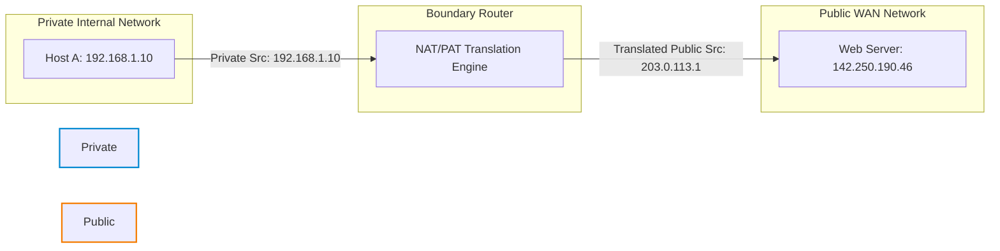
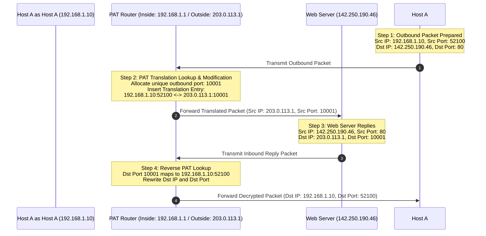

### 1.5 Network Address Translation (NAT) and Port Address Translation (PAT)

#### 1. The Core Architecture of Address Translation
The rapid growth of the Internet highlighted a major limitation in IPv4: the finite pool of 32-bit address spaces. To address this shortage, RFC 1918 defined three blocks of private IP address spaces that cannot be routed across the public Internet:
* **Class A:** `10.0.0.0/8`
* **Class B:** `172.16.0.0/12`
* **Class C:** `192.168.0.0/16`

Network Address Translation (NAT) was developed to translate private, non-routable IP addresses within an internal network into public, globally routable IP addresses. This translation occurs on a perimeter boundary device, such as a firewall or gateway router, allowing internal hosts to access public Internet resources.

---

#### 2. Detailed Translation Methodologies: Static, Dynamic, and Overload

##### Static NAT (1:1 Mapping)
Static NAT establishes a permanent, one-to-one mapping between an internal private IP address and an external public IP address.
* **Mechanism:** The translation table remains static. Every packet originating from a specific internal IP is translated to the same public IP.
* **Primary Use Case:** External-facing servers (such as Web, Mail, or VPN gateways) located within an internal private subnet or DMZ that must be accessible from the public Internet.

##### Dynamic NAT (Many-to-Many Mapping)
Dynamic NAT maps an private IP address to a public IP address from a pool of registered public addresses.
* **Mechanism:** When an internal host requests Internet access, the router dynamically assigns an unused public IP address from its pool. This binding remains active for the duration of the communication session.
* **Limitation:** If the public IP pool contains $N$ addresses, only $N$ internal hosts can communicate concurrently. Any additional hosts must wait until an active translation session expires.

##### Port Address Translation / PAT (Many-to-One / Overload)
PAT (also known as NAT Overload) maps multiple private IP addresses to a single public IP address by tracking unique port numbers.
* **Mechanism:** The gateway router tracks connections by using unique source port numbers. If multiple internal hosts initiate outbound connections using the same source port (e.g., source port `49152`), the PAT gateway modifies the source port of subsequent connections to ensure uniqueness (e.g., translating host B's connection to port `49153` on the public IP).

---

#### 3. NAT/PAT Translating Process
Consider Host A (`192.168.1.10`) initiating an HTTP connection to a public Web Server (`142.250.190.46:80`). The gateway router's public interface is configured with the IP address `203.0.113.1`.

---

#### 4. Exhaustive Technical Evaluation Matrix

| Evaluation Criteria | Static NAT (1:1) | Dynamic NAT (m:n) | Port Address Translation (PAT) |
| :--- | :--- | :--- | :--- |
| **Definition** | Static 1-to-1 IP address translation. | Dynamic assignment from a pool of public IPs. | Translates multiple private IPs to one public IP using source ports. |
| **Translation Mapping** | Private IP $\leftrightarrow$ Public IP (Permanent) | Private IP $\leftrightarrow$ Public IP (Session-based) | Private IP:Port $\leftrightarrow$ Public IP:Unique Port |
| **IP Pool Demand** | High (one public IP required for each translated server). | Medium (requires a pool proportional to peak concurrent sessions). | Low (allows thousands of hosts to share a single public IP). |
| **Primary Use Cases** | Web servers, Mail servers, secure static tunnels. | Temporary outbound access for small workgroups. | General user Internet access in homes and enterprise networks. |
| **Advantages** | * Supports bidirectional connection establishment (inbound and outbound). * Reliable and predictable translation. | * Secures internal hosts by keeping them invisible from the outside network when idle. | * Maximizes public IP space efficiency. * Highly cost-effective. * Simplifies address planning. |
| **Disadvantages** | * Inefficient use of public IP addresses. * Expensive to implement at scale. | * Unidirectional initiation only (inbound connections are blocked). * Sessions fail if the public IP pool is exhausted. | * High router resource overhead (requires maintaining state for thousands of port mappings). * Complex troubleshooting. |
| **Security Profile** | Moderate (hides private IP, but the host remains exposed via the public IP translation). | High (internal addresses are invisible from outside networks when idle). | Highest (completely conceals internal network topology; blocks unsolicited inbound traffic). |
| **Relative Cost** | High (recurring charges for public IP allocation from the ISP). | Medium to High. | Low (only requires a single public IP address). |