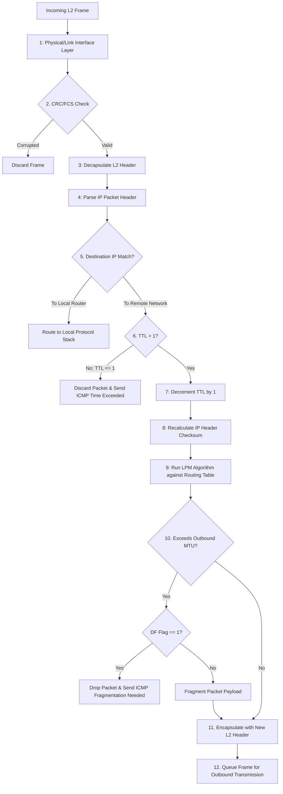
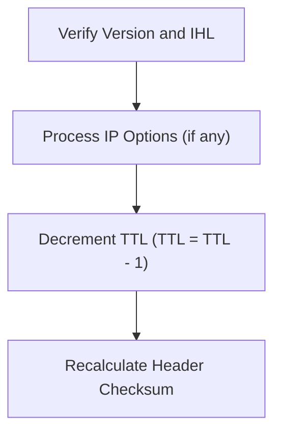

### 2.1 IP Router Operations and Packet Processing

#### 1. Hardware Architecture & Decapsulation

When an IP router receives a Layer 2 frame on an interface, it processes the packet through its physical, link, and network layers. This process must run efficiently to minimize latency and maximize packet throughput.

##### 1. Frame Ingress & Integrity Verification
* **Physical Processing:** The physical interface receives incoming bits and converts them into a digital frame.
* **CRC/FCS Verification:** The router checks the Cyclic Redundancy Check (CRC) or Frame Check Sequence (FCS) in the frame trailer. If the calculated value does not match the received value, the frame is corrupted and discarded immediately.

##### 2. Layer 2 Decapsulation
* **MAC Destination Match:** The router inspects the destination MAC address of the frame. It must match either the MAC address of the receiving router interface or a multicast address the router is listening to (e.g., `01:00:5E:XX:XX:XX` for OSPF/RIP).
* **Protocol Extraction:** The router decapsulates the Layer 2 header and trailer, exposing the Layer 3 IP packet. The EtherType field (e.g., `0x0800` for IPv4) determines which network-layer engine processes the payload.

---

#### 2. Network-Layer Header Verification & Operations

Once the Layer 3 IPv4 packet is exposed, the router performs a series of operational checks:

##### 1. TTL Decrement
* The router inspects the **Time to Live (TTL)** field in the IPv4 header.
* If the TTL is `1` or `0`, the router drops the packet and sends an **ICMP Type 11 Code 0 (Time to Live exceeded in transit)** message back to the sender. This loop-prevention mechanism keeps packets from circulating infinitely on the network.
* If the TTL is greater than `1`, the router decrements it by 1:
  $$\text{TTL}_{\text{new}} = \text{TTL}_{\text{old}} - 1$$

##### 2. Checksum Update
* Because the TTL field has changed, the IP header checksum is no longer valid. The router recalculates the header checksum to maintain data integrity.

---

#### 3. Forwarding Engine and Egress Processing

##### 1. Longest Prefix Match (LPM) Lookup
* The routing engine parses the destination IP address and runs the **Longest Prefix Match (LPM)** algorithm against its internal routing table to determine the most specific route.
* If no specific route matches, the router looks for a **Default Route (`0.0.0.0/0`)**. If no default route is configured, the packet is discarded, and the router returns an **ICMP Type 3 Code 0 (Destination Network Unreachable)** message to the source.

##### 2. Layer 3 Fragmentation (If Required)
* The router determines the Maximum Transmission Unit (MTU) of the egress interface.
* If the packet size exceeds the outbound interface's MTU, the router checks the **Don't Fragment (DF)** flag:
  * **If DF = 1:** The router drops the packet and returns an **ICMP Type 3 Code 4 (Destination Unreachable: Fragmentation Needed and DF Set)** message, specifying the MTU of the next-hop link.
  * **If DF = 0:** The router splits the payload across multiple fragments based on the MTU constraint, calculating the correct fragment offsets for each.

##### 3. Layer 2 Frame Re-encapsulation
* To send the packet out the exit interface, the router must build a new Layer 2 frame. It resolves the MAC address of the next-hop gateway or target host using its local ARP cache (or by sending an ARP request).
* It then wraps the packet in a new Layer 2 header:
  * **Source MAC Address:** The MAC address of the router's exit interface.
  * **Destination MAC Address:** The MAC address of the next-hop router or destination host.
* Finally, the router calculates a new FCS/CRC for the frame trailer, places the frame in the interface's egress queue, and transmits it over the physical medium.