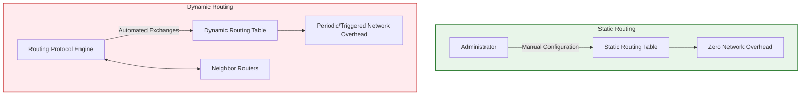
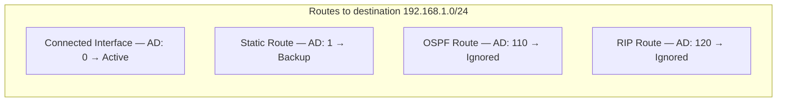

### 2.3 Static versus Dynamic Routing Paradigms

#### 1. Structural Comparison: Mechanics, Resource Utilization, and Limits

A core architectural decision when designing networks is choosing between static and dynamic routing. Both approaches differ significantly in how they populate routing tables and handle network changes.

* **Static Routing:** The network administrator manually defines route entries using static configuration commands. These routes are permanent and do not change unless an administrator manually updates them.
* **Dynamic Routing:** Routers run dynamic routing protocols (such as OSPF or RIP) to discover neighbors automatically, share topology information, and dynamically calculate the best paths.

---

#### 2. Comparative Evaluation Matrix

| Parameter | Static Routing | Dynamic Routing |
| :--- | :--- | :--- |
| **Configuration Complexity** | Simple in small networks; becomes unmanageable as the network grows. | Requires upfront design and protocol configuration; scales automatically. |
| **Topology Adaptation** | Manual intervention required. If a link fails, traffic is dropped until an administrator redirects it. | Automatic. Protocols quickly detect failures and reroute traffic along alternative paths. |
| **Route Selection Logic** | Pre-determined by the administrator. | Calculated algorithmically based on metrics (e.g., cost, hop count, bandwidth). |
| **CPU & Memory Overhead** | Negligible. No background processes or complex routing calculations required. | Higher overhead. Routers must run protocol engines, maintain topology databases, and calculate SPF trees. |
| **Link Bandwidth Consumption**| Zero. No routing protocol packets are transmitted over the physical medium. | Consumes bandwidth to transmit routing advertisements, hello packets, and state updates. |
| **Security Profile** | Higher. The network topology remains hidden from adjacent routers, preventing unauthorized advertisements. | Lower. Routers must authenticate routing updates to prevent routing loops, poisoning, or unauthorized route injection. |
| **Scalability** | Poor. Adding new subnets requires manual configuration across multiple devices. | Excellent. New subnets are automatically discovered and propagated throughout the network. |

---

#### 3. Administrative Distance (AD) and Metric Hierarchies

When a router learns multiple paths to the same destination network from different routing sources, it uses **Administrative Distance (AD)** to select the most reliable path. AD is a value from 0 to 255 that rates the trustworthiness of a routing source.

$$\text{Best Route Selection} = \min \left( \text{Administrative Distance} \right)$$

If there is still a tie because the AD values are identical, the router compares the protocol-specific **Metric** values.

##### Selection Process Example
A router receives three route advertisements for the same network `192.168.1.0/24`:
1. **OSPF:** Metric = `50`, AD = `110`
2. **RIPv2:** Metric = `2`, AD = `120`
3. **EIGRP:** Metric = `256000`, AD = `90`

The router selects the **EIGRP** route because it has the lowest Administrative Distance (90 < 110 < 120), even though its metric value is numerically higher. The metrics of different routing protocols are not compared because the protocols use different calculation methods.