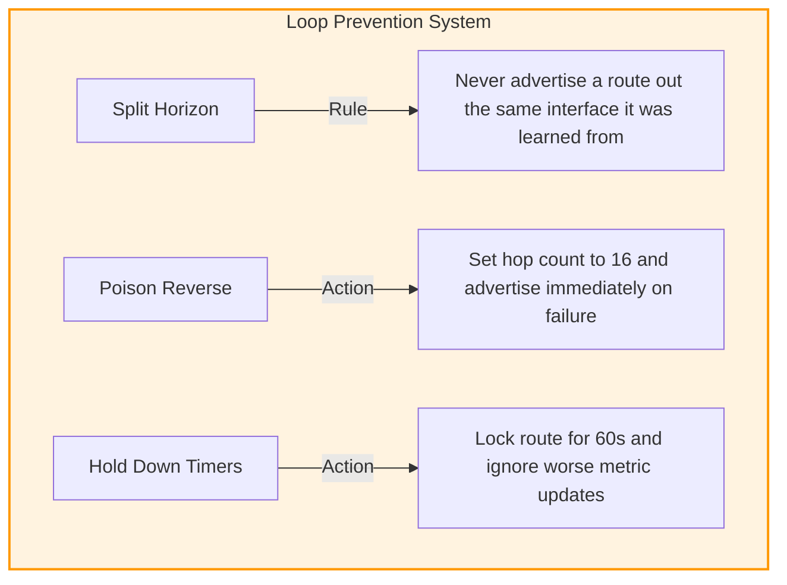

### 2.4 Distance Vector Protocols and Routing Information Protocol (RIPv2)

#### 1. Algorithmic Basis and Operating Mechanics
Distance-vector routing protocols rely on the Bellman-Ford algorithm to calculate the shortest path to remote networks. Known as "routing by rumor," distance-vector routers do not have a complete map of the entire network topology. Instead, each router relies on the routing tables of its directly connected neighbors to learn about remote networks and build its own routing table.

* **Periodic Updates:** Routers periodically transmit their entire routing table to directly connected neighbors.
* **Routing Updates:**
  * **RIPv1:** Broadcasts updates to the general destination IP `255.255.255.255` every 30 seconds.
  * **RIPv2:** Multicasts updates to the reserved destination IP `224.0.0.9` every 30 seconds.
* **Failure Discovery:** If a router does not receive an update from a neighbor within a designated period (the **Invalid Timer**, typically 180 seconds), it marks the associated routes as unreachable (setting the hop count to 16).

---

#### 2. Detailed Loop Prevention Mechanisms

Distance-vector protocols are prone to routing loops, especially during convergence after a link failure. To prevent loops, RIP implements several key mechanisms:

##### Split Horizon
* **Mechanism:** A router never advertises a route back out the same interface through which it learned that route. This prevents adjacent routers from bouncing packets back and forth, generating a local routing loop.

##### Poison Reverse
* **Mechanism:** When a router detects that a directly connected link has failed, it immediately poisons the route by setting its hop count to an infinite value (16) and advertises it to its neighbors. This immediately informs the network that the route is offline, bypassing the standard periodic update timer.

##### Hold-Down Timers (60 seconds)
* **Mechanism:** When a router receives an update indicating that a route is unreachable, it places that route into a hold-down state for 60 seconds. During this period, the router ignores any routing updates for that subnet that offer a worse metric than the original route. This allows the topology changes to propagate across the entire network and stabilize before the route is re-evaluated.

---

#### 3. RIPv1 vs. RIPv2 Comparative Matrix

| Protocol Characteristic | RIPv1 (RFC 1058) | RIPv2 (RFC 2453) |
| :--- | :--- | :--- |
| **Addressing Support** | **Classful Only.** Does not transmit subnet masks in routing updates. | **Classless.** Transmits subnet masks in routing updates. |
| **VLSM & CIDR Support**| Not supported. | Fully supported. |
| **Egress Frame Destination**| Broadcast IP (`255.255.255.255`). | Multicast IP (`224.0.0.9`). |
| **Authentication** | Not supported. | Supported (Plaintext or MD5 hashing). |
| **Routing Metric** | Hop Count (Max 15 hops; 16 is unreachable). | Hop Count (Max 15 hops; 16 is unreachable). |
| **Packet Size Overhead** | Standard 512-byte payload. | Optimized 144-byte routing payload. |
| **Network Efficiency** | Low. Floods local segments with broadcast traffic, forcing non-routing hosts to process the frames. | Moderate. Multicast updates are processed only by OSPF/RIP routers. |