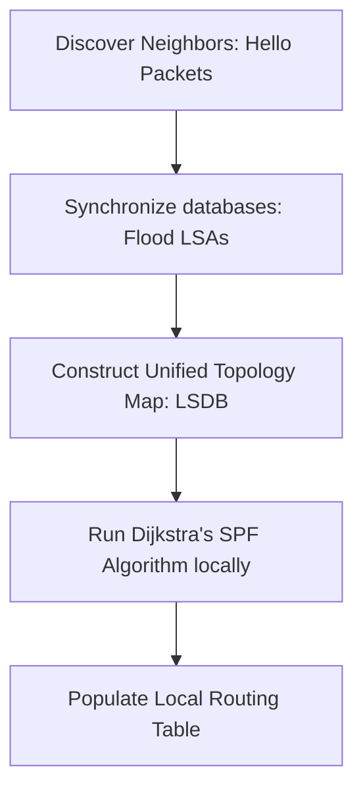
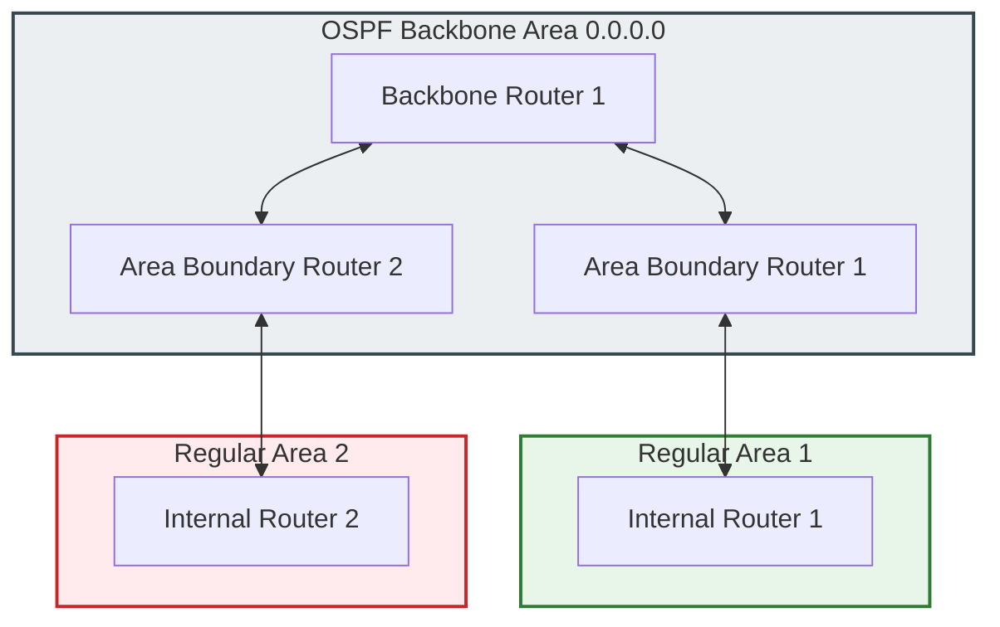

### 2.5 Link-State Routing and Open Shortest Path First (OSPF)

#### 1. Link-State Protocols and Dijkstra's Algorithm
Unlike distance-vector protocols, Link-State routing protocols (such as OSPF) require every router to maintain a complete topological map of the entire network. This map is stored in a synchronized **Link-State Database (LSDB)**. Every router in the routing domain runs Dijkstra's Shortest Path First (SPF) algorithm locally against this database to calculate the shortest path tree to all destinations, placing the optimal routes in its routing table.



##### 1. Neighbor Discovery
Routers periodically send multicast **Hello Packets** to discover adjacent routers and establish adjacencies.

##### 2. Link-State Advertisement (LSA) Flooding
Instead of sharing their entire routing table, routers flood **Link-State Advertisements (LSAs)** containing information about their directly connected links, interfaces, states, and costs. Routers forward these LSAs to all neighbors, ensuring that every router in the network domain builds an identical Link-State Database (LSDB).

##### 3. Local Shortest Path Calculations
Each router runs the Dijkstra algorithm independently, using itself as the root of the shortest path tree. This ensures rapid convergence, as routers can recalculate routes immediately after a network change without relying on neighboring routers.

---

#### 2. Hierarchical Multi-Area OSPF Design

To maintain performance as networks scale, OSPF supports a hierarchical design that divides a single routing domain into smaller, logical groups called **Areas**.



* **OSPF Area 0 (Backbone Area):** The central hub of a multi-area OSPF network. All other areas must connect directly to Area 0.0.0.0 to route traffic between areas.
* **Benefits of Multi-Area Design:**
  * **Smaller Routing Tables:** Routers within an area only need detailed topology information for their own area. Summary routes are used to advertise routes from other areas, which significantly reduces the size of the routing table.
  * **Isolated LSA Flooding:** LSAs are flooded only within the area they originate from. This limits the bandwidth and CPU overhead caused by network changes to the affected area.
  * **Reduced SPF Calculations:** If a link fails within Area 1, only the routers in Area 1 run the SPF algorithm to recalculate routes. Routers in Area 2 are unaffected.

---

#### 3. OSPF Router Roles

In a multi-area OSPF network, routers are classified into four distinct roles based on their position and routing responsibilities:

* **Internal Router (IR):** A router whose interfaces all reside within the same OSPF area.
* **Backbone Router (BR):** A router with at least one interface connected to OSPF Area 0.
* **Area Boundary Router (ABR):** A router that connects one or more regular OSPF areas to the backbone area (Area 0). ABRs maintain separate LSDBs for each connected area and generate summary routes to advertise across area boundaries.
* **Autonomous System Boundary Router (ASBR):** A router that connects the OSPF network to external networks, such as other autonomous systems or static routes. ASBRs redistribute these external routes into the OSPF domain.

---

#### 4. OSPF Cost Metric Calculations & The Gigabit Bottleneck

OSPF uses **Cost** as its routing metric. The cost of an interface is inversely proportional to its bandwidth:

$$\text{Cost} = \frac{\text{Reference Bandwidth}}{\text{Interface Bandwidth}}$$

By default, Cisco IOS uses a **Reference Bandwidth of $10^8 \text{ bps}$ ($100 \text{ Mbps}$)**.

##### 1. Calculating Default Costs
* **Ethernet ($10 \text{ Mbps}$):**
  $$\text{Cost} = \frac{100,000,000}{10,000,000} = 10$$
* **Fast Ethernet ($100 \text{ Mbps}$):**
  $$\text{Cost} = \frac{100,000,000}{100,000,000} = 1$$
* **Gigabit Ethernet ($1000 \text{ Mbps}$):**
  $$\text{Cost} = \frac{100,000,000}{1,000,000,000} = 0.1 \implies \mathbf{1}$$

##### 2. The Gigabit Bottleneck Problem
Because OSPF cost values must be integers, any calculated cost less than 1 is rounded up to 1. Using the default reference bandwidth ($100\text{ Mbps}$), Fast Ethernet ($100\text{ Mbps}$), Gigabit Ethernet ($1\text{ Gbps}$), and 10-Gigabit Ethernet ($10\text{ Gbps}$) interfaces are all assigned the same cost of 1. As a result, OSPF cannot differentiate between these links and may choose a slower path over a faster one.

##### 3. The Solution
To resolve this bottleneck, administrators must manually increase the OSPF reference bandwidth on all routers in the OSPF domain using the following command:

```ios
Router(config-router)# auto-cost reference-bandwidth 10000
```
This sets the reference bandwidth to $10\text{ Gbps}$ ($10,000\text{ Mbps}$), allowing OSPF to calculate unique, accurate costs for modern, high-speed interfaces:
* **Fast Ethernet:** Cost = 100
* **Gigabit Ethernet:** Cost = 10
* **10-Gigabit Ethernet:** Cost = 1