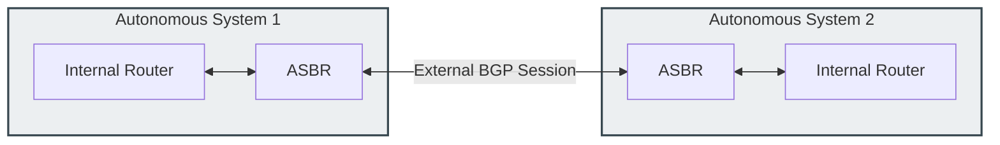
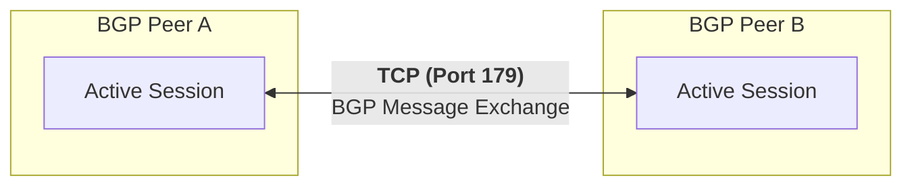

### 2.6 Path Vector Routing and Border Gateway Protocol (BGP)

#### 1. Autonomous Systems (AS) and Inter-Domain Routing
The global Internet is not a single, flat network. Instead, it is a massive collection of independent networks run by internet service providers, academic institutions, and large enterprises. These networks are called **Autonomous Systems (AS)**. An Autonomous System is a collection of IP networks managed by a single administrative authority that shares a unified routing policy.

* **Autonomous System Numbers (ASN):** Every AS is identified by a unique 16-bit or 32-bit number assigned by internet registries (such as IANA, RIRs, and LIRs).
  * **Public ASNs:** `1` to `64511` (routable across the global Internet).
  * **Private ASNs:** `64512` to `65535` (reserved for internal or private networks).
* **IGP vs. EGP Routing:**
  * **Interior Gateway Protocols (IGP):** Routing protocols (such as OSPF, RIP, or EIGRP) used to route traffic *within* a single Autonomous System.
  * **Exterior Gateway Protocols (EGP):** Routing protocols used to route traffic *between* different Autonomous Systems. **Border Gateway Protocol (BGP)** is the standard EGP used to connect the global Internet.

---

#### 2. Path-Vector Routing and Loop Prevention
Unlike OSPF (which uses a link-state topology map) or RIP (which relies on hop counts), BGP is a **Path-Vector Routing Protocol**.

* **Mechanism:** When a BGP router advertises a route to an external neighbor, it appends its own Autonomous System Number (ASN) to a list in the route advertisement called the **AS_PATH Attribute**. As the route advertisement propagates across different networks, each subsequent AS appends its own ASN to this list.
* **AS_PATH Example:** A route to network `192.0.2.0/24` has an AS_PATH attribute of `[64512, 64520, 64530]`. This tells the receiving router that the traffic must transit AS 64512, AS 64520, and AS 64530 to reach the destination network.
* **Path-Vector Loop Prevention:** When a BGP router receives a route advertisement, it inspects the AS_PATH list. If the router detects its own ASN within the list, it discards the update immediately. This simple mechanism prevents routing loops across Autonomous Systems.

---

#### 3. BGP Peer Sessions and Messages
BGP does not use automatic discovery protocols like OSPF to find adjacent routers. Instead, administrators must configure BGP neighbor relationships manually.

* **Reliable Connection Transport:** BGP neighbors (peers) establish a point-to-point connection over **TCP Port 179**. This leverages TCP's native flow control, error checking, and retransmission mechanisms, allowing BGP to run without implementing these features itself.
* **BGP Message Types:**
  * **Open (1):** Sent after the TCP connection is established to negotiate session parameters (such as ASN, hold time, and BGP identifiers) and initialize the peering relationship.
  * **Update (2):** The primary data-carrying message in BGP. It advertises new, reachable routes along with their path attributes, or withdraws routes that are no longer active.
  * **Notification (3):** Sent when a protocol error is detected. The router describes the error and immediately closes the TCP connection and BGP peer session.
  * **Keepalive (4):** Sent periodically between peers to verify that the neighbor remains online and active when no routing updates are being transmitted.