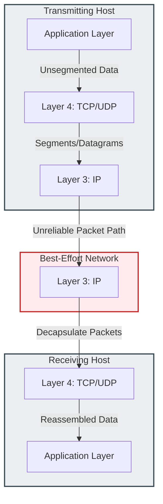

### 3.1 Transport Layer Role and Service Delivery Models

#### 1. Why We Need the Transport Layer
The network layer (IP) is a connectionless, unreliable "best-effort" delivery service. It routes packets across networks but does not guarantee that they will reach their destination safely, arrive in the correct order, or maintain an appropriate transmission speed. 

The Transport Layer (Layer 4) sits above the Network Layer to bridge these gaps. It provides logical communication between application processes running on different hosts, ensuring reliable data delivery, flow control, and error recovery.

---

#### 2. Key Responsibilities of the Transport Layer

##### 1. Segmentation & Reassembly
* Large application messages are split into smaller, manageable chunks called **Segments** (TCP) or **Datagrams** (UDP). At the receiving end, the transport layer reassembles these chunks into the original message before passing it to the application layer.

##### 2. Process Multiplexing & Demultiplexing
* Modern operating systems run multiple network-enabled applications simultaneously. The transport layer uses **Ports** to direct incoming network traffic to the correct application or service.

##### 3. Flow Control
* Prevents a fast sender from overwhelming a slow receiver with too much data. TCP uses a dynamic **sliding window** mechanism to adjust the sender's transmission rate based on the receiver's current buffer capacity.

##### 4. Congestion Control
* Prevents the network infrastructure (such as routers and switches) from becoming overwhelmed by too much traffic. TCP monitors packet loss and round-trip times to dynamically adjust its transmission speed, preventing network congestion collapses.

---

#### 3. TCP vs. UDP Architectural Comparison Matrix

| Protocol Characteristic | Transmission Control Protocol (TCP) | User Datagram Protocol (UDP) |
| :--- | :--- | :--- |
| **Connection Model** | **Connection-Oriented.** Requires a three-way handshake (`SYN` $\to$ `SYN-ACK` $\to$ `ACK`) to establish a session before transmitting data. | **Connectionless.** Sends packets immediately without establishing a connection. |
| **Reliability** | **Guaranteed Delivery.** The receiver must acknowledge received packets. Lost packets are automatically retransmitted. | **Best-Effort.** Does not track packet delivery or request retransmissions. |
| **Data Sequencing** | **Ordered Delivery.** Packs are assigned sequence numbers so the receiver can reassemble them in the correct order, discarding duplicates. | **Unordered.** Packets are delivered in the order they arrive, which may differ from the transmission order. |
| **Flow & Congestion Control**| Yes. Uses sliding window and congestion avoidance algorithms (e.g., slow start, congestion avoidance). | No. Sends data as fast as the application layer generates it. |
| **Header Overhead** | **High.** The TCP header is at least 20 bytes long to accommodate sequence numbers, ACKs, and window sizes. | **Low.** The UDP header is fixed at 8 bytes, which minimizes overhead. |
| **Transmission Speed** | Slower (due to connection setup, acknowledgments, and retransmission delays). | Faster (minimal packet processing and no transmission delays). |
| **Common Use Cases** | Web browsing (HTTP/HTTPS), Email (SMTP/IMAP), File Transfer (FTP), Secure Shell (SSH). | Real-time streaming (VoIP, IPTV), Video Conferencing, DNS queries, DHCP, TFTP. |