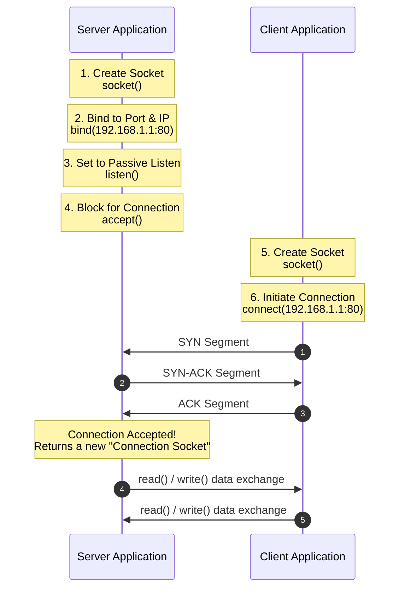

### 3.2 Logical Ports and Socket Programming Architecture

#### 1. Port Classifications and Ranges
Ports are 16-bit unsigned integers, providing a range of **`0` to `65535`**. They act as logical addresses that direct network traffic to specific application processes on a host.

```mermaid
block-beta
    columns 3
    block:WK["Well-Known Ports<br/>0 – 1023<br/>(System Services)"]:1
    block:Reg["Registered Ports<br/>1024 – 49151<br/>(Vendor Applications)"]:1
    block:Dyn["Dynamic / Private Ports<br/>49152 – 65535<br/>(Ephemeral Ports)"]:1
```

* **Well-Known Ports (`0` to `1023`):** Reserved for core network infrastructure services and system processes. On Unix-like systems, binding to these ports requires administrative privileges.
* **Registered Ports (`1024` to `49151`):** Assigned by IANA to specific vendor applications and third-party user services (e.g., port `1433` for Microsoft SQL Server).
* **Dynamic / Private Ports (`49152` to `65535`):** Also called **Ephemeral Ports**. Operating systems assign these ports dynamically to client applications to act as temporary source ports for outbound connections.

---

#### 2. Standard Service Port Reference Table

The following well-known ports are standard service mappings that are frequently tested in professional examinations:

| Port Number | Protocol | Associated Application / Protocol |
| :---: | :---: | :--- |
| **20** | TCP | File Transfer Protocol (FTP) - Data Connection |
| **21** | TCP | File Transfer Protocol (FTP) - Control Connection |
| **22** | TCP | Secure Shell (SSH) - Secure Remote Administration |
| **23** | TCP | Telnet - Unencrypted Remote Administration |
| **25** | TCP | Simple Mail Transfer Protocol (SMTP) - Mail Relay |
| **53** | UDP & TCP | Domain Name System (DNS) |
| **67** | UDP | Bootstrap Protocol (BOOTP) / DHCP - Server Listening Port |
| **68** | UDP | Bootstrap Protocol (BOOTP) / DHCP - Client Port |
| **69** | UDP | Trivial File Transfer Protocol (TFTP) |
| **80** | TCP | Hypertext Transfer Protocol (HTTP) - Unencrypted Web |
| **110** | TCP | Post Office Protocol Version 3 (POP3) - Mail Retrieval |
| **143** | TCP | Internet Message Access Protocol (IMAP) - Mail Retrieval |
| **161** | UDP | Simple Network Management Protocol (SNMP) |
| **443** | TCP | Hypertext Transfer Protocol Secure (HTTPS) - Encrypted Web |

---

#### 3. Sockets and Connection Identification

##### Sockets
A socket represents a single, unique endpoint in a network connection, defined as the combination of an IP address and a port number:

$$\text{Socket} = \langle \text{IP Address} : \text{Port Number} \rangle$$

##### The 5-Tuple Connection Key
To manage concurrent connections, an operating system identifies every active network connection using a unique **5-Tuple**:

$$\text{Connection Key} = \Big\langle \text{Protocol}, \text{Source IP}, \text{Source Port}, \text{Destination IP}, \text{Destination Port} \Big\rangle$$

Using this 5-tuple allows a server to host thousands of concurrent client sessions on a single port (such as port 80 or 443), because each client connection originates from a unique IP address or dynamic port.

---

#### 4. Socket Programming Interface & API State Flow

This sequence shows the step-by-step system calls made by client and server applications to establish a TCP connection:



---

#### 5. Listening Sockets vs. Connection Sockets

When programming socket connections on a server, the operating system manages two distinct types of sockets:

* **The Listening Socket:** A persistent socket bound to the server's configured port (e.g., port 80). Its sole purpose is to act as a passive listener, waiting for incoming connection requests. The server maintains only **one** listening socket per port.
* **The Connection Socket:** When the server accepts a connection request, the `accept()` system call creates a new, temporary socket specifically for that client session. This socket manages all subsequent data transfers for that client.
* **Why this is important:** Using separate sockets allows the server to continue listening for new connections on its main port while concurrently exchanging data with existing clients, preventing any interruption in service.