# Course: Image Processing and Analysis (Traitement et Analyse d'Images)

Welcome to the comprehensive master-level study guide for the **Image Processing and Analysis** course (Master I2A Pro, Pr. Gaceb Djamel). This book-grade set of notes is designed to be highly structured, mathematically rigorous, and exhaustive. It translates, clarifies, and builds upon all class slides, algorithms, mathematical derivations, and research insights presented during the lectures.

---

## Vault Architecture & Directory Map

To import this directly into your **Obsidian Vault**, maintain the following file structure. Ensure that you do not introduce underscores in folder or file names.

```text
Course/
├── Chapter 1. Image Fundamentals and Basic Notions/
│   ├── 1. Digital Image Definition and Representation.md
│   ├── 2. Spatial Resolution and Color Spaces.md
│   ├── 3. Pixel Neighborhoods and Distance Metrics.md
│   ├── 4. Image Histograms.md
│   ├── 5. Image Convolution and Boundary Effects.md
│   └── 6. Three Levels of Image Processing.md
├── Chapter 2. Image Preprocessing and Filtering/
│   ├── 1. Image Degradations and Noise Models.md
│   ├── 2. Linear Filtering in the Spatial Domain.md
│   ├── 3. Non Linear Spatial Filtering.md
│   ├── 4. Frequency Domain Filtering.md
│   ├── 5. Advanced Filtering Techniques.md
│   ├── 6. Contrast Enhancement.md
│   ├── 7. Adaptive and Local Contrast Methods.md
│   └── 8. Morphological Filtering.md
└── Chapter 3. Image Segmentation/
    ├── 1. Foundations of Segmentation.md
    ├── 2. Edge Based Segmentation.md
    ├── 3. Region Based Segmentation.md
    ├── 4. Binarization and Advanced Thresholding.md
    ├── 5. Connected Components and Shape Extraction.md
    ├── 6. Image Super Resolution.md
    └── 7. Evaluation Metrics for Image Segmentation.md
```

---

# Chapter 1. Image Fundamentals and Basic Notions

## 1. Digital Image Definition and Representation

### Mathematical Definition of an Image
A continuous physical image can be modeled as a two-dimensional continuous light intensity function:

$$f(x, y) \in \mathbb{R}^+$$

where $(x, y)$ represent the spatial coordinates in a two-dimensional Euclidean plane ($\mathbb{R}^2$), and the value of $f$ at any coordinate point $(x, y)$ is proportional to the intensity (brightness or luminance) of the image at that point. Because light is a form of physical energy, the intensity value is bounded:

$$0 < f(x, y) < \infty$$

### Digitization: Sampling and Quantization
To convert a continuous physical image $f(x, y)$ into a digital format that can be stored and processed by computers, two discretization steps are required:

1. **Sampling (Spatial Discretization):** This process digitizes the coordinate values $(x, y)$. The continuous coordinate space is divided into a discrete grid of points. The sampling rate determines the spatial resolution of the image.
2. **Quantization (Amplitude Discretization):** This process digitizes the continuous intensity values $f(x, y)$ into a finite set of discrete values. The intensity range is mapped to a discrete set of levels, typically represented as integers.

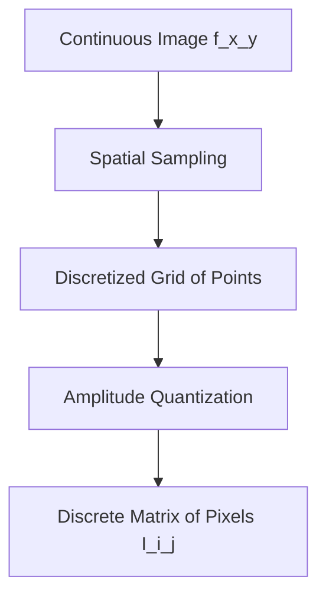

### Discrete Matrix Representation
After sampling and quantization, a digital image is represented as a two-dimensional matrix of size $M \times N$, where $M$ is the number of rows (height) and $N$ is the number of columns (width):

$$I(i, j) = \begin{pmatrix} 
I(0,0) & I(0,1) & \dots & I(0,N-1) \\
I(1,0) & I(1,1) & \dots & I(1,N-1) \\
\vdots & \vdots & \ddots & \vdots \\
I(M-1,0) & I(M-1,1) & \dots & I(M-1,N-1)
\end{pmatrix}$$

Each individual element in this matrix is called a **pixel** (picture element). The indices $(i, j)$ denote the discrete row and column positions of the pixel within the grid, and the scalar or vector value stored at $I(i, j)$ represents the quantized color or intensity of that pixel.

For a standard 8-bit grayscale image, the intensity of each pixel is represented by a single integer value $I(i, j) \in [0, 255]$, where `0` represents absolute black and `255` represents absolute white.

---

## 2. Spatial Resolution and Color Spaces

### Understanding Resolution and its Metrics
The representation of a physical object in a digital image is governed by two forms of resolution:

1. **Spatial Resolution:** The density of pixels per unit area. It is typically measured in **DPI (Dots Per Inch)** or **PPI (Pixels Per Inch)**, where $1 \text{ inch} = 2.54 \text{ cm}$. High spatial resolution means more pixels per unit area, resulting in sharper transitions and finer details. Low spatial resolution leads to pixelation (the visible grid effect).
2. **Quantization Resolution (Bit Depth):** The number of bits used to represent the intensity or color value of each pixel. If an image is quantized using $k$ bits, the number of gray levels $L$ is:

$$L = 2^k$$

For example, a $1$-bit image represents a binary image ($L=2$), whereas an $8$-bit image represents a standard grayscale image ($L=256$).

### Classical Color Models and Transformations

To mathematically represent color, different color spaces (or coordinate systems) are used depending on the physical medium (displays, printing, human perception, or processing efficiency).

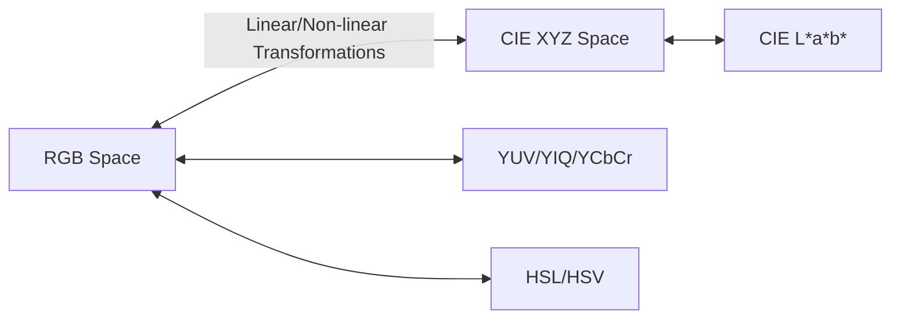

#### RGB (Red, Green, Blue)
An additive color model based on tri-chromatic theory. Colors are represented as vectors in a 3D Cartesian cube:

$$\mathbf{C}(i, j) = \begin{pmatrix} R(i, j) \\ G(i, j) \\ B(i, j) \end{pmatrix}$$

where $R, G, B \in [0, 255]$ for an 8-bit channel (totaling 24 bits per pixel, yielding $16.7 \times 10^6$ distinct colors).

#### CMY / CMYK (Cyan, Magenta, Yellow, Key/Black)
A subtractive color model used in printing. Cyan, magenta, and yellow are the exact complements of red, green, and blue, respectively. The conversion from normalized RGB to CMY is:

$$\begin{pmatrix} C \\ M \\ Y \end{pmatrix} = \begin{pmatrix} 1 \\ 1 \\ 1 \end{pmatrix} - \begin{pmatrix} R \\ G \\ B \end{pmatrix}$$

To save ink and improve the density of dark tones, a Key (black) channel is added:

$$K = \min(C, M, Y)$$

$$C' = \frac{C - K}{1 - K}, \quad M' = \frac{M - K}{1 - K}, \quad Y' = \frac{Y - K}{1 - K}$$

#### YUV / YIQ / YCbCr (Luminance and Chrominance)
These spaces separate the luminance (brightness, $Y$) from the chrominance (color information, $U, V$ or $Cb, Cr$). This separation is critical for image compression (e.g., JPEG, MPEG) and broadcasting, as the human visual system is far more sensitive to variations in brightness than in color. 

The standard transformation from RGB to YCbCr (ITU-R BT.601) is given by:

$$\begin{pmatrix} Y \\ Cb \\ Cr \end{pmatrix} = \begin{pmatrix} 0.299 & 0.587 & 0.114 \\ -0.1687 & -0.3313 & 0.5 \\ 0.5 & -0.4187 & -0.0813 \end{pmatrix} \begin{pmatrix} R \\ G \\ B \end{pmatrix} + \begin{pmatrix} 0 \\ 128 \\ 128 \end{pmatrix}$$

#### HSL / HSV (Hue, Saturation, Lightness / Value)
These models align more closely with human perception of color. 
* **Hue ($H$):** Represents the pure color dominant wavelength (expressed as an angle $[0, 360^\circ]$).
* **Saturation ($S$):** The purity or vividness of the color ($S \in [0, 1]$).
* **Value/Brightness ($V$ or $L$):** The intensity of the light ($V \in [0, 1]$).

#### CIE XYZ and CIE L\*a\*b\*
* **CIE XYZ:** A device-independent color space developed by the CIE in 1931 to model standard human color vision.
* **CIE L\*a\*b\*:** A perceptually uniform color space where:
  * $L^*$ represents lightness.
  * $a^*$ represents the green-to-red axis.
  * $b^*$ represents the blue-to-yellow axis.
  The Euclidean distance between two color vectors in $L^*a^*b^*$ corresponds directly to the color differences perceived by humans.

---

## 3. Pixel Neighborhoods and Distance Metrics

Let $P$ and $Q$ be two pixels in an image grid with integer coordinates $P(x_p, y_p)$ and $Q(x_q, y_q)$.

### Distance Metrics

To measure distances on a discrete integer grid, three fundamental metric functions are defined.

#### 1. Manhattan Distance ($d_1$ or City-Block Distance)
This metric restricts motion to horizontal and vertical steps only:

$$d_1(P, Q) = |x_p - x_q| + |y_p - y_q|$$

The locus of points at a Manhattan distance $\le r$ forms a diamond shape.

#### 2. Euclidean Distance ($d_2$)
The standard straight-line distance in Euclidean space:

$$d_2(P, Q) = \sqrt{(x_p - x_q)^2 + (y_p - y_q)^2}$$

The locus of points at a Euclidean distance $\le r$ forms a disk.

#### 3. Chessboard Distance ($d_\infty$)
This metric allows movements along horizontal, vertical, and diagonal directions, matching the movement of a king on a chessboard:

$$d_{\infty}(P, Q) = \max(|x_p - x_q|, |y_p - y_q|)$$

The locus of points at a Chessboard distance $\le r$ forms a square.

```mermaid
grid-layout
| | | | | |
| | | | | |
| | | | | |
| | | | | |
```
*(Mathematical note on metric bounds)*: On any discrete grid, these three metrics are ordered by the following inequality:

$$d_{\infty}(P, Q) \le d_2(P, Q) \le d_1(P, Q)$$

### Defining Pixel Neighborhoods
The neighborhood of a pixel $P$ is the set of pixels $Q$ whose distance from $P$ is less than or equal to a given threshold.

#### 4-Neighborhood ($V_4(P)$)
The set of four pixels sharing an edge with $P(x, y)$ at a Manhattan distance of $1$:

$$V_4(P) = \{(x \pm 1, y), (x, y \pm 1)\}$$

#### Diagonal Neighborhood ($V_D(P)$)
The set of four pixels sharing only a corner with $P(x, y)$:

$$V_D(P) = \{(x \pm 1, y \pm 1), (x \pm 1, y \mp 1)\}$$

#### 8-Neighborhood ($V_8(P)$)
The union of the 4-neighborhood and the diagonal neighborhood. This set contains all pixels at a chessboard distance of $1$ from $P(x, y)$:

$$V_8(P) = V_4(P) \cup V_D(P)$$

```text
4-Neighborhood:          Diagonal:            8-Neighborhood:
     [ ]                    [X]   [X]             [X] [ ] [X]
 [ ] [P] [ ]                    [P]               [ ] [P] [ ]
     [ ]                    [X]   [X]             [X] [ ] [X]
```

---

## 4. Image Histograms

### Mathematical Definition
The histogram of a grayscale image is a discrete function $H(r)$ that represents the distribution of pixel intensities. For an image with gray levels in the range $[0, L-1]$, the histogram is defined as:

$$H(r_k) = n_k$$

where $r_k$ is the $k$-th gray level ($k \in [0, L-1]$), and $n_k$ is the total number of pixels in the image that have intensity $r_k$.

### Normalized Histograms and Probability Densities
To make the histogram independent of the physical dimensions of the image, we divide each bin by the total number of pixels $N$ (where $N = M \times N$):

$$p(r_k) = \frac{n_k}{N}$$

Here, $p(r_k)$ acts as an empirical probability density function (PDF). It represents the probability of a randomly selected pixel having the intensity $r_k$. By definition:

$$\sum_{k=0}^{L-1} p(r_k) = 1$$

### The Cumulative Histogram
The cumulative histogram $H_c(r_k)$ sums the pixel counts up to a given intensity level:

$$H_c(r_k) = \sum_{j=0}^{k} n_j$$

Dividing this by the total number of pixels $N$ yields the Cumulative Distribution Function (CDF):

$$P_c(r_k) = \sum_{j=0}^{k} p(r_j)$$

where $P_c(r_k) \in [0, 1]$ represents the probability that a pixel has an intensity less than or equal to $r_k$.

---

## 5. Image Convolution and Boundary Effects

### Discrete 2D Convolution Formulation
In image processing, linear spatial filtering is implemented using 2D discrete convolution. Let $f(x, y)$ be an input image of size $M \times N$, and let $h(i, j)$ be a spatial filter kernel (also called a mask or template) of size $2K+1 \times 2L+1$. The output filtered image $g(x, y)$ is defined mathematically as:

$$g(x, y) = f(x, y) * h(x, y) = \sum_{i=-K}^{K} \sum_{j=-L}^{L} f(x - i, y - j) h(i, j)$$

> **Important Distinction:** In many practical deep learning frameworks and image libraries, the operation performed is technically **cross-correlation** rather than convolution. Cross-correlation does not flip the kernel:
> $$g(x, y) = \sum_{i=-K}^{K} \sum_{j=-L}^{L} f(x + i, y + j) h(i, j)$$
> For symmetric kernels (like Gaussian or Laplacian filters), the mathematical results of convolution and cross-correlation are identical.

### Mathematical Walkthrough of a 2D Convolution Step
Let's compute the convolution output $g(x, y)$ for a target pixel at position $(x, y)$ with an input local image neighborhood and a $3 \times 3$ kernel.

#### Step 1: Flip the Kernel (if performing mathematically exact convolution)
If our kernel is:

$$h(i, j) = \begin{pmatrix} w_1 & w_2 & w_3 \\ w_4 & w_5 & w_6 \\ w_7 & w_8 & w_9 \end{pmatrix}$$

Flipping both horizontally and vertically yields:

$$h_{\text{flipped}}(i, j) = \begin{pmatrix} w_9 & w_8 & w_7 \\ w_6 & w_5 & w_4 \\ w_3 & w_2 & w_1 \end{pmatrix}$$

#### Step 2: Overlap and Perform Element-wise Multiplication
Align the center of the flipped kernel $w_5$ with the input pixel $f(x, y)$:

$$g(x, y) = w_9 f(x-1, y-1) + w_8 f(x-1, y) + w_7 f(x-1, y+1) + w_6 f(x, y-1) + w_5 f(x, y) + \dots$$

```text
Image Neighborhood:                      Flipped Mask Weights:
f(x-1, y-1)  f(x-1, y)  f(x-1, y+1)           w_9   w_8   w_7
f(x, y-1)    f(x, y)    f(x, y+1)      ×      w_6   w_5   w_4
f(x+1, y-1)  f(x+1, y)  f(x+1, y+1)           w_3   w_2   w_1
```

### Boundary (Edge) Effects and Padding Solutions
When applying a kernel of size $W \times H$ to an image near its outer borders, the kernel extends beyond the boundaries of the image, where pixel values are undefined.

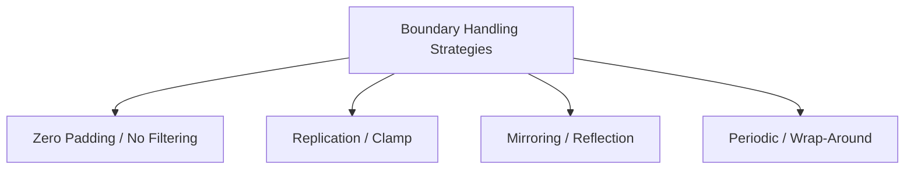

* **Zero Padding (Constant Padding):** The missing out-of-boundary values are filled with zeros:
  
  $$f(x, y) = 0 \quad \text{for } x < 0 \text{ or } x \ge M$$
  
  *Pros:* Simple to implement.  
  *Cons:* Introduces artificial dark borders (high-frequency edges) that distort high-pass filters.

* **Replication (Clamp Padding):** Out-of-boundary values are filled by replicating the nearest edge pixel:
  
  $$f(-1, y) = f(0, y)$$

* **Mirroring (Reflection Padding):** The image is reflected across its outer border:
  
  $$f(-1, y) = f(1, y)$$
  
  *Pros:* Preserves intensity continuity, minimizing boundary artifacts.

---

## 6. Three Levels of Image Processing

Image processing and computer vision systems are traditionally divided into three levels of abstraction, categorized by their input and output representations.

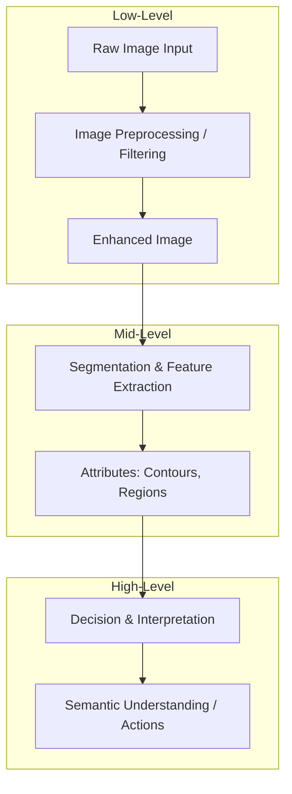

### 1. Low-Level Processing (Bas niveau)
* **Inputs:** Raw pixels.
* **Outputs:** Pixels.
* **Objective:** Improve image quality, reduce noise, or convert the image into a more suitable format.
* **Key Tasks:** Noise reduction (spatial/frequency filtering), contrast enhancement, binarization, morphological filtering, image restoration.

### 2. Mid-Level Processing (Niveau intermédiaire)
* **Inputs:** Pixels.
* **Outputs:** Attributes, segments, vectors, or boundaries.
* **Objective:** Extract structural features and group pixels into meaningful entities.
* **Key Tasks:** Image segmentation, contour extraction, region classification, shape description, connected component labeling.

### 3. High-Level Processing (Haut niveau)
* **Inputs:** Extracted features, attributes, and regions.
* **Outputs:** Decisions, labels, predictions, or physical actions.
* **Objective:** Emulate human vision by making decisions based on the extracted image content.
* **Key Tasks:** Object recognition, facial identification, scene classification, anomaly detection, semantic feature matching.

---

# Chapter 2. Image Preprocessing and Filtering

## 1. Image Degradations and Noise Models

### Mathematical Model of Degradation
An observed degraded digital image $G(x, y)$ can be modeled mathematically as the result of a degradation system $H$ and an additive noise term $\eta(x, y)$ acting on the original clean image $F(x, y)$:

$$G(x, y) = H\{F(x, y)\} + \eta(x, y)$$

If $H$ is a linear, space-invariant process (such as motion blur or atmospheric distortion), the degradation can be modeled as a spatial convolution:

$$G(x, y) = F(x, y) * h(x, y) + \eta(x, y)$$

where $h(x, y)$ is the **Point Spread Function (PSF)** of the degradation system.

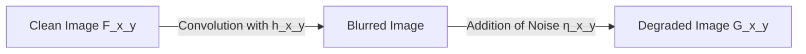

### Common Spatial Noise Models
Noise is introduced during image acquisition (sensor heating, low lighting) or transmission (electronic interference).

#### 1. Additive Gaussian Noise
This model represents electronic circuit noise and sensor noise under low-light conditions. The noise values at each pixel are drawn from a zero-mean Gaussian distribution:

$$p(z) = \frac{1}{\sqrt{2\pi}\sigma} \exp\left( -\frac{(z - \mu)^2}{2\sigma^2} \right)$$

where $z$ represents the intensity variation, $\mu$ is the mean (typically $0$), and $\sigma$ is the standard deviation.

#### 2. Multiplicative Noise (Speckle Noise)
Common in coherent imaging systems like radar (SAR) or ultrasound. The noise is proportional to the local signal intensity:

$$G(x, y) = F(x, y) \cdot \eta(x, y)$$

#### 3. Impulse Noise (Salt-and-Pepper Noise)
This model represents transmission errors, bad pixels, or dust particles on the sensor. Pixels are randomly replaced by minimum or maximum intensity values:

$$P(z) = \begin{cases} 
P_a & \text{for } z = a \quad \text{(pepper, black: 0)} \\ 
P_b & \text{for } z = b \quad \text{(salt, white: 255)} \\
1 - (P_a + P_b) & \text{for unchanged pixels}
\end{cases}$$

### Quantifying Restoration Quality: MSE and PSNR
To evaluate the performance of a denoising algorithm, we compare the restored image $\hat{F}$ with the original clean reference image $F$.

#### Mean Squared Error (MSE)
The average squared difference between the restored and reference images:

$$\text{MSE}(F, \hat{F}) = \frac{1}{M \times N} \sum_{i=0}^{M-1} \sum_{j=0}^{N-1} [F(i, j) - \hat{F}(i, j)]^2$$

#### Peak Signal-to-Noise Ratio (PSNR)
The ratio between the maximum possible power of the signal and the power of corrupting noise, expressed in decibels (dB):

$$\text{PSNR} = 10 \log_{10} \left( \frac{I_{\text{max}}^2}{\text{MSE}(F, \hat{F})} \right) = 20 \log_{10} \left( \frac{I_{\text{max}}}{\sqrt{\text{MSE}(F, \hat{F})}} \right)$$

where $I_{\text{max}}$ is the maximum possible pixel value (e.g., $255$ for an 8-bit image).
* A high PSNR (typically $>30\text{ dB}$) indicates a restored image of high visual quality.
* If $\text{MSE} \to 0$, then $\text{PSNR} \to \infty$.

---

## 2. Linear Filtering in the Spatial Domain

Linear filtering operations are implemented by convolving the image with a spatial mask.

### 1. Mean (Box) Filter
A low-pass filter used for smoothing and noise reduction. It replaces each pixel value with the average intensity of its local neighborhood. A standard $3 \times 3$ normalized box filter is defined as:

$$H_{\text{mean}} = \frac{1}{9} \begin{pmatrix} 1 & 1 & 1 \\ 1 & 1 & 1 \\ 1 & 1 & 1 \end{pmatrix}$$

#### Trade-offs
* **Pros:** Highly efficient, easy to compute.
* **Cons:** Blurs sharp edges and fine details. It is also ineffective at handling impulse (salt-and-pepper) noise, as outlier values distort the computed mean.

---

### 2. Gaussian Filter
The Gaussian filter is a rotationally symmetric low-pass filter. It weights neighboring pixels based on their distance from the central pixel, preserving details better than a box filter.

The continuous 2D Gaussian function is defined as:

$$G(x, y) = \frac{1}{2\pi\sigma^2} \exp\left( -\frac{x^2 + y^2}{2\sigma^2} \right)$$

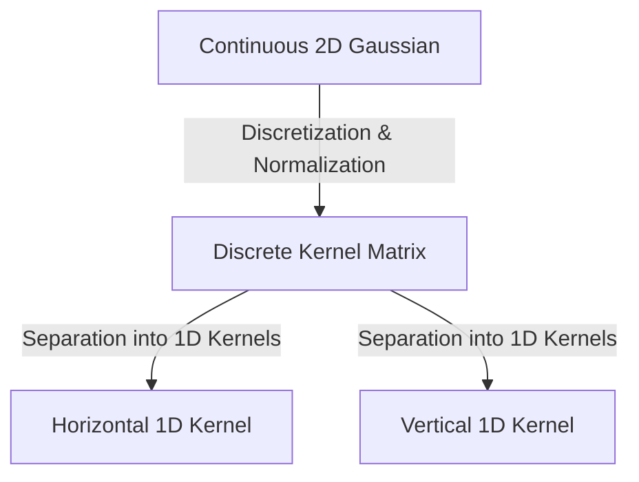

To create a discrete $5 \times 5$ Gaussian kernel with $\sigma = 1.4$, we sample the continuous function at integer coordinates $(x, y) \in [-2, 2] \times [-2, 2]$ and normalize the sum to $1$:

$$H_{\text{Gauss}} = \frac{1}{115} \begin{pmatrix} 
2 & 4 & 5 & 4 & 2 \\ 
4 & 9 & 12 & 9 & 4 \\ 
5 & 12 & 15 & 12 & 5 \\ 
4 & 9 & 12 & 9 & 4 \\ 
2 & 4 & 5 & 4 & 2 
\end{pmatrix}$$

#### The Principle of Kernel Separability
An important mathematical property of the 2D Gaussian function is its **separability**. A 2D Gaussian can be factored into the product of two 1D Gaussian functions:

$$G(x, y) = G_1(x) \cdot G_2(y) = \left( \frac{1}{\sqrt{2\pi}\sigma} \exp\left( -\frac{x^2}{2\sigma^2} \right) \right) \times \left( \frac{1}{\sqrt{2\pi}\sigma} \exp\left( -\frac{y^2}{2\sigma^2} \right) \right)$$

Convolving an image with a separable 2D filter of size $W \times W$ can be decomposed into two consecutive 1D convolutions: first convolving the rows with a $1 \times W$ horizontal kernel, then convolving the columns of the result with a $W \times 1$ vertical kernel.

```text
2D Convolution (Standard):
[ Image ]  ⊗  [ W × W Kernel ]  ===>  Requires W² multiplications per pixel.

Separated Convolution:
[ Image ]  ⊗  [ 1 × W Kernel ]  ===>  [ Intermediate ]  ⊗  [ W × 1 Kernel ]
This reduces the computational cost to 2W multiplications per pixel.
```

*For a $5 \times 5$ kernel:* Standard 2D convolution requires **25** multiplications per pixel, whereas separable convolution requires only $5 + 5 =$ **10** multiplications, significantly improving processing speed.

---

## 3. Non-Linear Spatial Filtering

Non-linear spatial filters modify pixel values using operations that cannot be expressed as weighted linear combinations of neighbors. These filters are highly effective at removing noise while preserving sharp edges.

### 1. Median Filter (Order-Statistic Filter)
The median filter replaces the intensity of the central pixel with the median value of the sorted intensities within its local neighborhood:

$$g(x, y) = \text{median} \{ f(x - i, y - j) \mid (i, j) \in S \}$$

```text
Let a 3x3 neighborhood centered on pixel value 150 be:
[ 19   23   42 ]
[ 11  150   31 ]
[ 60   25   12 ]

Step 1: Extract and sort the array of values:
[11, 12, 19, 23, 25, 31, 42, 60, 150]

Step 2: Find the median value (the 5th element in a 9-element array):
Median = 25

Step 3: Replace the central value 150 with 25.
The outlier value 150 (impulse noise) is successfully removed.
```

#### Key Advantages
* Extremely effective at removing impulse (salt-and-pepper) noise.
* Unlike linear smoothing filters, it preserves sharp transitions and edges because the median value is always selected from the existing pixel values in the neighborhood, preventing the creation of blurred intermediate intensities.

---

### 2. Adaptive Mean Filter
This filter dynamically adjusts its behavior based on the local statistics of the neighborhood, balancing noise reduction and edge preservation. Let the input pixel under the window $S$ of size $L$ be $A[i, j]$, and let its neighbors be represented by $a_k$. The output $C[i, j]$ is given by:

$$C[i, j] = \frac{\sum_{k=1}^{L} w(|a_k - A[i, j]|) \cdot a_k}{\sum_{k=1}^{L} w(|a_k - A[i, j]|)}$$

The weighting function $w(x)$ acts as a threshold-based gate:

$$w(x) = \begin{cases} 1 & \text{if } |x| \le t \\ 0 & \text{otherwise} \end{cases}$$

where $t$ is a predefined threshold. If a neighboring pixel's intensity differs from the central pixel by more than $t$, it is considered an outlier or part of a different region and is excluded from the average calculation.

---

### 3. Min-Max DNL (Dynamic Noise Limiting) Filter
The Min-Max filter operates on the assumption that a pixel's value should be bounded by the range of its neighbors (excluding itself).
1. Define a neighborhood $S$ around the pixel $P(x, y)$, excluding $P$ itself.
2. Calculate the local minimum and maximum values:
   
   $$\text{Min} = \min \{ Q \in S \}, \quad \text{Max} = \max \{ Q \in S \}$$

3. Apply the thresholding rule:
   
   $$P_{\text{new}}(x, y) = \begin{cases}
   P(x, y) & \text{if } \text{Min} \le P(x, y) \le \text{Max} \\
   \text{Min} & \text{if } P(x, y) < \text{Min} \\
   \text{Max} & \text{if } P(x, y) > \text{Max}
   \end{cases}$$

This approach is highly effective at removing impulse noise with minimal blurring of sharp details.

---

## 4. Frequency Domain Filtering

Filtering in the frequency domain is based on the **Convolution Theorem**, which states that spatial convolution is mathematically equivalent to element-wise multiplication in the frequency domain:

$$f(x, y) * h(x, y) \iff F(u, v) \cdot H(u, v)$$

### Discrete Fourier Transform (DFT)
For an $N \times N$ digital image, the Discrete Fourier Transform $F(u, v)$ is defined as:

$$F(u, v) = \sum_{x=0}^{N-1} \sum_{y=0}^{N-1} f(x, y) e^{-i 2\pi \left( \frac{ux + vy}{N} \right)}$$

The Inverse Discrete Fourier Transform (IDFT) reconstructs the spatial image:

$$f(x, y) = \frac{1}{N^2} \sum_{u=0}^{N-1} \sum_{v=0}^{N-1} F(u, v) e^{i 2\pi \left( \frac{ux + vy}{N} \right)}$$

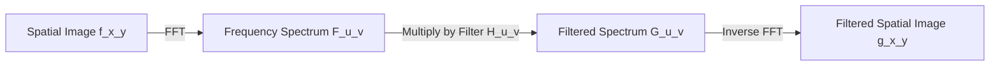

### Frequency Domain Filters
* **Low-Pass Filter (LPF):** Attenuates high frequencies while passing low frequencies. It removes high-frequency noise but blurs edges.
* **High-Pass Filter (HPF):** Attenuates low frequencies while passing high frequencies. It highlights sharp transitions and edges but increases noise.
* **Band-Reject (Notch) Filter:** Attenuates a specific range of frequencies. This is highly effective for removing periodic patterns or structured noise.

---

## 5. Advanced Filtering Techniques

These advanced algorithms are designed to denoise images while preserving sharp, meaningful edges and transitions.

### 1. Bilateral Filter
The bilateral filter is a non-linear, edge-preserving smoothing filter. While standard Gaussian filtering only considers the spatial distance between pixels, the bilateral filter considers both **spatial proximity** and **radiometric similarity** (intensity differences).

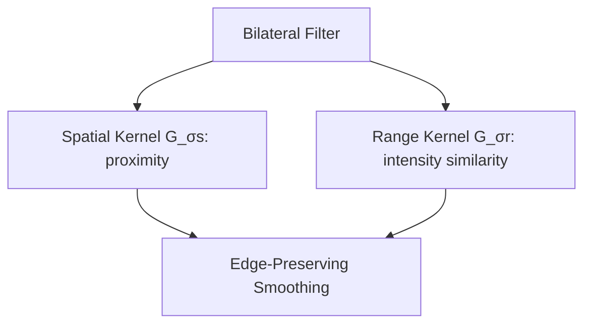

The filtered intensity value at pixel $p$ is defined as:

$$I_{\text{filtered}}(p) = \frac{1}{W_p} \sum_{q \in S} I(q) G_{\sigma_s}(\|p - q\|) G_{\sigma_r}(|I(p) - I(q)|)$$

where:
* $S$ is the neighborhood centered at $p$.
* $G_{\sigma_s}(\|p - q\|) = \exp\left( -\frac{\|p - q\|^2}{2\sigma_s^2} \right)$ is the **spatial domain kernel**, which decreases with spatial distance $\|p - q\|$.
* $G_{\sigma_r}(|I(p) - I(q)|) = \exp\left( -\frac{|I(p) - I(q)|^2}{2\sigma_r^2} \right)$ is the **range domain kernel**, which decreases with intensity difference $|I(p) - I(q)|$.
* $W_p$ is the normalization factor ensuring the filter weights sum to $1$:

$$W_p = \sum_{q \in S} G_{\sigma_s}(\|p - q\|) G_{\sigma_r}(|I(p) - I(q)|)$$

#### Analysis of Parameters
* **$\sigma_s$ (Spatial Parameter):** Larger values smooth larger features.
* **$\sigma_r$ (Range Parameter):** Larger values allow the filter to combine pixels with wider intensity differences, making it behave more like a standard Gaussian filter. If $\sigma_r$ is small, pixels across a sharp edge (which have large intensity differences) are not averaged, preserving the boundary.

---

### 2. Anisotropic Diffusion (Perona-Malik Equation)
Anisotropic diffusion removes image noise through a scale-space process described by a non-linear Partial Differential Equation (PDE). Unlike standard isotropic diffusion (which behaves like Gaussian blurring and degrades edges), anisotropic diffusion adapts the diffusion rate based on the local image gradient.

The continuous diffusion equation proposed by Perona and Malik (1990) is:

$$\frac{\partial I}{\partial t} = \text{div}\Big( c\big(\|\nabla I\|\big) \nabla I \Big)$$

where $\text{div}$ is the divergence operator, $\nabla I$ is the spatial gradient, and $c\big(\|\nabla I\|\big)$ is the **diffusion coefficient function**.

Perona and Malik proposed two functions for the diffusion coefficient:

$$1. \ c\big(\|\nabla I\|\big) = \exp\left( -\left(\frac{\|\nabla I\|}{K}\right)^2 \right)$$

This function favors high-contrast edges over low-contrast ones.

$$2. \ c\big(\|\nabla I\|\big) = \frac{1}{1 + \left(\frac{\|\nabla I\|}{K}\right)^2}$$

This function favors wider regions over sharper, high-contrast borders.

The parameter $K$ controls the sensitivity to edges. 
* In homogeneous areas where the gradient is low ($\|\nabla I\| \to 0$), $c\big(\|\nabla I\|\big) \to 1$, leading to isotropic smoothing.
* At sharp boundaries where the gradient is high ($\|\nabla I\| \gg K$), $c\big(\|\nabla I\|\big) \to 0$, stopping the diffusion process and preserving the edge.

---

### 3. Mean-Shift Filtering
Mean-Shift is a non-parametric clustering and segmentation algorithm. It treats pixel intensity and spatial coordinates as a multi-dimensional probability density function and iteratively shifts each pixel toward the local mode (the peak of the density function).

For each pixel at position $x$, the Mean-Shift vector $m(x)$ is calculated as:

$$m(x) = \frac{\sum_{x_i \in S_h} x_i g\left( \big\|\frac{x - x_i}{h}\big\|^2 \right)}{\sum_{x_i \in S_h} g\left( \big\|\frac{x - x_i}{h}\big\|^2 \right)} - x$$

where:
* $S_h$ is a high-dimensional sphere of radius $h$ centered at $x$.
* $g(s) = -k'(s)$ is the derivative of the selected kernel profile.

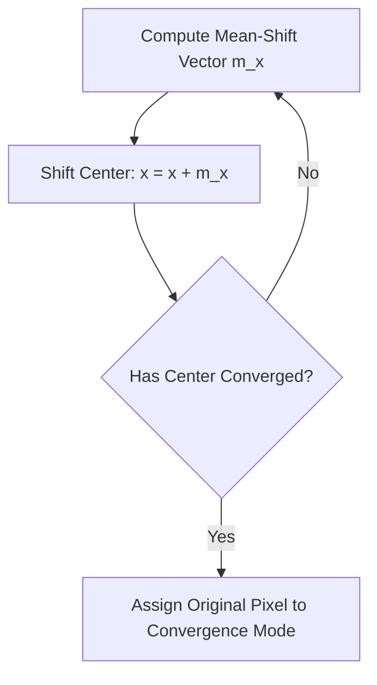

This iterative shifting groups pixels with similar intensities and spatial coordinates, producing a flattened, segmented image with sharp boundaries and no noise.

---

### 4. Gabor Filter
A linear filter whose impulse response is a Gaussian function modulated by a sinusoidal plane wave. It is highly effective for texture analysis and edge detection, matching the spatial frequency and orientation selectivity of the human visual system.

The complex 2D Gabor filter function is defined as:

$$G(x, y; \lambda, \theta, \psi, \sigma, \gamma) = \exp\left( -\frac{x'^2 + \gamma^2 y'^2}{2\sigma^2} \right) \exp\left( i \left( 2\pi\frac{x'}{\lambda} + \psi \right) \right)$$

where:

$$x' = x \cos\theta + y \sin\theta, \quad y' = -x \sin\theta + y \cos\theta$$

* **$\theta$:** The orientation of the parallel stripes of the Gabor function.
* **$\lambda$:** The wavelength of the sinusoidal factor (controls the frequency scale).
* **$\psi$:** The phase offset.
* **$\sigma$:** The standard deviation of the Gaussian envelope.
* **$\gamma$:** The spatial aspect ratio (defines the ellipticity of the support).

---

### 5. Nagao Adaptive Edge-Preserving Filter
The Nagao filter is designed to smooth flat regions without blurring edges. It operates by analyzing a $5 \times 5$ window centered on pixel $P$. The window is divided into nine overlapping sub-regions of $7$ pixels each, oriented in different directions around the center.

```text
Nagao Sub-regions (9 sectors of 7 pixels each):
   [1] [1] [1]              [2] [2]                  [3] [3]
   [1] [P] [1]          [2] [P] [2]              [3] [P] [3]
   [1] [1] [1]      [2] [2]                  [3] [3]
   Sector 1            Sector 2 (Diagonal)      Sector 3 (Horizontal)
```

The filter evaluates the variance of each sub-region:
1. For each of the nine sub-regions $R_i \ (i=1 \dots 9)$, compute the local mean $\mu_i$ and variance $\sigma_i^2$.
2. Identify the sub-region with the lowest variance:
   
   $$R_{\text{target}} = \arg\min_{i} (\sigma_i^2)$$

3. Replace the central pixel's value with the mean of this target sub-region:
   
   $$P_{\text{new}} = \mu_{\text{target}}$$

#### Why This Works
The sub-region with the lowest variance is the most homogeneous, meaning it does not cross an edge. By replacing the central pixel with the average of this region, the filter performs smoothing within the region while avoiding averaging across boundaries, keeping edges sharp.

---

## 6. Contrast Enhancement

### 1. Contrast Stretching (Expansion Dynamique)
If an image is captured under poor lighting conditions, its gray levels may span only a narrow range $[X_{\text{min}}, X_{\text{max}}]$ within the full dynamic range $[Y_{\text{min}}, Y_{\text{max}}]$. Contrast stretching linearly maps these intensities to the full range using a transformation function:

$$Y(i, j) = \alpha + \beta X(i, j)$$

To stretch the intensity values to the standard range $[0, 255]$, the formula is:

$$Y(i, j) = \frac{255}{X_{\text{max}} - X_{\text{min}}} \left( X(i, j) - X_{\text{min}} \right)$$

To handle outliers, we can clip values that fall outside the target bounds:

$$Y(i, j) = \begin{cases} 
0 & \text{if } Y(i, j) < 0 \\ 
255 & \text{if } Y(i, j) > 255 \\ 
Y(i, j) & \text{otherwise} 
\end{cases}$$

---

### 2. Global Histogram Equalization (HE)
This non-linear method redistributes pixel intensities to produce a uniform histogram, spreading out high-density intensity ranges and improving overall contrast.

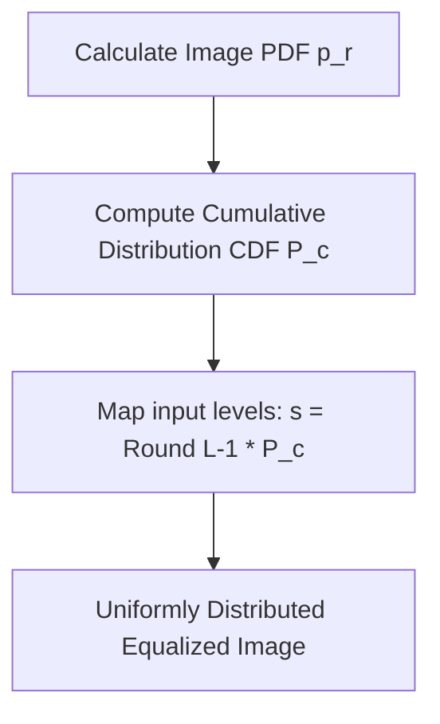

#### Step-by-Step Derivation

**Step 1:** Calculate the probability density function (PDF) for each intensity level $r_k$:

$$p_r(r_k) = \frac{n_k}{N}, \quad k = 0, 1, \dots, L-1$$

**Step 2:** Compute the Cumulative Distribution Function (CDF):

$$T(r_k) = (L-1) \sum_{j=0}^{k} p_r(r_j) = \frac{L-1}{N} \sum_{j=0}^{k} n_j$$

**Step 3:** Map the original gray level $r_k$ to the new equalized value $s_k$ by rounding to the nearest integer:

$$s_k = \text{round}\Big( T(r_k) \Big)$$

---

## 7. Adaptive and Local Contrast Methods

### 1. Adaptive Histogram Equalization (AHE)
Standard global histogram equalization uses a single mapping function across the entire image, which can over-amplify noise or fail to improve contrast in local regions with varying lighting conditions.

Adaptive Histogram Equalization addresses this by computing the histogram and mapping function within a moving localized window (e.g., $8 \times 8$ or $16 \times 16$ pixels) centered at each pixel.

#### Step-by-Step Algorithm
1. Define a sliding neighborhood window $S$ of size $W \times W$.
2. Center the window at pixel coordinate $(x, y)$.
3. Compute the local histogram and cumulative distribution function (CDF) for the pixels within $S$.
4. Equalize the intensity of the central pixel $f(x, y)$ using this local CDF.
5. Move the window to the next pixel and repeat.

#### Limitations
While AHE improves local contrast, it can over-amplify noise in homogeneous regions where the local variance is low.

---

### 2. Contrast Limited Adaptive Histogram Equalization (CLAHE)
CLAHE addresses AHE's noise amplification problem by clipping high peaks in the local histogram before computing the CDF.

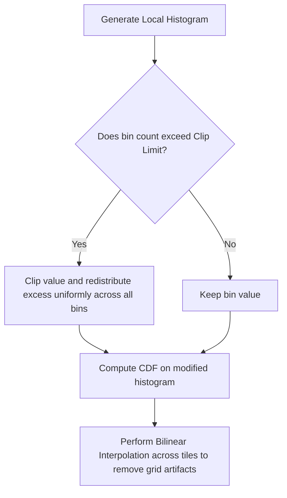

#### Step-by-Step Algorithm

**Step 1: Tile Division**  
Divide the image into non-overlapping grid blocks called tiles (commonly $8 \times 8$ pixels).

**Step 2: Histogram Clipping**  
Compute the histogram for each tile. If any bin exceeds a predefined threshold called the **Clip Limit** ($N_{\text{clip}}$), the excess pixels are clipped. The total excess $E_{\text{total}}$ is calculated as:

$$E_{\text{total}} = \sum_{h=0}^{L-1} \max(0, H(h) - N_{\text{clip}})$$

The excess $E_{\text{total}}$ is then redistributed uniformly across all histogram bins:

$$H_{\text{redistributed}}(h) = \min\left( H(h), N_{\text{clip}} \right) + \frac{E_{\text{total}}}{L}$$

**Step 3: Equalization**  
Compute the cumulative distribution function (CDF) on this clipped, redistributed histogram to determine the mapping function for each tile.

**Step 4: Bilinear Interpolation**  
To prevent visible seams and grid artifacts between adjacent tiles, the intensity of each pixel is determined using bilinear interpolation of the mapping functions from the four nearest neighboring tiles.

---

## 8. Morphological Filtering

Mathematical morphology processes binary and grayscale images based on shape, using a probe called a **Structuring Element (SE)**. Let $A$ represent the image set and $B$ represent the structuring element.

```text
Structuring Element (SE) Examples (3x3):
   [1] [1] [1]              [0] [1] [0]
   [1] [1] [1]              [1] [1] [1]
   [1] [1] [1]              [0] [1] [0]
   Square SE                Cross SE
```

### 1. Fundamental Operations: Erosion and Dilatation

#### Erosion ($\ominus$)
Erosion shrinks foreground objects. Mathematically, it is the set of all points $z$ such that the structuring element $B$ translated by $z$ is completely contained within the foreground $A$:

$$A \ominus B = \{ z \mid (B)_z \subseteq A \}$$

For grayscale images, erosion acts as a local minimum operator:

$$[g \ominus b](x, y) = \min \{ f(x-i, y-j) \mid (i, j) \in B \}$$

#### Dilatation ($\oplus$)
Dilatation expands foreground objects. It is the set of all points $z$ such that the structuring element $B$ translated by $z$ overlaps with the foreground $A$ by at least one pixel:

$$A \oplus B = \{ z \mid (\hat{B})_z \cap A \neq \varnothing \}$$

For grayscale images, dilatation acts as a local maximum operator:

$$[g \oplus b](x, y) = \max \{ f(x-i, y-j) \mid (i, j) \in B \}$$

---

### 2. Compound Operations: Opening and Closing

#### Opening ($\circ$)
An erosion followed by a dilatation using the same structuring element:

$$A \circ B = (A \ominus B) \oplus B$$

* **Application:** Removes small foreground objects, isolates thin connections, and smooths outer boundaries without significantly changing the size of larger structures.

#### Closing ($\bullet$)
A dilatation followed by an erosion using the same structuring element:

$$A \bullet B = (A \oplus B) \ominus B$$

* **Application:** Fills small holes within foreground objects, joins nearby structures, and smooths inner boundaries.

---

### 3. Advanced Morphological Operations

#### Morphological Gradient
Highlights structural edges by calculating the difference between the dilated and eroded versions of the image:

$$\text{Gradient}(A) = (A \oplus B) - (A \ominus B)$$

#### Boundary Extraction
Extracts the inner boundary of foreground objects by subtracting the eroded image from the original:

$$\partial A = A - (A \ominus B)$$

#### Skeletonization
Reduces foreground objects to their single-pixel-wide central skeletons while preserving their topology:

$$S(A) = \bigcup_{k=0}^{K} S_k(A) = \bigcup_{k=0}^{K} \Big( (A \ominus k B) - \big( (A \ominus k B) \circ B \big) \Big)$$

---

# Chapter 3. Image Segmentation

## 1. Foundations of Segmentation

Image segmentation partitions an image into $n$ distinct, homogeneous regions that correspond to physical objects or structures.

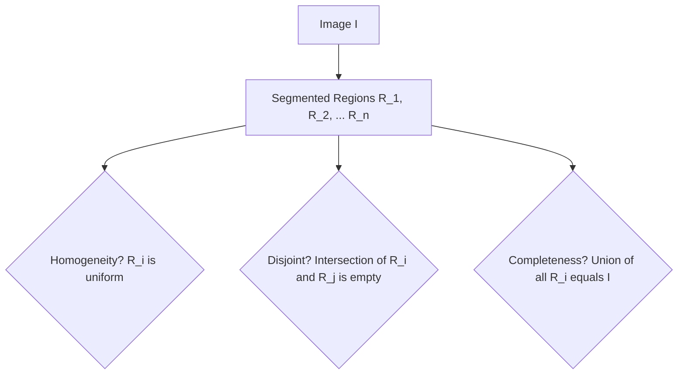

### Mathematical Conditions
A valid segmentation must satisfy the following five formal conditions:

1. **Completeness:** The union of all partitioned regions must equal the entire image domain $I$:
   
   $$\bigcup_{i=1}^{n} R_i = I$$

2. **Disjointness:** The partitioned regions must not overlap:
   
   $$R_i \cap R_j = \varnothing \quad \text{for all } i \neq j$$

3. **Homogeneity:** All pixels within a region $R_i$ must satisfy a uniform property predicate $P(R_i)$ (e.g., similar intensity, color, or texture):
   
   $$P(R_i) = \text{True} \quad \text{for all } i$$

4. **Separability:** Any two adjacent regions $R_i$ and $R_j$ must have different properties, meaning their union does not satisfy the homogeneity predicate:
   
   $$P(R_i \cup R_j) = \text{False} \quad \text{for adjacent } R_i, R_j$$

5. **Connectivity:** Each partitioned region $R_i$ must be a connected component:
   
   $$R_i \text{ is a connected set of pixels.}$$

---

## 2. Edge-Based Segmentation

Edge-based segmentation detects boundaries by identifying sharp, local changes in intensity. These high-frequency transitions are found using first and second derivatives.

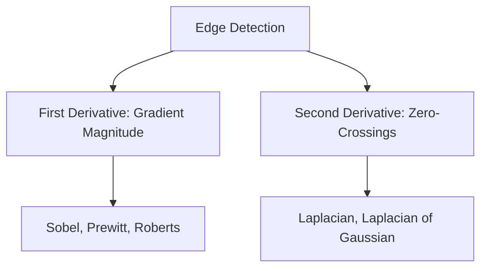

### 1. First-Derivative (Gradient) Operators
The gradient of a continuous function $f(x, y)$ is a spatial vector pointing in the direction of the greatest rate of change:

$$\nabla f(x, y) = \begin{pmatrix} G_x \\ G_y \end{pmatrix} = \begin{pmatrix} \frac{\partial f}{\partial x} \\ \frac{\partial f}{\partial y} \end{pmatrix}$$

#### Gradient Magnitude (Edge Strength)

$$G(x, y) = \|\nabla f\| = \sqrt{G_x^2 + G_y^2}$$

For faster computation, the magnitude can be approximated using absolute values:

$$G(x, y) \approx |G_x| + |G_y| \quad \text{or} \quad G(x, y) \approx \max(|G_x|, |G_y|)$$

#### Gradient Direction (Orientation)

$$\theta(x, y) = \arctan\left( \frac{G_y}{G_x} \right)$$

---

### Classical Discrete Gradient Kernels

#### Sobel Operator
Weights the central pixels along the axes to reduce noise and provide smoother derivative estimates:

$$G_x = \begin{pmatrix} -1 & 0 & 1 \\ -2 & 0 & 2 \\ -1 & 0 & 1 \end{pmatrix}, \quad G_y = \begin{pmatrix} 1 & 2 & 1 \\ 0 & 0 & 0 \\ -1 & -2 & -1 \end{pmatrix}$$

#### Prewitt Operator
Uses unweighted averages, making it slightly more sensitive to noise than the Sobel operator:

$$G_x = \begin{pmatrix} -1 & 0 & 1 \\ -1 & 0 & 1 \\ -1 & 0 & 1 \end{pmatrix}, \quad G_y = \begin{pmatrix} 1 & 1 & 1 \\ 0 & 0 & 0 \\ -1 & -1 & -1 \end{pmatrix}$$

#### Roberts Cross Operator
Uses diagonal differences on a $2 \times 2$ grid, making it highly sensitive to high-frequency details but vulnerable to noise:

$$G_x = \begin{pmatrix} 1 & 0 \\ 0 & -1 \end{pmatrix}, \quad G_y = \begin{pmatrix} 0 & 1 \\ -1 & 0 \end{pmatrix}$$

---

### 2. Second-Derivative (Laplacian) Operators
The Laplacian is an isotropic scalar operator that measures the second spatial derivative of an image:

$$\Delta f = \nabla^2 f = \frac{\partial^2 f}{\partial x^2} + \frac{\partial^2 f}{\partial y^2}$$

Its discrete approximation on an image grid is:

$$\nabla^2 f(x, y) = f(x+1, y) + f(x-1, y) + f(x, y+1) + f(x, y-1) - 4f(x, y)$$

This approximation can be implemented using the following convolution masks:

$$\text{Mask (a)} = \begin{pmatrix} 0 & 1 & 0 \\ 1 & -4 & 1 \\ 0 & 1 & 0 \end{pmatrix}, \quad \text{Mask (b) (with diagonals)} = \begin{pmatrix} 1 & 1 & 1 \\ 1 & -8 & 1 \\ 1 & 1 & 1 \end{pmatrix}$$

#### Key Properties
* Unlike first derivatives (which produce thick, ramp-like responses), the Laplacian produces thin double-line responses.
* Edges correspond exactly to the **zero-crossings** of the Laplacian.
* **Limitation:** The Laplacian is highly sensitive to noise, so it is typically paired with a smoothing filter, as seen in the **Laplacian of Gaussian (LoG)** operator.

---

### 3. The Canny Edge Detection Algorithm
The Canny detector is a multi-stage process designed to minimize error rates, locate edges precisely, and produce single-pixel-wide responses.

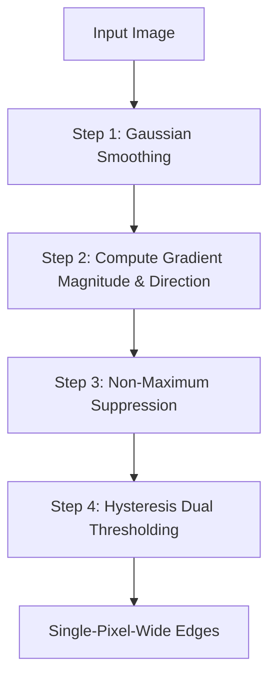

#### Step-by-Step Execution

**Step 1: Noise Reduction**  
Smooth the image using a Gaussian filter to reduce noise that could cause false edge detections:

$$I_{\text{smooth}} = I * G_{\sigma}$$

**Step 2: Gradient Computation**  
Compute the gradient magnitude $M(x, y)$ and direction $\theta(x, y)$ using Sobel kernels:

$$M(x, y) = \sqrt{G_x^2 + G_y^2}, \quad \theta(x, y) = \arctan\left(\frac{G_y}{G_x}\right)$$

**Step 3: Non-Maximum Suppression (Edge Thinning)**  
To thin the thick gradient responses into sharp lines, the algorithm evaluates each pixel's gradient magnitude along its gradient direction. The continuous angle $\theta(x, y)$ is rounded to one of four sectors: $0^\circ, 45^\circ, 90^\circ,$ or $135^\circ$.

```text
       90° (Vertical)
  135°    /    45°
     \   /    /
0°----[Pixel]----0° (Horizontal)
     /   \    \
  45°     \    135°
```

If the gradient magnitude at $M(x, y)$ is smaller than the magnitudes of its two neighbors along this direction, its value is set to $0$. Otherwise, it is preserved.

**Step 4: Hysteresis Thresholding**  
Standard thresholding with a single value can create fragmented edges due to noise and varying contrast. Canny solves this using two thresholds: a high threshold $T_{\text{high}}$ and a low threshold $T_{\text{low}}$.

* If $M(x, y) \ge T_{\text{high}}$, the pixel is classified as a **Strong Edge**.
* If $M(x, y) < T_{\text{low}}$, the pixel is discarded ($0$).
* If $T_{\text{low}} \le M(x, y) < T_{\text{high}}$, the pixel is classified as a **Weak Edge**. It is preserved only if it is connected to a strong edge within an 8-neighborhood. This recursive tracking links weak edge segments to complete the boundaries.

---

## 3. Region-Based Segmentation

Region-based segmentation groups pixels with similar properties into homogeneous regions.

### 1. Region Growing
This bottom-up approach starts with a set of seed points and grows regions by adding neighboring pixels that satisfy a similarity criterion.

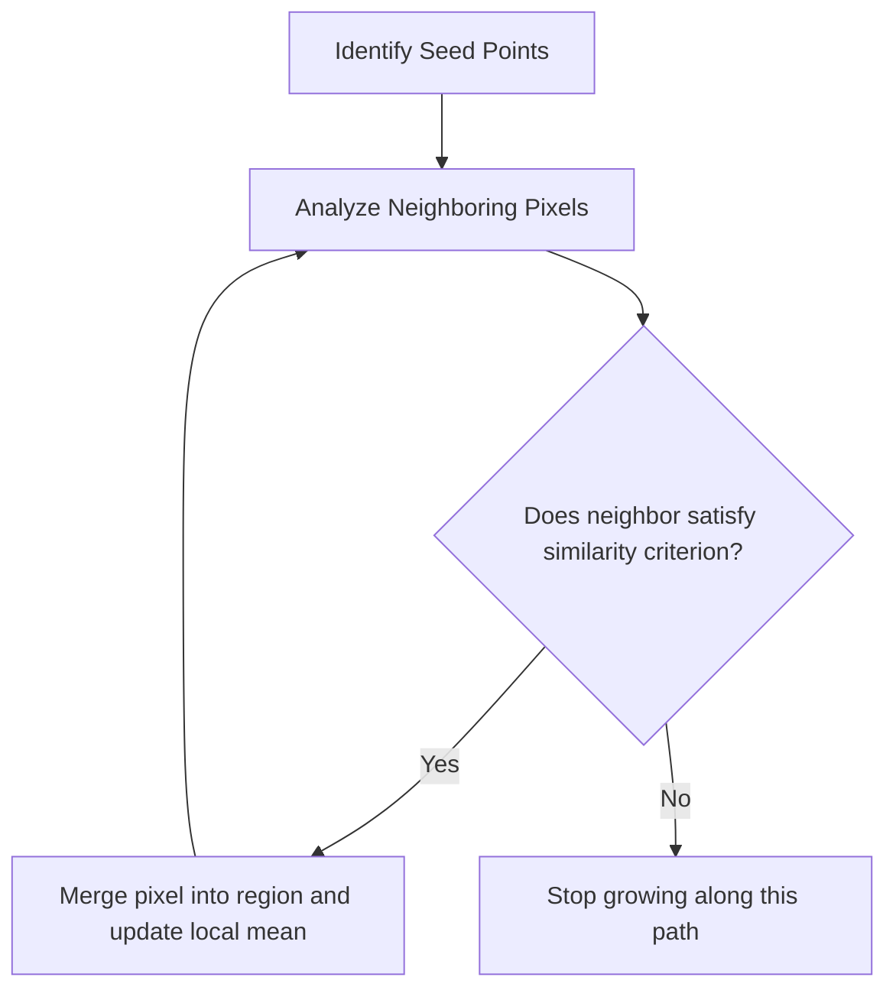

#### Growth Criterion Function
A neighbor pixel $p$ is added to region $R$ if the difference between its intensity $I(p)$ and the region's mean intensity $\mu_R$ is below a threshold $T$, weighted by the region's standard deviation $\sigma_R$:

$$\frac{|I(p) - \mu_R|}{\sigma_R} \le T$$

#### Implementation Notes and Common Traps
* **Seed Selection:** Seed points should be placed in homogeneous areas (low gradient) to prevent noise from corrupting the initial region properties.
* **Order Dependence:** The order in which pixels are processed can affect the final boundaries, especially in regions with gradual intensity gradients.

---

### 2. Region Splitting and Merging (Quadtree Segmentation)
This hybrid top-down and bottom-up approach uses a quadtree data structure to split non-homogeneous regions and merge adjacent regions with similar properties.

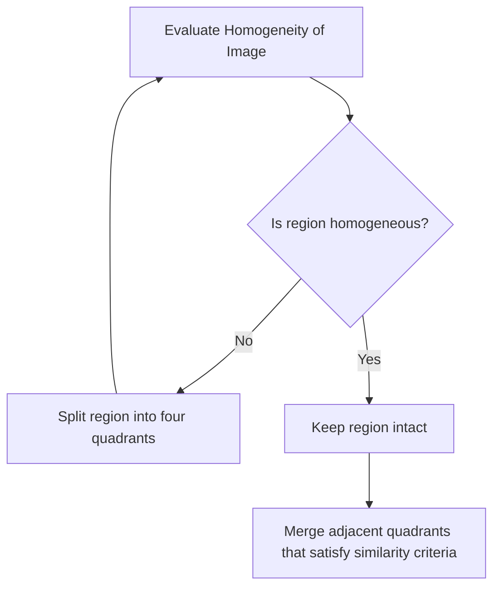

#### Homogeneity Criterion
A quadtree node region $R$ is split if its intensity variance exceeds a threshold:

$$\text{Variance}(R) > \theta_{\text{split}}$$

Once the splitting phase is complete, adjacent regions $R_i$ and $R_j$ are merged if their combined variance remains below the threshold:

$$\text{Variance}(R_i \cup R_j) \le \theta_{\text{merge}}$$

---

## 4. Binarization and Advanced Thresholding

Binarization maps a grayscale image $f(x, y)$ to a binary image $g(x, y) \in \{0, 1\}$ using a threshold $T$:

$$g(x, y) = \begin{cases} 1 & \text{if } f(x, y) \ge T \\ 0 & \text{otherwise} \end{cases}$$

### 1. Global Thresholding: Otsu's Method
Otsu's method calculates an optimal global threshold by maximizing the variance between two pixel classes: the foreground ($C_1$) and the background ($C_2$).

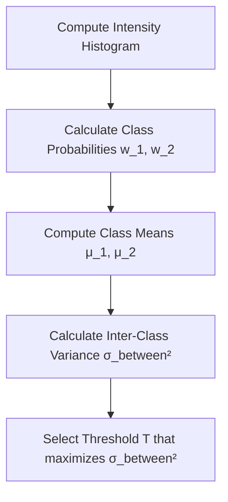

#### Step-by-Step Derivation

**Step 1:** Calculate the normalized histogram probabilities $p_i$ for each gray level $i \in [0, L-1]$:

$$p_i = \frac{n_i}{N}$$

**Step 2:** For a candidate threshold $t$, define the cumulative probabilities (weights) of the background class $C_1$ and foreground class $C_2$:

$$\omega_1(t) = \sum_{i=0}^{t} p_i, \quad \omega_2(t) = \sum_{i=t+1}^{L-1} p_i = 1 - \omega_1(t)$$

**Step 3:** Calculate the mean intensity values for each class:

$$\mu_1(t) = \frac{1}{\omega_1(t)} \sum_{i=0}^{t} i \cdot p_i, \quad \mu_2(t) = \frac{1}{\omega_2(t)} \sum_{i=t+1}^{L-1} i \cdot p_i$$

The global mean of the entire image is:

$$\mu_G = \sum_{i=0}^{L-1} i \cdot p_i = \omega_1(t)\mu_1(t) + \omega_2(t)\mu_2(t)$$

**Step 4:** Calculate the inter-class variance $\sigma_B^2(t)$:

$$\sigma_B^2(t) = \omega_1(t) \big(\mu_1(t) - \mu_G\big)^2 + \omega_2(t) \big(\mu_2(t) - \mu_G\big)^2 = \omega_1(t)\omega_2(t)\big(\mu_1(t) - \mu_2(t)\big)^2$$

**Step 5:** Find the optimal threshold $T^*$ that maximizes this variance:

$$T^* = \arg\max_{0 \le t \le L-1} \Big( \sigma_B^2(t) \Big)$$

---

### 2. Local Adaptive Thresholding: Niblack's Method
Global thresholding fails when an image has non-uniform lighting, such as shadows or gradients across the page. Local methods calculate a unique threshold for each pixel based on the statistics of its local neighborhood.

Niblack's method computes a threshold $T(x, y)$ within a sliding window of size $W \times W$ centered at coordinate $(x, y)$:

$$T(x, y) = m(x, y) + k \cdot s(x, y)$$

where:
* $m(x, y)$ is the local mean intensity within the window.
* $s(x, y)$ is the local standard deviation within the window.
* $k$ is a user-defined scaling parameter (typically $k \in [-0.1, -0.2]$ for dark text on a light background).

---

### 3. Local Adaptive Thresholding: Sauvola's Method
Sauvola's method improves upon Niblack's by scaling the threshold based on the local dynamic range of the standard deviation. This prevents noise amplification in flat, homogeneous regions.

The local threshold $T(x, y)$ is defined as:

$$T(x, y) = m(x, y) \cdot \left[ 1 + k \cdot \left( \frac{s(x, y)}{R} - 1 \right) \right]$$

where:
* $m(x, y)$ and $s(x, y)$ are the local mean and standard deviation.
* $R$ is the maximum dynamic range of the standard deviation (for an 8-bit grayscale image, $R = 128$).
* $k$ is a scaling parameter (typically $k \in [0.2, 0.5]$).

#### Why This Works
* In high-contrast areas (such as near text strokes), $s(x, y) \approx R$, so the threshold remains close to the local mean $m(x, y)$, producing clean boundaries.
* In homogeneous, low-contrast background areas, $s(x, y) \to 0$, which lowers the threshold significantly below the mean. This prevents background noise and texture from being falsely detected as foreground.

---

### 4. Gaceb's Mixed Binarization Approach (2006)
Developed to process complex document images with non-uniform lighting, stains, and faded text, this hybrid approach combines the strengths of global and local binarization techniques.

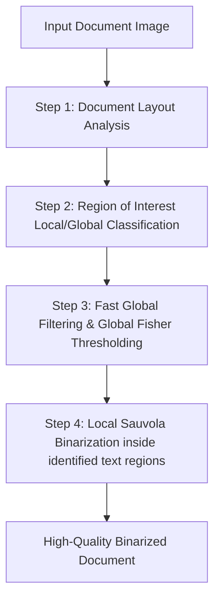

#### Step-by-Step Pipeline

**Step 1: Spatial Block Decomposition**  
Divide the document image into rectangular blocks of varying sizes.

**Step 2: Global Background Analysis**  
Apply global Fisher discriminant analysis to identify obvious background and high-contrast regions.

**Step 3: Local Text Line Extraction**  
Within regions containing complex patterns or degradation, extract localized text strokes using a cumulative gradient approach.

**Step 4: Adaptive Local Binarization**  
Apply Sauvola's local thresholding only inside the active text regions identified in Step 3. This preserves fine character details while keeping homogeneous background areas clean.

---

## 5. Connected Components and Shape Extraction

Once an image is binarized, connected components (adjacent pixels of the same class) are identified and labeled to isolate individual objects.

```text
4-Connectivity vs. 8-Connectivity on Binary Pixels:
       [ ]                         [X]     [X]
   [ ] [P] [ ]                         [P]
       [ ]                         [X]     [X]
  4-Connected neighbors        8-Connected neighbors (including diagonals)
```

### Connected Component Labeling (CCL) Algorithm
This two-pass algorithm assigns unique labels to connected regions in a binary image.

#### Pass 1: Initial Labeling
Scan the image row by row, from left to right. For each foreground pixel $P$:
1. Examine the labels of its already processed neighbors (above and to the left).
2. If no neighbors have a label, assign a new, unique label to $P$.
3. If only one neighbor has a label, copy that label to $P$.
4. If multiple neighbors have different labels, assign the smallest label to $P$ and record the equivalence between the labels in an equivalence table.

#### Pass 2: Resolving Equivalences
Scan the image a second time and replace each temporary label with its smallest equivalent label from the equivalence table, merging connected regions.

---

### Geometric Features: Bounding Boxes and Enclosing Rectangles
Once connected components are labeled, geometric descriptors are extracted for each object.

#### 1. Axis-Aligned Bounding Box (AABB)
The smallest rectangle that encloses the object, with sides parallel to the coordinate axes. It is defined by the minimum and maximum coordinates of the pixels in the connected component:

$$\mathbf{AABB}(C) = [x_{\text{min}}, y_{\text{min}}, x_{\text{max}}, y_{\text{max}}]$$

where:

$$x_{\text{min}} = \min_{(x, y) \in C} (x), \quad x_{\text{max}} = \max_{(x, y) \in C} (x)$$

$$y_{\text{min}} = \min_{(x, y) \in C} (y), \quad y_{\text{max}} = \max_{(x, y) \in C} (y)$$

```text
Axis-Aligned Bounding Box (AABB):
  (x_min, y_min) ┌───────────────┐
                 │    * * *      │
                 │  *       *    │
                 │    * * *      │
                 └───────────────┘ (x_max, y_max)
```

#### 2. Oriented Bounding Box (OBB)
The smallest rectangle that encloses the object, oriented along the object's principal axis of rotation. The orientation angle $\theta$ is calculated using central moments:

$$\theta = \frac{1}{2} \arctan \left( \frac{2 \mu_{11}}{\mu_{20} - \mu_{02}} \right)$$

where $\mu_{pq}$ represent the central moments of the connected component.

---

## 6. Image Super-Resolution

Super-Resolution (SR) reconstructs a high-resolution (HR) image from one or more low-resolution (LR) observations.

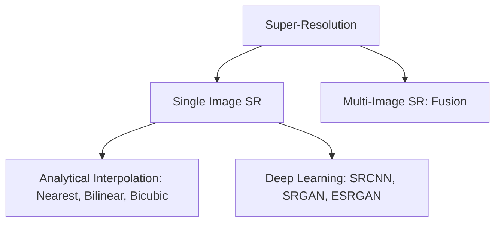

### 1. Classical Interpolation Techniques

#### Nearest-Neighbor Interpolation
Assigns each pixel in the upsampled grid the value of the nearest pixel in the original image.
* **Limitation:** Highly efficient but produces blocky results and jagged edges (aliasing).

#### Bilinear Interpolation
Computes the value of an unknown pixel $P(x, y)$ by performing linear interpolation along both axes using the four nearest known pixels:

$$Q_{11}(x_1, y_1), \quad Q_{21}(x_2, y_1), \quad Q_{12}(x_1, y_2), \quad Q_{22}(x_2, y_2)$$

The interpolation formula is:

$$\begin{aligned}
f(x, y) \approx \frac{1}{(x_2-x_1)(y_2-y_1)} \Big[ 
& f(Q_{11})(x_2 - x)(y_2 - y) + f(Q_{21})(x - x_1)(y_2 - y) \\
+ & f(Q_{12})(x_2 - x)(y - y_1) + f(Q_{22})(x - x_1)(y - y_1) 
\Big]
\end{aligned}$$

* **Limitation:** Produces smoother results than nearest-neighbor but blurs high-frequency details and sharp edges.

#### Bicubic Interpolation
Computes the value of an unknown pixel using a weighted average of the $16$ nearest pixels on a $4 \times 4$ grid:

$$P(x, y) = \sum_{i=-1}^{2} \sum_{j=-1}^{2} P_{i, j} W(x - i) W(y - j)$$

The weight function $W(d)$ is defined by **Keys' cubic spline kernel**:

$$W(d) = \begin{cases} 
(a + 2)|d|^3 - (a + 3)|d|^2 + 1 & \text{for } 0 \le |d| \le 1 \\ 
a|d|^3 - 5a|d|^2 + 8a|d| - 4a & \text{for } 1 < |d| \le 2 \\ 
0 & \text{otherwise} 
\end{cases}$$

where $a$ is a scaling parameter (typically set to $-0.5$ or $-0.75$).
* **Pros:** Preserves sharp transitions and fine details much better than bilinear interpolation.

---

### 2. Edge-Adaptive Interpolation: Contour Stencils (Getreuer 2009)
Standard interpolation techniques ignore edge directions, which can blur boundaries and introduce artifacts. Edge-adaptive methods, such as Contour Stencils, estimate the local orientation of edges before interpolating to ensure transitions remain sharp.

```mermaid
graph TD
    A[Locate Interpolation Target] --> B[Evaluate Local Total Variation TV across 12 orientations]
    B --> C[Identify orientation with the minimum TV: S_star]
    C --> D[Interpolate along the path of S_star]
    D --> E[Sharp, clean edge preservation in HR Image]
```

#### Step-by-Step Mathematical Algorithm

**Step 1: Total Variation (TV) Estimation**  
For a candidate orientation stencil $S$, calculate the local Total Variation (TV) over a set of neighboring pixels:

$$\text{TV}_c(S) = \frac{1}{|S|} \sum_{e \in \text{edges}(S)} w_e |v_{\alpha_e} - v_{\beta_e}|$$

where $v_{\alpha_e}$ and $v_{\beta_e}$ are the intensities of the pixels connected by edge $e$, and $w_e$ is a spatial weighting factor.

**Step 2: Direction Selection**  
Evaluate the TV across twelve distinct stencil orientations. Identify the optimal orientation $S^*$ that minimizes the local variation:

$$S^* = \arg\min_{S \in \Sigma} \Big( \text{TV}_c(S) \Big)$$

**Step 3: Directional Interpolation**  
Interpolate the missing pixel values along the path of $S^*$. By interpolating parallel to the edge rather than across it, the algorithm prevents blurring and preserves sharp boundaries.

---

### 3. Deep Learning Super-Resolution Models

#### SRCNN (Super-Resolution Convolutional Neural Network)
The first deep learning model for super-resolution. It uses a three-layer convolutional neural network to learn the mapping from low-resolution to high-resolution patches.

```mermaid
graph LR
    LR[Low-Resolution Image] -->|Bicubic Upsampling| Interpolated[Upsampled Image]
    Interpolated -->|Layer 1: Patch Extraction| L1[Conv 9x9]
    L1 -->|Layer 2: Non-linear Mapping| L2[Conv 1x1 / 5x5]
    L2 -->|Layer 3: Reconstruction| L3[Conv 5x5]
    L3 -->|Output| HR[High-Resolution Image]
```

#### SRGAN (Super-Resolution Generative Adversarial Network)
SRGAN uses Generative Adversarial Networks (GANs) to generate realistic, high-frequency details. It incorporates a **Perceptual Loss** function that combines content loss (measured in the feature space of a pre-trained VGG network) and adversarial loss, producing sharper and more natural-looking textures than pixel-wise loss functions (like MSE).

#### ESRGAN (Enhanced SRGAN)
Improves upon SRGAN by:
* Introducing the **Residual-in-Residual Dense Block (RRDB)**, which increases network capacity and stability.
* Removing Batch Normalization layers to reduce computational overhead and eliminate artifacts.
* Using a **Relativistic Discriminator**, which estimates the probability that an image is more realistic than real data, rather than classifying it as simply real or fake.

---

### 4. Bi-ESRGAN: Dual-Deep Transfer Learning for Document Images (Kezzoula & Gaceb, 2023)
Developed specifically for document restoration, this specialized architecture improves upon standard ESRGAN by using a dual-path pipeline to process structural text and background details separately.

```mermaid
graph TD
    A[Degraded Document Image] --> B[Separate Background & Foreground]
    B --> C[Path 1: Standard Background Denoising]
    B --> D[Path 2: High-Frequency Text Edge Enhancement]
    C --> E[Reconstruct Document Layout]
    D --> E
    E --> F[High-Resolution Restored Document]
```

* **Foreground Path:** Focuses on extracting and sharpening text strokes, preserving the legibility of characters.
* **Background Path:** Focuses on denoising, removing stains, and flattening non-uniform lighting.
* **Fusion:** Combines the outputs of both paths to produce a high-resolution, clean, and legible document image.

---

## 7. Evaluation Metrics for Image Segmentation

To measure the accuracy of a segmentation algorithm, its output is compared against a gold-standard reference image called the **Ground Truth**.

```mermaid
graph TD
    A[Segmentation Evaluation] --> B[Supervised: Comparative]
    A --> C[Unsupervised: Intrinsic]
    B --> D[Dice Coefficient, Jaccard IoU, Hausdorff Distance]
    C --> E[Zeboudj Contrast Metric, Intra-Region Variance]
```

### 1. Supervised Evaluation Metrics

Let $A$ represent the segmented region produced by the algorithm, and let $B$ represent the Ground Truth region.

#### Dice Similarity Coefficient (DSC)
Measures the overlap between the two regions:

$$\text{Dice}(A, B) = \frac{2 |A \cap B|}{|A| + |B|}$$

The Dice coefficient ranges from $0$ (no overlap) to $1$ (perfect match).

#### Jaccard Index (Intersection over Union, IoU)
The ratio of the intersection area to the union area of the two regions:

$$\text{Jaccard}(A, B) = \frac{|A \cap B|}{|A \cup B|}$$

#### Relationship between Dice and Jaccard

$$\text{Dice} = \frac{2 \cdot \text{Jaccard}}{1 + \text{Jaccard}}$$

#### Hausdorff Distance ($d_H$)
Measures the maximum distance between the boundary points of the segmented region $A$ and the ground truth boundary $B$. This metric is highly sensitive to boundary deviations and outliers:

$$d_H(A, B) = \max \Big( \sup_{a \in A} \inf_{b \in B} \|a - b\|, \ \sup_{b \in B} \inf_{a \in A} \|a - b\| \Big)$$

---

### 2. Unsupervised Evaluation Metrics
Unsupervised metrics evaluate the quality of a segmentation without a ground truth reference by measuring intrinsic properties of the segmented regions, such as homogeneity and contrast.

#### Zeboudj Contrast Metric
Evaluates the quality of segmentation by measuring the contrast between adjacent regions relative to the homogeneity within those regions. A high score indicates well-defined, distinct segments.

#### Intra-Region Variance
Measures the sum of intensity variances within each segmented region, weighted by the region's area:

$$\text{UM}(R) = \sum_{i=1}^{n} \frac{|R_i|}{|I|} \sigma^2(R_i)$$

A lower intra-region variance indicates more homogeneous segments.

---

# Practice Exercises and Mathematical Derivations

This section contains step-by-step mathematical solutions to key exercises from the course, illustrating how these algorithms operate under real-world conditions.

---

## Exercise 1: Computing 2D Convolution and Boundary Padding

### Problem Statement
Given an input $5 \times 5$ image channel $f(x, y)$ and a $3 \times 3$ high-pass filter kernel $h(i, j)$, calculate the filtered intensity of the central pixel $f(2, 2)$ using two boundary handling strategies:
1. **Zero Padding**
2. **Mirror Padding**

The input image $f(x, y)$ is:

$$f(x, y) = \begin{pmatrix} 
100 & 130 & 110 & 120 & 110 \\ 
110 & 90  & 100 & 90  & 100 \\ 
130 & 100 & 90  & 130 & 110 \\ 
120 & 100 & 130 & 110 & 120 \\ 
90  & 110 & 80  & 120 & 100 
\end{pmatrix}$$

The $3 \times 3$ high-pass filter kernel $h(i, j)$ is:

$$h(i, j) = \begin{pmatrix} 
-1 & -1 & -1 \\ 
-1 &  8 & -1 \\ 
-1 & -1 & -1 
\end{pmatrix}$$

---

### Solution Strategy
The central pixel of the image is at coordinates $(2, 2)$ (using 0-based indexing), which corresponds to the value $90$:

$$f(2, 2) = 90$$

Since the pixel is at the center of a $5 \times 5$ image, its $3 \times 3$ neighborhood is fully defined and does not touch the outer borders. Therefore, boundary padding is not required for this pixel. Let's select a pixel on the border, such as $f(0, 0) = 100$, to demonstrate how padding affects the convolution calculation.

#### local neighborhood centered at $f(0, 0)$ prior to padding:

$$\begin{array}{ccc} 
? & ? & ? \\ 
? & 100 & 130 \\ 
? & 110 & 90 
\end{array}$$

---

### Step-by-Step Convolution with Zero Padding

With zero padding, any coordinate index that falls outside the boundaries $[0, 4] \times [0, 4]$ is assigned an intensity of $0$.

#### 1. Define the Padded Neighborhood for $f(0, 0)$:

$$f_{\text{zero}} = \begin{pmatrix} 
0 & 0 & 0 \\ 
0 & 100 & 130 \\ 
0 & 110 & 90 
\end{pmatrix}$$

#### 2. Perform Element-wise Multiplication with Kernel $h(i, j)$:

$$\begin{aligned}
g(0, 0) = & (0 \times -1) + (0 \times -1) + (0 \times -1) \\
+ & (0 \times -1) + (100 \times 8) + (130 \times -1) \\
+ & (0 \times -1) + (110 \times -1) + (90 \times -1)
\end{aligned}$$

#### 3. Calculate the Sum:

$$g(0, 0) = 0 + 0 + 0 + 0 + 800 - 130 + 0 - 110 - 90$$

$$g(0, 0) = 800 - 330 = 470$$

---

### Step-by-Step Convolution with Mirror Padding

With mirror padding, the out-of-boundary values are filled by reflecting the image across its borders:
* $f(-1, -1) = f(1, 1) = 90$
* $f(-1, 0) = f(1, 0) = 110$
* $f(-1, 1) = f(1, 1) = 90$
* $f(0, -1) = f(0, 1) = 130$
* $f(1, -1) = f(1, 1) = 90$

#### 1. Define the Padded Neighborhood for $f(0, 0)$:

$$f_{\text{mirror}} = \begin{pmatrix} 
90  & 110 & 90 \\ 
130 & 100 & 130 \\ 
90  & 110 & 90 
\end{pmatrix}$$

#### 2. Perform Element-wise Multiplication with Kernel $h(i, j)$:

$$\begin{aligned}
g(0, 0) = & (90 \times -1) + (110 \times -1) + (90 \times -1) \\
+ & (130 \times -1) + (100 \times 8) + (130 \times -1) \\
+ & (90 \times -1) + (110 \times -1) + (90 \times -1)
\end{aligned}$$

#### 3. Calculate the Sum:

$$g(0, 0) = -90 - 110 - 90 - 130 + 800 - 130 - 90 - 110 - 90$$

$$g(0, 0) = 800 - 840 = -40$$

#### Summary of Results
* **Zero Padding:** $g(0, 0) = 470$
* **Mirror Padding:** $g(0, 0) = -40$

> **Key Takeaway:** Zero padding introduces an artificial, high-contrast dark border, causing the high-pass filter to output a large value ($470$). Mirror padding preserves the continuity of local intensities, producing a more accurate and stable result ($-40$).

---

## Exercise 2: Implementing Otsu's Global Thresholding

### Problem Statement
Given a $6 \times 6$ image with three gray levels ($0, 1,$ and $2$), find the optimal binarization threshold $T^*$ using Otsu's method.

The pixel count for each gray level is:
* Intensity **0:** $12$ pixels
* Intensity **1:** $16$ pixels
* Intensity **2:** $8$ pixels

Total number of pixels $N = 6 \times 6 = 36$ pixels.

---

### Step-by-Step Derivation

#### Step 1: Calculate the Class Probabilities $p_i$

$$p_0 = \frac{12}{36} \approx 0.3333$$

$$p_1 = \frac{16}{36} \approx 0.4444$$

$$p_2 = \frac{8}{36} \approx 0.2222$$

#### Step 2: Compute the Global Mean $\mu_G$

$$\mu_G = \sum_{i=0}^{2} i \cdot p_i = (0 \times 0.3333) + (1 \times 0.4444) + (2 \times 0.2222)$$

$$\mu_G = 0 + 0.4444 + 0.4444 = 0.8888$$

---

#### Step 3: Evaluate Candidate Threshold $t = 0$

At $t = 0$, the image is partitioned into two classes:
* $C_1 = \{0\}$
* $C_2 = \{1, 2\}$

##### 1. Class Weights ($\omega_1, \omega_2$)

$$\omega_1(0) = p_0 = 0.3333$$

$$\omega_2(0) = p_1 + p_2 = 0.4444 + 0.2222 = 0.6667$$

##### 2. Class Means ($\mu_1, \mu_2$)

$$\mu_1(0) = \frac{1}{\omega_1(0)} \sum_{i=0}^{0} i \cdot p_i = \frac{0 \times 0.3333}{0.3333} = 0$$

$$\mu_2(0) = \frac{1}{\omega_2(0)} \sum_{i=1}^{2} i \cdot p_i = \frac{(1 \times 0.4444) + (2 \times 0.2222)}{0.6667} = \frac{0.8888}{0.6667} \approx 1.3331$$

##### 3. Inter-Class Variance ($\sigma_B^2(0)$)

$$\sigma_B^2(0) = \omega_1(0) \omega_2(0) \big(\mu_1(0) - \mu_2(0)\big)^2$$

$$\sigma_B^2(0) = (0.3333) \times (0.6667) \times (0 - 1.3331)^2$$

$$\sigma_B^2(0) \approx 0.2222 \times 1.7772 \approx 0.3949$$

---

#### Step 4: Evaluate Candidate Threshold $t = 1$

At $t = 1$, the classes are:
* $C_1 = \{0, 1\}$
* $C_2 = \{2\}$

##### 1. Class Weights ($\omega_1, \omega_2$)

$$\omega_1(1) = p_0 + p_1 = 0.3333 + 0.4444 = 0.7777$$

$$\omega_2(1) = p_2 = 0.2222$$

##### 2. Class Means ($\mu_1, \mu_2$)

$$\mu_1(1) = \frac{1}{\omega_1(1)} \sum_{i=0}^{1} i \cdot p_i = \frac{(0 \times 0.3333) + (1 \times 0.4444)}{0.7777} = \frac{0.4444}{0.7777} \approx 0.5714$$

$$\mu_2(1) = \frac{2 \times 0.2222}{0.2222} = 2.0$$

##### 3. Inter-Class Variance ($\sigma_B^2(1)$)

$$\sigma_B^2(1) = \omega_1(1) \omega_2(1) \big(\mu_1(1) - \mu_2(1)\big)^2$$

$$\sigma_B^2(1) = (0.7777) \times (0.2222) \times (0.5714 - 2.0)^2$$

$$\sigma_B^2(1) = 0.1728 \times (-1.4286)^2 \approx 0.1728 \times 2.0409 \approx 0.3527$$

---

#### Conclusion and Selection
* **Variance for $t = 0$:** $\sigma_B^2(0) = 0.3949$
* **Variance for $t = 1$:** $\sigma_B^2(1) = 0.3527$

Otsu's method selects the threshold that maximizes inter-class variance. Since $\sigma_B^2(0) > \sigma_B^2(1)$, the optimal threshold is:

$$T^* = 0$$

Pixels with intensity values $> 0$ are classified as foreground, and pixels with intensity $0$ are classified as background.

---

## Exercise 3: Bilinear Interpolation for Image Super-Resolution

### Problem Statement
An image is being upsampled by a factor of $2$. Calculate the intensity of the new upsampled pixel at coordinates $P(1.5, 1.5)$ using the intensities of its four nearest neighbors on the original pixel grid:
* $Q_{11}(1, 1) = 120$
* $Q_{21}(2, 1) = 140$
* $Q_{12}(1, 2) = 100$
* $Q_{22}(2, 2) = 180$

---

### Step-by-Step Derivation

We interpolate along the coordinate range $[x_1, x_2] = [1, 2]$ and $[y_1, y_2] = [1, 2]$. Since the grid spacing is $1$:

$$(x_2 - x_1) = 1, \quad (y_2 - y_1) = 1$$

Using the bilinear interpolation formula:

$$\begin{aligned}
f(x, y) = & f(Q_{11})(x_2 - x)(y_2 - y) + f(Q_{21})(x - x_1)(y_2 - y) \\
+ & f(Q_{12})(x_2 - x)(y - y_1) + f(Q_{22})(x - x_1)(y - y_1)
\end{aligned}$$

Substitute the coordinate values $x = 1.5$ and $y = 1.5$:
* $(x_2 - x) = (2 - 1.5) = 0.5$
* $(x - x_1) = (1.5 - 1) = 0.5$
* $(y_2 - y) = (2 - 1.5) = 0.5$
* $(y - y_1) = (1.5 - 1) = 0.5$

Substitute these weights into the interpolation equation:

$$\begin{aligned}
f(1.5, 1.5) = & 120 \times (0.5 \times 0.5) + 140 \times (0.5 \times 0.5) \\
+ & 100 \times (0.5 \times 0.5) + 180 \times (0.5 \times 0.5)
\end{aligned}$$

Factor out the common weight $(0.5 \times 0.5) = 0.25$:

$$f(1.5, 1.5) = 0.25 \times (120 + 140 + 100 + 180)$$

$$f(1.5, 1.5) = 0.25 \times 540 = 135$$

The interpolated intensity value at coordinate $P(1.5, 1.5)$ is **135**.