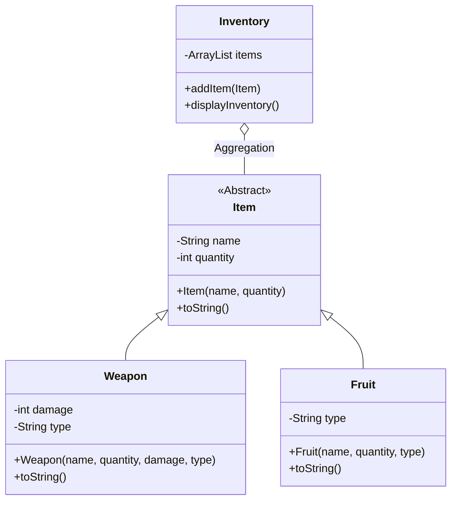

### 1. The Goal

Create a game inventory system demonstrating **[[020 Encapsulation and Access Control|Encapsulation]]** and **[[042 Polymorphism Summary|Polymorphism]]**.

### 2. [[005 Intro to Classes|Class]] Structure



### 3. Key Concepts Applied

- **Encapsulation:** The `Item` class has `private` name and quantity. Access is strictly via Getters.
- **[[030 Inheritance|Inheritance]]:** `Weapon` extends `Item`.
  - It uses `super(name, quantity)` to store data in the parent class.
  - It adds unique data: `damage` and `weaponType`.
- **Polymorphism (Overriding):**
  - The `toString()` method in `Item` is overridden in `Weapon` to display damage stats.
  - The `Inventory` class holds a list of `Item` [[002 Object|objects]] (`ArrayList<Item>`). Because of polymorphism, this list can hold both `Fruit` objects and `Weapon` objects simultaneously.

**Code Highlight: Dynamic Binding in Inventory**

```java
// Inventory.java
for (Item i : items) {
    // This calls the specific toString() of Weapon or Fruit
    // depending on what the object actually is.
    System.out.println(i.toString());
}
```


---
**Keywords:** #inventory-system, #project
