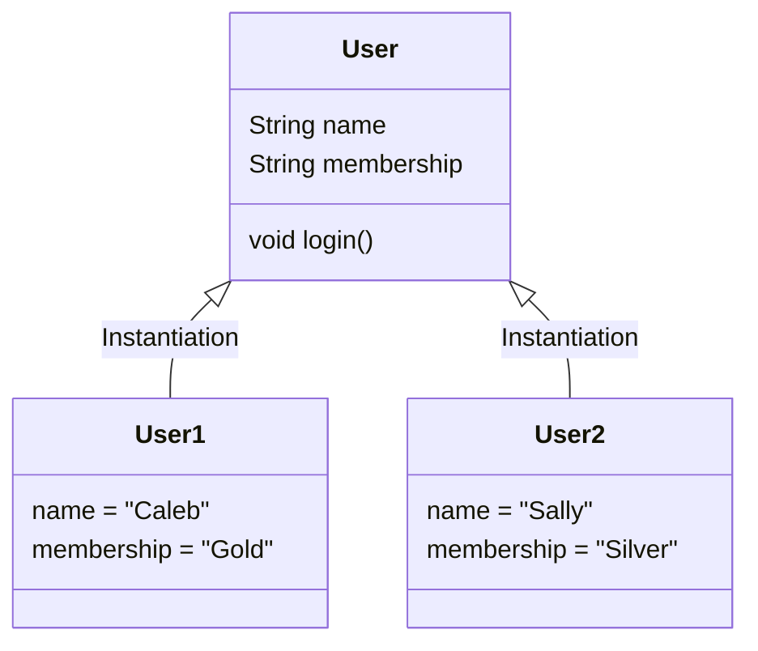

### 1. The Paradigm Shift: From Primitives to Objects

Before understanding Object-Oriented Programming (OOP), we must look at **Primitive Data Types**. In early programming (and in Java basics), we use primitives like `int`, `double`, `boolean`, and `char`. These store single, simple values.

**The Problem with Primitives:**
As programs grow complex, primitives fail to group related data.

- **Example (The Chess Board):** If you are coding a Knight in chess, you need variables for:
  - `int rowPosition`
  - `int colPosition`
  - `boolean isCaptured`
  - `String color`
- If you have 4 Knights, you would need $4 \times 4 = 16$ individual variables. This becomes unmanageable (Spaghetti Code).

**The Solution: Objects**
OOP allows us to group variables (Attributes) and functions (Methods) into a single unit called an **Object**. This mirrors the real world. A "Knight" is an entity that holds its own data and knows how to move itself.

---

### 2. Classes vs. Objects

This is the most fundamental distinction in Java.

#### **The Class (The Blueprint)**

A Class is a logical entity. It is a template, a blueprint, or a "cookie cutter."

- It does **not** exist in physical memory (RAM) as data until you use it.
- It defines _what_ data an object will have and _what_ it can do.

**Analogy:**

- **Class:** The architectural blueprint of a house. You cannot live in the blueprint.
- **Object:** The actual physical house built from that blueprint.

#### **The Object (The Instance)**

An Object is a physical instance of the class. It occupies memory.

- You can create thousands of objects from one class.
- Each object has its own unique state (values for its variables).

**Mermaid Diagram: Class vs Object Relationship**



---

### 3. Java Syntax Breakdown

To create an object, we use the `new` keyword.

```java
// Class Definition (The Type)
public class User {
    String name;
    String membership;
}

// Main Execution
public static void main(String[] args) {
    // 1. Declaration: User u
    // 2. Instantiation: new User()
    // 3. Initialization: The constructor prepares the object
    User u = new User();

    u.name = "Caleb"; // Accessing attributes via dot operator
    u.membership = "Gold";
}
```

> [!TIP] **The `null` Trap**
> When you declare a reference variable like `User u;` without assigning it `new User();`, the value is `null`. If you try to do `u.name = "Caleb"`, you will get a **NullPointerException**. Always ensure you have instantiated the object with `new` before accessing it.
