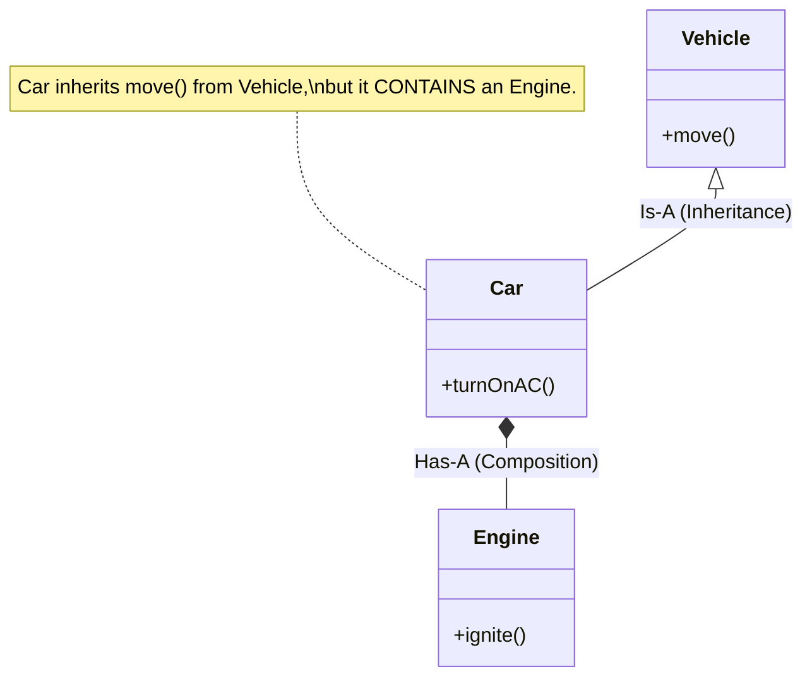
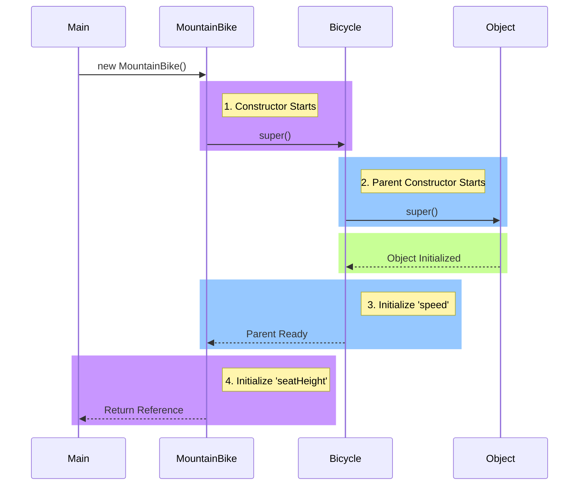

### **1. The Core Philosophy: The "Is-A" Relationship**

Inheritance is the mechanism where a new class derives properties and characteristics from an existing class. It is the architectural backbone of Object-Oriented Programming, designed strictly for **hierarchical classification**.

*   **Superclass (Parent/Base):** The general concept (e.g., `Vehicle`).
*   **Subclass (Child/Derived):** The specialized version (e.g., `Car`).

#### **The Logical Litmus Test**
Before using the `extends` keyword, you must pass the **"Is-A"** test. If you cannot say the sentence logically, do not use inheritance.

*   *Is a Mountain Bike a Bicycle?* **Yes.** $\rightarrow$ **Inheritance** (`extends`) is appropriate.
*   *Is a Wheel a Bicycle?* **No.** A Bicycle *has* a Wheel. This is **Composition**.

> [!WARNING] **The Composition Trap**
> Novice programmers often overuse inheritance to share code.
> *   **Wrong:** `class Airplane extends Engine` (An airplane is not an engine).
> *   **Right:** `class Airplane` has a private field `Engine e`.
>
> **Golden Rule:** Favor Composition over Inheritance unless there is a strict hierarchical relationship. Inheritance creates a tight coupling between classes; if the Parent changes, the Child breaks.

**Mermaid Diagram: Inheritance vs. Composition**



---

### **2. The Mechanics of `extends`**

When you write `class MountainBike extends Bicycle`, Java performs specific operations during compilation and memory allocation.

#### **A. What is Inherited?**
1.  **Attributes (Fields):** The child gets all `public` and `protected` variables. It does *not* get direct access to `private` variables (though they exist in memory, see below).
2.  **Methods:** The child gains the ability to call public/protected methods of the parent.
3.  **Type Compatibility:** A `MountainBike` is legally allowed to live inside a variable of type `Bicycle`.

#### **B. Memory Layout (The "Onion" Model)**
When you create a Child object (e.g., `new MountainBike()`), Java does not create two separate objects (one Parent, one Child). It creates **one single object** on the Heap.

However, inside that single object, there are "layers."
*   The inner core contains the **Parent's** fields.
*   The outer layer contains the **Child's** fields.

**Mermaid Diagram: Memory Layout of a Subclass**

```mermaid
graph TD
    subgraph Heap Memory [Heap Memory Address: 0x55A1]
        subgraph Object [Object: MountainBike]
            subgraph Super [Super Layer (Bicycle)]
                speed[speed = 10]
                gear[gear = 2]
            end
            subgraph Sub [Sub Layer (MountainBike)]
                seatHeight[seatHeight = 25]
            end
        end
    end
    
    Ref[Variable: mb] --> Heap Memory
    
    style Super fill:#f9f,stroke:#333,stroke-width:2px
    style Sub fill:#bbf,stroke:#333,stroke-width:2px
```

**Implication:**
Even if `speed` is `private` in `Bicycle`, it **still exists** inside the memory of `MountainBike`. The `MountainBike` methods just can't "see" it directly; they must ask the "Super Layer" to modify it via public getters/setters.

---

### **3. Constructors in Inheritance (The Chain Reaction)**

This is the most critical technical detail of inheritance.

**The Rule:** A Child class cannot exist without its Parent being fully initialized first. You cannot build the second floor of a house until the foundation (first floor) is poured and dried.

#### **The Execution Order**
When you call `new MountainBike()`, the execution flow flows **UP** the hierarchy to `Object`, and initialization flows **DOWN**.

1.  `MountainBike` constructor starts.
2.  It immediately pauses and calls `super()` (Bicycle constructor).
3.  `Bicycle` constructor starts.
4.  It immediately pauses and calls `super()` (Object constructor).
5.  `Object` initializes.
6.  `Bicycle` initializes its fields (`speed`, `gear`).
7.  `MountainBike` initializes its fields (`seatHeight`).

**Mermaid Diagram: Constructor Chaining**



#### **The Syntax Traps**

**Scenario A: The Implicit Call**
If you write no constructor code, Java inserts this for you:
```java
public MountainBike() {
    super(); // Invisible line inserted by compiler
}
```
*Requirement:* The Parent (`Bicycle`) **must** have a "No-Argument" constructor.

**Scenario B: The Compilation Error (The "Broken Chain")**
If `Bicycle` *only* has a constructor that takes arguments (`Bicycle(int speed)`), the default no-arg constructor is deleted.
*   **Result:** `MountainBike` fails to compile. Java tries to insert `super()` (no args), but that constructor no longer exists in the parent.
*   **Fix:** You **must** manually call the correct parent constructor.

```java
// Parent
public class Bicycle {
    public Bicycle(int startSpeed) { ... } // No-arg constructor is GONE
}

// Child
public class MountainBike extends Bicycle {
    public MountainBike(int height, int speed) {
        // super(); <--- This would FAIL automatically
        super(speed); // <--- We MUST match the Parent's signature manually
        this.seatHeight = height;
    }
}
```

---

### **4. The `protected` Modifier**

As detailed in the **Encapsulation** note, `protected` is a special key specifically for inheritance.

*   **`private`:** Only the Base class can touch it. The Child has it in memory but can't touch it.
*   **`protected`:** The Base class shares it with the Child (and classes in the same package).
*   **`public`:** The whole world can touch it.

> [!TIP] **The Architectural Decision**
> Should you make variables `protected`?
> *   **Pros:** Performance. The child accesses `this.speed` directly without the overhead of a method call (`getSpeed()`).
> *   **Cons:** Coupling. If the Parent changes the variable name from `speed` to `velocity`, the Child class breaks.
> *   **Recommendation:** Stick to `private` variables and `public/protected` getters/setters unless you have a critical reason not to.

---

### **5. Single Inheritance & The Diamond Problem**

Java enforces **Single Inheritance**.
*   A Child can extend only **one** Parent.
*   `class C extends A, B` is **ILLEGAL**.

#### **Why? The Diamond Problem**
This is a classic ambiguity issue in computer science (common in C++).

**The Scenario:**
1.  Class `Animal` has a method `eat()` that prints "Munch".
2.  Class `Tiger` extends `Animal` and overrides `eat()` to print "Chomp".
3.  Class `Lion` extends `Animal` and overrides `eat()` to print "Gulp".
4.  Class `Liger` tries to extend **both** `Tiger` and `Lion`.

**The Conflict:**
When you create a `Liger` and call `liger.eat()`, the compiler panics. Does it inherit the "Chomp" (Tiger) version or the "Gulp" (Lion) version? There is no way to know.

**Mermaid Diagram: The Diamond of Death**

```mermaid
graph TD
    A[Animal<br>eat()] --> B[Tiger<br>eat() { print 'Chomp' }]
    A --> C[Lion<br>eat() { print 'Gulp' }]
    
    B -.-> D[Liger?]
    C -.-> D
    
    D --> Q{call eat()?}
    Q -- Ambiguity --> Error[COMPILER ERROR]
    
    style D fill:#ffcccc,stroke:#333,stroke-width:2px,stroke-dasharray: 5 5
    style Error fill:#ff0000,color:#fff
```

#### **Java's Solution: Interfaces**
Java allows you to implement multiple **Interfaces** because interfaces (historically) did not have implementation code.
*   If `Tiger` and `Lion` were interfaces, they would just say "I require an `eat()` method."
*   The `Liger` class would then be forced to write its **own** `eat()` method, resolving the ambiguity manually.