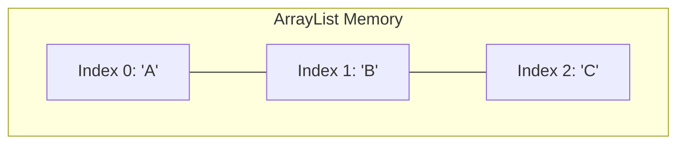
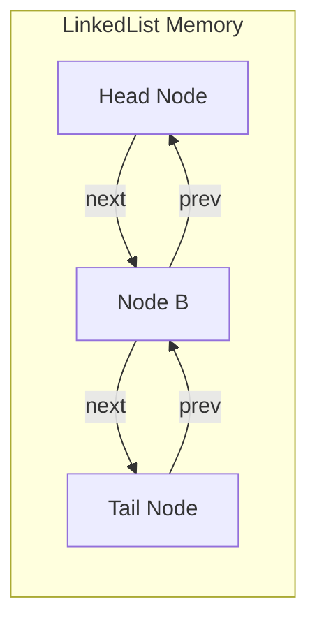

## The List Interface (`java.util.List`)

A **List** is an **ordered collection** (sometimes called a "sequence").

**Key Properties:**
1.  **Ordered**: Elements stay in the order you insert them.
2.  **Index-based**: You can access elements by their integer position (`.get(0)`).
3.  **Duplicates**: Allowed (you can have "A", "B", "A").

### 1. ArrayList (`java.util.ArrayList`)

This is the default "go-to" implementation for 90% of use cases.

*   **Under the hood**: It uses a standard array (`Object[] elementData`).
*   **Dynamic**: When the internal array gets full, `ArrayList` creates a new array that is **50% larger** and copies everything over automatically.

**Performance (Big O):**
*   **Read (get index)**: **$O(1)$** (Instant). This is why we use it.
*   **Insert at End**: **$O(1)$** (amortized). Very fast.
*   **Insert/Delete in Middle**: **$O(n)$**. Slow. It has to shift all subsequent elements to the right or left.

### 2. LinkedList (`java.util.LinkedList`)

This is a **Doubly Linked List**. It does not use an array. It uses "Nodes". Each node holds data and two pointers: one to the `Next` node and one to the `Previous` node.

**Performance (Big O):**
*   **Read (get index)**: **$O(n)$**. Slow. To get element #500, it has to start at #0 and hop 500 times.
*   **Insert/Delete at Ends**: **$O(1)$**. Instant. Just update pointers.
*   **Insert in Middle**: **$O(1)$** *if* you already have a reference to the node (via an Iterator).

### ArrayList vs. LinkedList Cheat Sheet

| Operation | ArrayList | LinkedList | Winner |
| :--- | :--- | :--- | :--- |
| `get(i)` | Fast ($O(1)$) | Slow ($O(n)$) | **ArrayList** |
| `add()` (at end) | Fast | Fast | Tie |
| `add(i, val)` (middle) | Slow (Shifting) | Fast (Pointer change)* | **LinkedList** (mostly) |
| Memory Overhead | Low | High (Node objects) | **ArrayList** |

> [!TIP]
> **Modern Hardware Tip**
> Even if you insert in the middle, `ArrayList` is often practically faster than `LinkedList` for small-to-medium datasets because of **CPU Cache Locality**. Arrays are contiguous in memory; Linked Lists are scattered. The CPU hates jumping around memory. **Default to ArrayList unless you have a specific reason not to.**

---