# Course: UML Software Engineering and Object-Oriented Design

---

## Chapter 1: Use Case Modeling (UML Use Cases)

### 1.1 Theoretical Foundations of Use Case Modeling

Use case modeling is the primary technique in UML used to capture the functional requirements of a system. It defines the system's boundary and describes the interactions between the system and external actors to deliver a measurable business value.

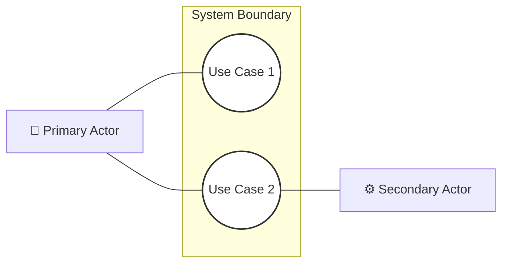

#### 1. Core Concepts
*   **System Boundary (Subject/Classifier):** A boundary rectangle that represents the limits of the system. Everything inside this box is part of the system under development; everything outside is an external actor.
*   **Use Case:** An oval representing a complete unit of business value. It is initiated by an actor, goes through a sequence of transactions, and leaves the system in a state of rest.
*   **Actor:** A role played by an external entity (human, device, or external system) interacting with the system.
    *   **Primary (Principal) vs. Secondary (Secondaire):** Primary actors initiate the use case to achieve a goal. Secondary actors are called upon by the system to assist in completing the use case (e.g., external payment gateways, printers).
    *   **Active vs. Passive:** Active actors initiate interactions. Passive actors receive outputs or are queried by the system.
    *   **Human vs. Non-Human (Mechanical/System):** Humans are represented as stick figures; non-human actors (SGBD, external servers, hardware peripherals) are stereotyped as `<<System>>` or `<<actor>>` and can be visually styled as 3D boxes or rectangles.

#### 2. Relationships between Use Cases
*   **Inclusion (`<<include>>`):** Represents a mandatory step. The base usecase cannot complete without executing the included usecase. The arrow points from the base use case *to* the included use case.
*   **Extension (`<<extend>>`):** Represents an optional, conditional step. The extending use case adds its behavior to the base use case only if a specific condition is met. The arrow points from the extending usecase *to* the base usecase.
*   **Generalization (Inheritance):** A taxonomic relationship where a specialized usecase (sub-usecase) inherits, overrides, or extends the behavior of a generalized usecase (parent). Represented by a line with a hollow triangular arrowhead pointing to the parent.

---

### 1.2 Use Case Exercises (Document A)

#### Exercise 1: School Room and Pedagogical Resource Reservation
**Problem Statement:** Design a use case diagram for a school room and equipment (laptops, projectors) reservation system.
*   Only teachers can make reservations, subject to availability.
*   Anyone (teachers and students) can view the room schedule.
*   Only teachers can view their personal schedule summary.
*   Each curriculum has a lead teacher (*Responsable formation*) who alone can print the schedule summary for the entire curriculum.

##### Step-by-Step Solution & Analysis
1.  **Identify Actors:**
    *   `Utilisateur salle` (Room User): Abstract parent role representing anyone who can view schedules.
    *   `Enseignant` (Teacher): Inherits from `Utilisateur salle` (is-a relationship).
    *   `Responsable formation` (Curriculum Lead): Inherits from `Enseignant` (is-a relationship).
    *   `Étudiant` (Student): Inherits from `Utilisateur salle` (implicit).
2.  **Identify Use Cases:**
    *   `Consulter planning` (View Schedule): Associated with `Utilisateur salle`.
    *   `Consulter récap horaire enseignant` (View Personal Summary): Associated with `Enseignant`.
    *   `Réserver` (Reserve): Base abstract usecase associated with `Enseignant`.
    *   `Vérification disponibilité` (Check Availability): Included (`<<include>>`) by `Réserver`.
    *   `Réservation salle` (Reserve Room) and `Réserver matériel` (Reserve Equipment): Specialize `Réserver` (Generalization).
    *   `Réserver vidéo` (Reserve Projector) and `Réserver portable` (Reserve Laptop): Specialize `Réserver matériel`.
    *   `Editer récap formation` (Print Curriculum Summary): Associated with `Responsable formation`.

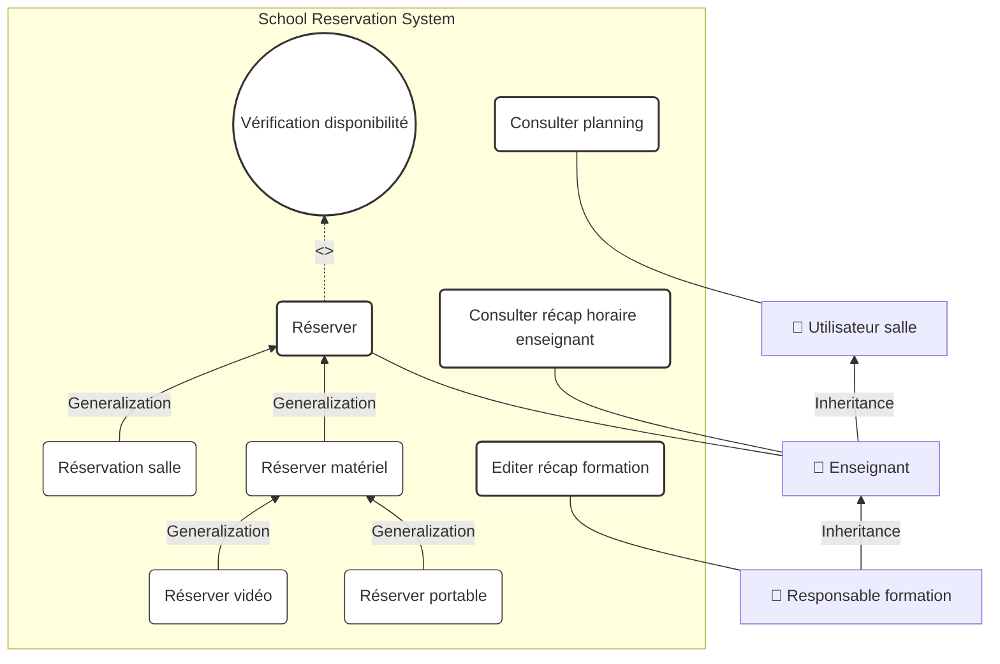

**Why this works:** The actor hierarchy simplifies the diagram. By making `Enseignant` inherit from `Utilisateur salle`, we avoid drawing a redundant association line from `Enseignant` to `Consulter planning`. The `<<include>>` relationship to `Vérification disponibilité` ensures that no reservation is completed without verifying resource availability first.

---

#### Exercise 2: Viticulture Research Project

**Problem Statement:** Design a use case diagram for a research system tracking labor times on pilot farms.
*   Workers do not have computers. They fill in paper logs using a standard reference glossary.
*   Pest control (phytosanitary) tasks require extra details (target diseases, growth stage, treatment methods, observations).
*   At the end of the month, the farm manager (*Chef d'exploitation*) checks and corrects paper logs, then inputs them into a web database.
*   The researcher receives an automated email, validates the data, and notifies the manager.
*   The manager then prints two reports: the monthly labor report for each employee, and the phytosanitary report.
*   At the end of the year, the researcher analyzes all data, writes a report, and sends it to all farm managers.

##### Step-by-Step Solution & Analysis
1.  **Identify Actors:**
    *   `Ouvrier Agricole` (Farm Worker): Primary actor who fills in paper logs.
    *   `Chef d'exploitation` (Farm Manager): Inherits from `Ouvrier Agricole`. He is responsible for verifying logs, entering data, and printing reports.
    *   `Chercheur` (Researcher): Verifies data in the database and writes the annual synthesis.
2.  **Identify Use Cases:**
    *   `Saisie opération` (Record Operation): Base usecase associated with `Ouvrier Agricole`.
    *   `Consultation du glossaire` (Consult Glossary): Optionally extends `Saisie opération`.
    *   `Opération phyto` (Pest Control Operation) and `Autre opération` (Other Operation): Specialize `Saisie opération` (Generalization).
    *   `Vérification saisie cahier` (Verify Paper Log) and `Correction éventuelle` (Correct Log): Associated with `Chef d'exploitation`.
    *   `Saisie BDD` (Input into Database): Associated with `Chef d'exploitation`, includes `Identification` (Authentication).
    *   `Etat terravitis` (Print Reports): Associated with `Chef d'exploitation`.
    *   `Vérification données BDD` (Verify DB Data), `Correction données BDD` (Correct DB Data), `Notification saisie ok` (Notify Validation), `Analyse résultats` (Analyze Results), and `Rédaction synthèse` (Write Annual Synthesis): Associated with `Chercheur`.

```mermaid
graph BT
    subgraph Viticulture Research System
        direction TB
        UC_Saisie(Saisie opération)
        UC_Phyto(Opération phyto)
        UC_Autre(Autre opération)
        UC_Glossaire(Consultation du glossaire)
        
        UC_VerifyC(Vérification saisie cahier)
        UC_CorrectC(Correction éventuelle)
        UC_SaisieBDD(Saisie BDD)
        UC_Ident((Identification))
        UC_Report(Etat terravitis)
        
        UC_VerifyD(Vérification données BDD)
        UC_CorrectD(Correction données BDD)
        UC_Notify(Notification saisie ok)
        UC_Analyze(Analyse résultats)
        UC_Synth(Rédaction synthèse)
        
        UC_Phyto -->|Generalization| UC_Saisie
        UC_Autre -->|Generalization| UC_Saisie
        UC_Glossaire -.->|<<extend>>| UC_Saisie
        UC_SaisieBDD -.->|<<include>>| UC_Ident
    end
    
    A_Worker["👤 Ouvrier Agricole"] --- UC_Saisie
    A_Manager["👤 Chef d'exploitation"] -->|Inheritance| A_Worker
    
    A_Manager --- UC_VerifyC
    A_Manager --- UC_CorrectC
    A_Manager --- UC_SaisieBDD
    A_Manager --- UC_Report
    
    A_Researcher["👤 Chercheur"] --- UC_VerifyD
    A_Researcher --- UC_CorrectD
    A_Researcher --- UC_Notify
    A_Researcher --- UC_Analyze
    A_Researcher --- UC_Synth
    
    style UC_Saisie fill:#fff,stroke:#333,stroke-width:2px;
    style UC_Phyto fill:#fff,stroke:#333,stroke-width:1px;
    style UC_Autre fill:#fff,stroke:#333,stroke-width:1px;
    style UC_Glossaire fill:#fff,stroke:#333,stroke-width:2px;
    style UC_VerifyC fill:#fff,stroke:#333,stroke-width:2px;
    style UC_CorrectC fill:#fff,stroke:#333,stroke-width:2px;
    style UC_SaisieBDD fill:#fff,stroke:#333,stroke-width:2px;
    style UC_Ident fill:#fff,stroke:#333,stroke-width:2px;
    style UC_Report fill:#fff,stroke:#333,stroke-width:2px;
    style UC_VerifyD fill:#fff,stroke:#333,stroke-width:2px;
    style UC_CorrectD fill:#fff,stroke:#333,stroke-width:2px;
    style UC_Notify fill:#fff,stroke:#333,stroke-width:2px;
    style UC_Analyze fill:#fff,stroke:#333,stroke-width:2px;
    style UC_Synth fill:#fff,stroke:#333,stroke-width:2px;
```

**Why this works:** The `<<extend>>` relationship from `Consultation du glossaire` to `Saisie opération` is correct because consulting the glossary is an optional step that depends on the worker's knowledge. Saisie BDD includes `Identification` (Authentication) to secure access, which is a key security practice.

---

#### Exercise 3: Store Sales Process

**Problem Statement:** Design a use case diagram for a store sales process: A client enters the store, browses the aisles, can request information from a salesperson or try out items. If inventory is sufficient, the customer takes the items, goes to the checkout counter, and pays using any accepted payment method. Customers may also be eligible for discounts.

##### Step-by-Step Solution & Analysis
1.  **Identify Actors:**
    *   `Client` (Customer): Primary actor who initiates browsing, trying items, buying, and paying.
    *   `Vendeur` (Salesperson): Supporting actor who provides information.
    *   `Caisse` (Cashier/POS System): Supporting actor that handles checkout and payment.
    *   `Groupement des banques` (Bank Network): Supporting actor involved in credit card authorization.
2.  **Identify Use Cases:**
    *   `Prospecter` (Browse): Base usecase associated with `Client`.
    *   `Renseigner` (Provide Info): Associated with `Vendeur`, extends `Prospecter`.
    *   `Essayer` (Try Items): Extends `Prospecter`.
    *   `Acheter` (Purchase): Associated with `Client`. Includes `Vérification stock` and `Payer`.
    *   `Bénéficier réduction` (Apply Discount): Optionally extends `Acheter`.
    *   `Payer` (Pay): Associated with `Caisse`, serves as parent usecase.
    *   `Payer CB` (Pay by Card), `Payer liquide` (Pay by Cash), `Payer chèque` (Pay by Check): Specialize `Payer` (Generalization).
    *   `Groupement des banques` is associated with `Payer CB`.

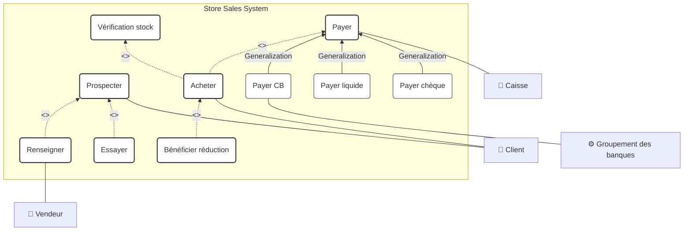

**Why this works:** Splitting `Payer` into subclasses (CB, liquide, chèque) shows how different payment methods are handled without cluttering the main `Acheter` use case. `Vérification stock` is a mandatory precondition to purchase, which is why it is modeled as an `<<include>>` relationship.

---

#### Exercise 4: Bank ATM (DAB) System

**Problem Statement:** Design a use case diagram for an ATM (DAB) system:
*   The ATM serves cardholders (Visa or bank cards) for cash withdrawals.
*   For bank customers, it supports checking account balances and depositing cash or checks.
*   All transactions require secure authentication.
*   If a card is swallowed, a maintenance technician is responsible for retrieving it. The technician also collects deposits and replenishes cash.

##### Step-by-Step Solution & Analysis
1.  **Identify Actors:**
    *   `Porteur de carte` (Cardholder): Abstract primary actor representing anyone with a compatible card.
    *   `Client de la banque` (Bank Customer): Inherits from `Porteur de carte`.
    *   `SI Banque` (Bank IT System) and `SI gestion CB` (Card Processor System): Secondary actors involved in verification.
    *   `Opérateur de maintenance` (Maintenance Operator): Handles physical machine servicing.
2.  **Identify Use Cases:**
    *   `Retirer argent` (Withdraw Cash): Associated with `Porteur de carte`. Includes `S'authentifier`.
    *   `Retirer argent avec visa` (Withdraw Cash with Visa): Associated with `Porteur de carte`, includes `S'authentifier`.
    *   `Consulter solde` (Check Balance): Associated with `Client de la banque`, includes `S'authentifier`.
    *   `Déposer argent` (Deposit Cash/Check): Base usecase associated with `Client de la banque`, includes `S'authentifier`.
    *   `Déposer numéraire` (Deposit Cash) and `Déposer chèques` (Deposit Checks): Specialize `Déposer argent` (Generalization).
    *   `S'authentifier` (Authenticate): Associated with `SI Banque` and `SI gestion CB`.
    *   `Recharger DAB` (Replenish ATM), `Récupérer cartes avalées` (Retrieve Swallowed Cards), `Récupérer chèque` (Retrieve Checks): Associated with `Opérateur de maintenance`.

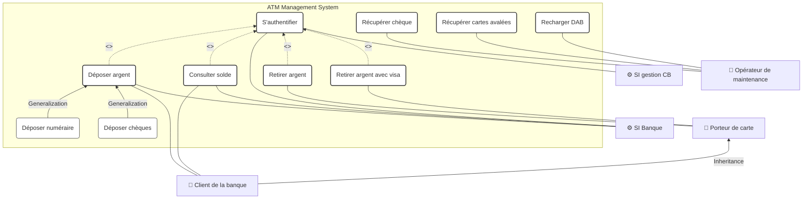

**Why this works:** Organizing use cases into distinct paths for general cardholders vs. bank customers prevents authorization bypass issues. External authorization networks (like bank servers and Visa networks) are correctly modeled as secondary system actors connected to `S'authentifier` and query use cases.

---

#### Exercise 5: Inventory Management System for a Merchant

**Problem Statement:** Design a use case diagram for an inventory management system:
*   A merchant needs a system to edit a supplier profile.
*   The system must allow adding a new item, which automatically creates the supplier profile if it doesn't exist.
*   The system must support editing the inventory. From this screen, the user can choose to print the inventory, delete an item, or edit/print an item's details.

##### Step-by-Step Solution & Analysis
1.  **Identify Actors:**
    *   `Commerçant` (Merchant): The primary actor who manages the inventory.
2.  **Identify Use Cases:**
    *   `Affichage inventaire` (Display Inventory): Associated with `Commerçant`.
    *   `Impression inventaire` (Print Inventory), `Effacement article` (Delete Item), `Edition article` (Edit Item): Optionally extend `Affichage inventaire`.
    *   `Edition fournisseur` (Edit Supplier): Associated with `Commerçant`. Optionally extended by `Edition article`.
    *   `Ajouter article` (Add Item): Associated with `Commerçant`. Includes `Edition fournisseur`.
    *   `Ajout fournisseur` (Add Supplier): Optionally extends `Ajouter article`.

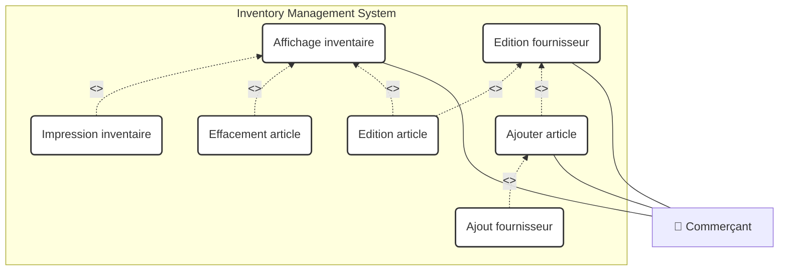

**Why this works:** The `<<extend>>` relationship from `Impression inventaire`, `Effacement article`, and `Edition article` to `Affichage inventaire` is correct because these operations are initiated directly from the inventory display screen. Adding an item includes `Edition fournisseur` (supplier profile editing) because creating or opening a supplier record is a required part of adding a new item.

---

### 1.3 MonAuto Case Study (Document B)

#### Problem Statement & Context
MonAuto is a business that sells, services, and repairs cars. They want to implement a repair management system on their intranet. The system needs to interface with an existing accounting software to handle repair invoices. 

The system is designed mainly for the workshop manager (*Chef d'atelier*), who enters repair logs and records work hours. Spare parts are managed in the stockroom. Stockkeepers (*Magasiniers*) only issue parts for cars with an open repair log. They record issued parts in the system via a terminal in the stockroom. Once a repair is complete, the workshop manager test drives the car and closes the repair log. Closed repair logs must be imported into the accounting software by the accountant (*Comptable*).

---

#### 1. Step-by-Step Construction: Boundary & Initial Diagrams

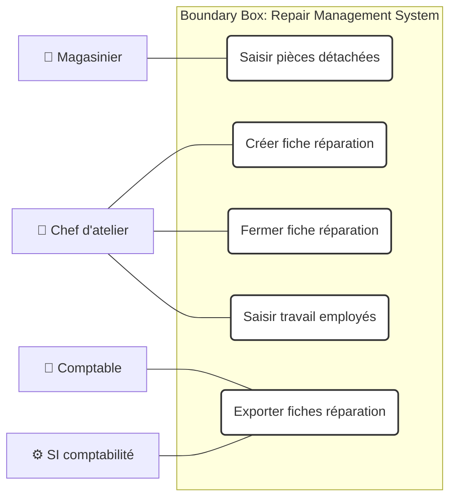

---

#### 2. Optimized Use Case Diagram

We optimize the diagram by applying the **"Administrateur"** and **"Gestion"** patterns:
*   We introduce an abstract parent actor, **`Employé`**, to manage shared tasks like searching repair logs.
*   We add a secure authentication use case (`S'authentifier`) that is included by all operational workflows.
*   We add an administrative user account management use case to handle system administration.

```mermaid
graph BT
    subgraph MonAuto System Boundary
        direction TB
        UC_Print(Imprimer fiche)
        UC_Read(Consulter fiche)
        UC_Search(Rechercher fiche)
        UC_Parts(Saisir pièces détachées)
        UC_Modify(Modifier fiche)
        UC_Labor(Saisir travail effectué)
        UC_Create(Créer fiche)
        UC_Close(Fermer fiche)
        UC_ManageUsers(Gérer comptes utilisateurs)
        UC_Archive(Archiver fiches)
        UC_Export(Exporter fiches)
        UC_Auth(S'identifier)
        
        UC_Print -.->|<<extend>>| UC_Read
        UC_Read -.->|<<extend>>| UC_Search
        
        UC_Parts -.->|<<include>>| UC_Auth
        UC_Labor -.->|<<include>>| UC_Auth
        UC_Modify -.->|<<include>>| UC_Auth
        UC_Create -.->|<<include>>| UC_Auth
        UC_Close -.->|<<include>>| UC_Auth
        UC_ManageUsers -.->|<<include>>| UC_Auth
        UC_Archive -.->|<<include>>| UC_Auth
        UC_Export -.->|<<include>>| UC_Auth
    end
    
    A_Employe["👤 Employé (Abstract)"] --- UC_Search
    A_Stock["👤 Magasinier"] -->|Inheritance| A_Employe
    A_Workshop["👤 Chef d'atelier"] -->|Inheritance| A_Employe
    A_Admin["👤 Administrateur"] -->|Inheritance| A_Employe
    
    A_Stock --- UC_Parts
    A_Stock --- UC_Modify
    
    A_Workshop --- UC_Modify
    A_Workshop --- UC_Create
    A_Workshop --- UC_Close
    A_Workshop --- UC_Labor
    
    A_Admin --- UC_ManageUsers
    A_Admin --- UC_Archive
    
    A_Accountant["👤 Comptable"] --- UC_Export
    A_AccSys["⚙️ SI comptabilité"] --- UC_Export
    
    style UC_Print fill:#fff,stroke:#333,stroke-width:2px;
    style UC_Read fill:#fff,stroke:#333,stroke-width:2px;
    style UC_Search fill:#fff,stroke:#333,stroke-width:2px;
    style UC_Parts fill:#fff,stroke:#333,stroke-width:2px;
    style UC_Modify fill:#fff,stroke:#333,stroke-width:2px;
    style UC_Labor fill:#fff,stroke:#333,stroke-width:2px;
    style UC_Create fill:#fff,stroke:#333,stroke-width:2px;
    style UC_Close fill:#fff,stroke:#333,stroke-width:2px;
    style UC_ManageUsers fill:#fff,stroke:#333,stroke-width:2px;
    style UC_Archive fill:#fff,stroke:#333,stroke-width:2px;
    style UC_Export fill:#fff,stroke:#333,stroke-width:2px;
    style UC_Auth fill:#fff,stroke:#333,stroke-width:2px;
```

---

### 1.4 Practical Lab Exercises (Document C)

#### Exercise 1: Gas Station Fuel Dispensing
1.  **Who is the actor when a customer pumps fuel?**
    *   The primary actor is the `Client` (Customer). Pumping fuel is an action performed directly by the customer, who interacts with the system via physical controls (nozzle detection and trigger inputs).
2.  **Add the Station Manager's management use cases:**
    *   The `Gérant` (Station Manager) is a primary actor for administrative tasks like `Gérer les cuves` (Manage Fuel Tanks) and `Consulter les ventes` (View Sales Report).
3.  **The manager can pump fuel for their own car. How do we model this?**
    *   The physical manager is playing the *role* of a `Client`. Therefore, we use actor generalization: `Gérant` inherits from `Client`. This allows the manager to access all use cases associated with the client role, including `Se servir de l'essence`.
4.  **The station has a small maintenance workshop. The manager is also the mechanic. How is this modeled?**
    *   We introduce a new actor role: `Mécanicien` (Mechanic), who is associated with `Entretenir les véhicules` (Service Vehicles). The `Gérant` actor inherits from both `Client` and `Mécanicien` (Multiple Inheritance). This shows that the manager can play all three roles.

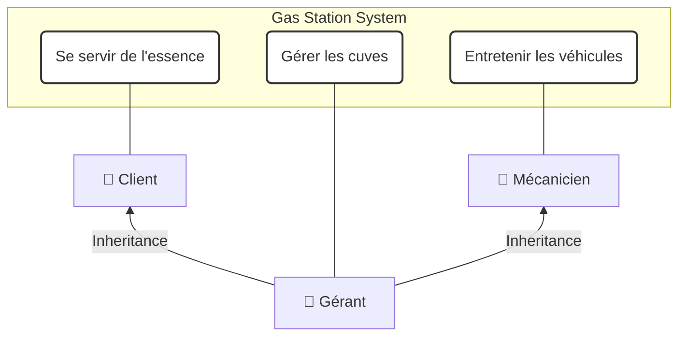

---

#### Exercise 2: Critique of the Gas Station Diagram
The provided diagram (Screenshot Page 1 of Document C) has several design issues:
*   **Issues**: It models individual sequential steps (`Décrocher le pistolet`, `Appuyer sur la gâchette`, `Reposer le pistolet`) as separate use cases.
*   **Correction**: This is a classic anti-pattern (over-functional decomposition). A usecase must represent a complete, atomic transaction that delivers value. The individual steps are part of the internal flow of a single use case: `Se servir de l'essence` (Pump Fuel).

---

#### Exercise 3: Travel Agency
**Problem Statement:** A travel agency organizes trips, manages transportation and lodging, and offers optional taxi reservations. Some clients request detailed invoices. Travel can be booked by train or plane.

##### Step-by-Step Solution & Analysis
1.  **Identify Actors:** `Client`, `Système de réservation` (legacy system).
2.  **Identify Use Cases:**
    *   `Organiser voyage` (Organize Trip): Main usecase.
    *   `Réserver taxi` (Book Taxi): Optionally extends (`<<extend>>`) `Organiser voyage`.
    *   `Etablir facture détaillée` (Issue Detailed Invoice): Optionally extends `Organiser voyage`.
    *   `Voyager par train` (Travel by Train) and `Voyager par avion` (Travel by Plane): Specialize `Organiser voyage` (Generalization).

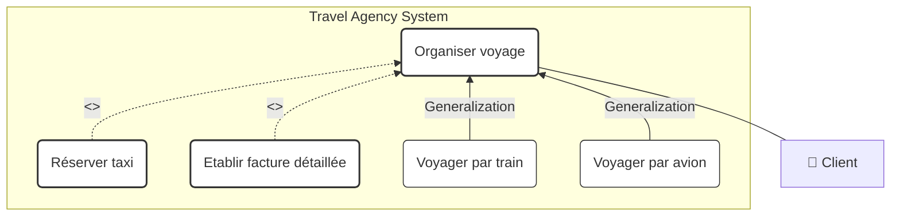

---

#### Exercise 4: Video Cassette Dispenser
**Problem Statement:** Customers use a magnetic card to rent cassettes from an automated dispenser. Cards are managed and refilled at a nearby store. Rental costs 1 Euro per 6-hour block. If the card balance is at least 1 Euro, the customer can rent a cassette. If not, they must refill the card at the store. The system tracks debtor accounts, which are managed by store personnel.

##### Step-by-Step Solution & Analysis
1.  **Identify Actors:** `Client` (User), `Personnel du magasin` (Store Personnel).
2.  **Identify Use Cases:**
    *   `Louer cassette` (Rent Cassette): Associated with `Client`.
    *   `S'identifier` (Authenticate): Included (`<<include>>`) by `Louer cassette` and `Restituer cassette`.
    *   `Restituer cassette` (Return Cassette): Associated with `Client`.
    *   `Recharger carte` (Refill Card) and `Régulariser compte débiteur` (Settle Debtor Account): Associated with `Personnel du magasin`.

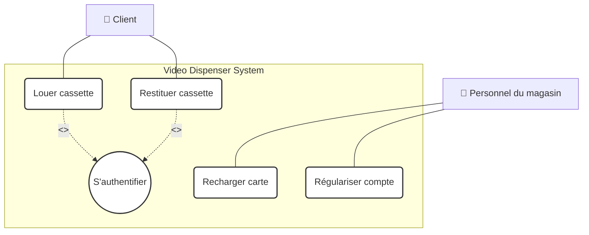

**Why this works:** Splitting machine-based use cases (which are used by the customer) from store-based use cases (which are handled by store staff) is correct because it matches the physical boundaries of the system.

---

#### Exercise 5: Animation Centers (Mairie de Paris)
**Problem Statement:** A city manages several activity centers. Members can register at only one center and must pay an annual membership fee. However, they can sign up for activities across multiple centers. Activity sign-ups are on a quarterly basis. Members who do not renew their annual membership within 6 months of expiration lose their membership status.

##### Step-by-Step Solution & Analysis
1.  **Identify Actors:** `Membre` (Member), `Gestionnaire` (Center Manager).
2.  **Identify Use Cases:**
    *   `S'inscrire au centre` (Register at Center): Includes paying the annual fee.
    *   `S'inscrire à une activité` (Register for Activity): Associated with `Membre`.
    *   `Gérer les adhésions` (Manage Memberships) and `Radier membre inactif` (Remove Expired Members): Associated with `Gestionnaire`.

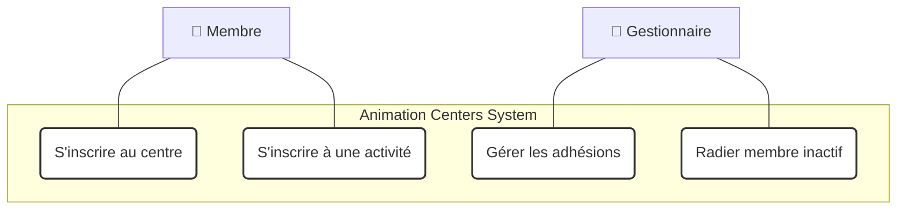

---

#### Exercise 6: Remote-Controlled Robot

**Problem Statement:** A robot is equipped with a video camera and electric motors. It is controlled remotely over a radio link from a piloting station. The piloting station displays the video feed on a monitor, and the pilot uses controls to command the wheels and motors.
1.  **Define the system boundary using a single system, then split it into sub-systems:**
    *   **Single System**: The system boundary includes both the robot hardware and the software running on the piloting station.
    *   **Sub-systems**:
        *   `Sous-système Robot`: Runs on the physical robot (handles motor control and camera capture).
        *   `Sous-système Station de Pilotage`: Runs on the remote control station (handles the user interface and video display).

##### UML Use Case Diagram

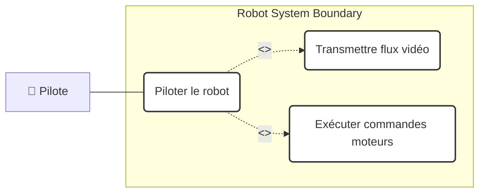

---

#### Exercise 7: Media Library (Médiathèque)

**Problem Statement:** A media library allows visitors to search for books at interactive kiosks. Registered members can log in using their library card to manage and place holds on books. Librarians manage book loans, return processing, acquisition planning, and new member registrations. Late returns trigger progressive penalties: after 3 months, the dispute is sent to collections (*Service Contentieux*), and after one year, it triggers legal action (*Procédure Judiciaire*). Both librarians and collection agents must log in with a username and password.

##### Step-by-Step Solution & Analysis
1.  **Identify Actors:**
    *   `Visiteur` (Visitor): Generic user who can search books.
    *   `Abonné` (Member): Inherits from `Visiteur` (can also place holds).
    *   `Bibliothécaire` (Librarian): Manages loans, returns, and catalog data.
    *   `Service Contentieux` (Collection Agent): Handles long-term defaults.
    *   `Service Juridique` (Legal System/Agent): Handles legal escalations.
2.  **Identify Use Cases:**
    *   `Consulter catalogue` (Search Catalog): Associated with `Visiteur`.
    *   `Gérer commandes` (Manage Holds): Associated with `Abonné`, includes `S'authentifier`.
    *   `Enregistrer emprunt` (Record Loan) and `Enregistrer retour` (Record Return): Associated with `Bibliothécaire`, includes `S'authentifier`.
    *   `Gérer les adhésions` (Manage Registrations): Associated with `Bibliothécaire`.
    *   `S'authentifier` (Authenticate): Shared included use case.
    *   `Gérer contentieux` (Manage Disputes): Associated with `Service Contentieux`.
    *   `Engager procédure judiciaire` (Trigger Legal Action): Associated with `Service Juridique`.

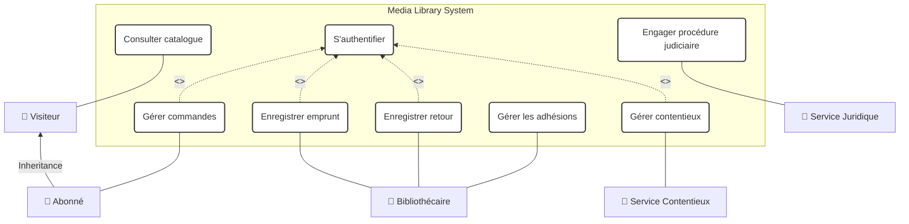

---

#### Exercise 8: Gas Pump Dispenser System
**Problem Statement:** A customer uses a gas pump after it has been enabled by the pump attendant (*Pompiste*). If the pump is enabled and the customer presses the trigger, fuel is dispensed. If the nozzle is returned to its holster, the pump is disabled. The pump attendant can enable the pump for a new transaction, or resume the previous transaction if the customer returned the nozzle but wants to continue fueling. Fuel volume is measured by a flow meter (*Débitmètre*). Four fuel types are available (Diesel, Unleaded 98, Unleaded 95, Leaded). Payments can be made by cash, check, or card, and all transactions are archived at the end of the day. If the fuel tank level drops below 5% of capacity, the pump cannot be enabled.

##### Step-by-Step Solution & Analysis
1.  **Identify Actors:**
    *   `Client` (Customer): Dispenses fuel and pays.
    *   `Pompiste` (Attendant): Enables or resumes the pump.
    *   `Débitmètre` (Flow Meter): Supporting system actor that tracks dispensed volume.
    *   `Cuve` (Storage Tank): Supporting system actor that monitors fuel levels.
2.  **Identify Use Cases:**
    *   `Prendre carburant` (Dispense Fuel): Associated with `Client`, `Pompiste`, and `Débitmètre`.
    *   `Autoriser pompe` (Enable Pump): Associated with `Pompiste`. Includes `Vérifier niveau cuve` (Check Tank Level).
    *   `Payer` (Pay): Associated with `Client`.
    *   `Archiver transactions` (Archive Transactions): Temporal use case.

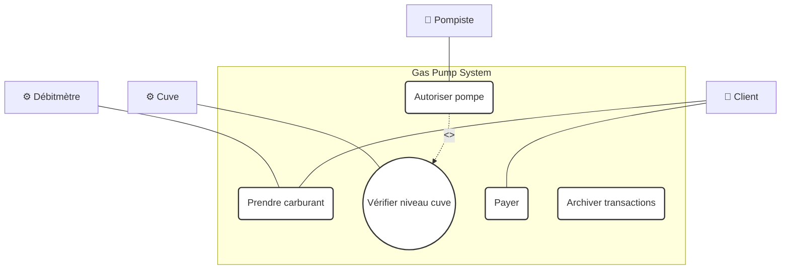

---

#### Exercise 9: Transport Service Vehicle and Driver Management
**Problem Statement:** A company's transport department manages vehicles, drivers, and trips. Staff members include administrative personnel, drivers, and mechanics. Administrative staff manage vehicle schedules and bookings. Bookings are allowed only if a vehicle's category is appropriate for the passenger group's priority rank. Higher-ranking employees can book higher-category vehicles, but the reverse is not allowed. Bookings also depend on driver availability and licensing. Vehicles are classified as Available, Booked, In-Service, or In-Maintenance. Mechanics handle maintenance schedules. If a vehicle breaks down, it is sent to an external garage for repair. The company management can purchase new vehicles or rent them from external providers. Driver schedules track vacation and sick days. To ensure safety, bookings must be spaced by at least 10% of the preceding trip's duration. At the end of a trip, drivers submit fuel receipts for reimbursement. Financial aspects are handled by a separate accounting system.

##### Step-by-Step Solution & Analysis
1.  **Identify Actors:**
    *   `Personnel Administratif` (Admin Staff): Manages bookings and driver schedules.
    *   `Mécanicien` (Mechanic): Manages vehicle maintenance.
    *   `Chauffeur` (Driver): Submits fuel receipts.
    *   `Direction` (Management): Decides on purchases and rentals.
    *   `Garage Extérieur` (External Garage): Handles repairs.
    *   `Société de Location` (Rental Provider): Handles rentals.
2.  **Identify Use Cases:**
    *   `Réserver véhicule` (Book Vehicle): Associated with `Personnel Administratif`. Includes checking driver licenses and priority ranks.
    *   `Gérer planning chauffeurs` (Manage Driver Schedules): Associated with `Personnel Administratif`.
    *   `Gérer maintenance` (Manage Maintenance): Associated with `Mécanicien`.
    *   `Enregistrer réparation extérieure` (Record External Repair): Associated with `Mécanicien` and `Garage Extérieur`.
    *   `Acheter véhicule` (Purchase Vehicle) and `Louer véhicule` (Rent Vehicle): Associated with `Direction`.
    *   `Soumettre facture carburant` (Submit Fuel Receipt): Associated with `Chauffeur`.

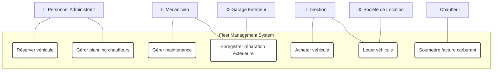

---

## Chapter 2: Structural Modeling (UML Class Diagrams)

### 2.1 Foundations of Class Diagrams & Associations

UML Class Diagrams represent the static structure of a system by showing its classes, attributes, operations, and relationships.

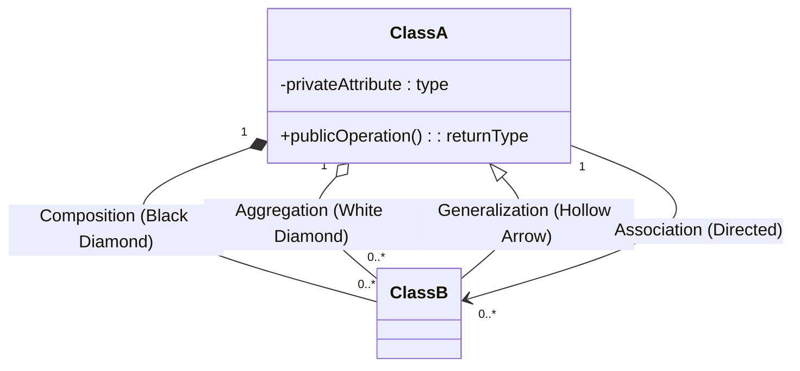

#### Key Relationships
1.  **Association**: A general relationship between classes, represented as a solid line. It defines how many instances of one class can be linked to instances of another (multiplicity, e.g., `1`, `0..*`, `1..*`).
2.  **Aggregation (Agrégation)**: A specialized "part-of" association where the child can exist independently of the parent (weak coupling). Represented by a hollow diamond at the parent end.
3.  **Composition**: A strong "part-of" association where the child's lifetime is managed by the parent. If the parent is destroyed, the child is destroyed too. Represented by a filled black diamond at the parent end.
4.  **Generalization (Héritage)**: Represents an inheritance relationship, shown as a solid line with a hollow triangular arrowhead pointing to the parent class.

---

### 2.2 Structural Relationship Exercises (Document A - Ex 9)

For each sentence, we determine the most appropriate relationship:

#### 1. "Un répertoire contient des fichiers" (A directory contains files)
*   **Analysis**: A file is a distinct entity. While it is stored inside a directory, destroying the directory does not necessarily destroy the file (or we can model it as a strong lifecycle dependency). If we model this as a directory having exclusive ownership of its files, we use **Composition**. If files can exist in multiple contexts or references, we use **Aggregation**. In standard operating systems, a file belongs to exactly one parent directory; if the directory is deleted, the file is deleted. Therefore, **Composition** is the most accurate relationship.
*   **Multiplicity**: 1 directory contains 0 to many (`0..*`) files.

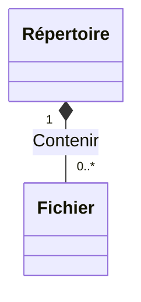

---

#### 2. "Une pièce contient des murs" (A room contains walls)
*   **Analysis**: A wall cannot exist without the room it bounds. If the room is destroyed, the physical walls are destroyed as well. This strong lifecycle dependency represents **Composition**.
*   **Multiplicity**: A room is made of 1 or more (`1..*`) walls. A wall belongs to 1 or 2 rooms (for shared partition walls). Let's use `1..*` on the wall side and `1..2` on the room side.

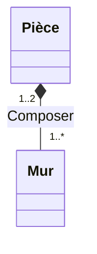

---

#### 3. "Les modems et claviers sont des périphériques d'entrée/sortie" (Modems and keyboards are input/output peripherals)
*   **Analysis**: This is an "is-a" taxonomic relationship. Modems and Keyboards are specialized types of peripherals. We use **Generalization**.

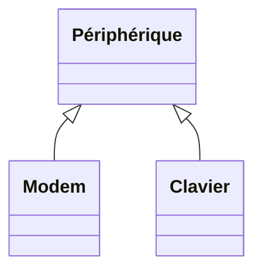

---

#### 4. "Une transaction boursière est un achat ou une vente" (A stock transaction is a purchase or a sale)
*   **Analysis**: This is also an "is-a" relationship. A stock transaction is an abstract parent class specialized into `Achat` (Purchase) or `Vente` (Sale). We use **Generalization**.

```mermaid
classDiagram
    class TransactionBoursière {
        <<Abstract>>
    }
    class Achat {
    }
    class Vente {
    }
    TransactionBoursière <|-- Achat
    TransactionBoursière <|-- Vente
```

---

#### 5. "Un compte bancaire peut appartenir à une personne physique ou morale" (A bank account can belong to a natural or legal person)
*   **Analysis**: `Personne morale` (Legal Person) and `Personne physique` (Natural Person) share a common parent class: `Client` (or `Personne`). A bank account is associated with this parent class.
*   **Multiplicity**: An account belongs to exactly 1 client (`1..1`). A client can own 1 or more (`1..*`) bank accounts.

```mermaid
classDiagram
    class Client {
        <<Abstract>>
    }
    class PersonnePhysique {
    }
    class PersonneMorale {
    }
    class CompteBancaire {
    }
    Client <|-- PersonnePhysique
    Client <|-- PersonneMorale
    Client "1" <-- "1..*" CompteBancaire : Appartenir
```

---

### 2.3 Academy Course Management (Document A - Ex 10)

#### Problem Statement
An academy manages courses across several colleges.
*   Each college has a website.
*   Each college is organized into departments. Departments group teachers. Each department has one designated head.
*   A teacher has a name, phone, email, hire date, and pay index.
*   A teacher teaches exactly one subject.
*   Students take several subjects and receive a grade for each.
*   A student has a name, phone, email, and enrollment year.
*   A subject can be taught by multiple teachers but always takes place in the same classroom (which has a set capacity).
*   The system must calculate average grades by subject, by department, and for each student, and display subjects for which a student has not yet received a grade.
*   It must also print profiles for teachers and students.

#### Step-by-Step Solution & Analysis
1.  **Identify Classes and Attributes**:
    *   `College`: `nom`, `adresse_site`.
    *   `Departement`: `code_dept`, `nom`.
    *   `Personne` (Abstract parent): `nom`, `prenom`, `tel`, `mail`.
    *   `Enseignant` (extends `Personne`): `date_embauche`, `indice`.
    *   `Etudiant` (extends `Personne`): `annee_entree`.
    *   `Cours` (Subject): `code_cours`, `libelle_cours`.
    *   `Salle` (Classroom): `code_salle`, `nom`, `capacite`.
    *   `Note` (Association class): `note_controle`.
2.  **Define Relationships and Multiplicities**:
    *   `College` has a 1-to-many (`1..*`) composition with `Departement`.
    *   `Departement` has a 1-to-many (`1..*`) association with `Enseignant` (aggregation).
    *   A department has exactly one head: `Etre chef de` (1-to-1 association from `Departement` to `Enseignant`).
    *   An `Enseignant` teaches exactly one subject (`Cours`), but a `Cours` can be taught by multiple teachers (`1..*`).
    *   A `Cours` always takes place in exactly one `Salle` (`1..1`), but a `Salle` can host multiple courses (`0..*`).
    *   An `Etudiant` takes several courses, and a course has several students. This is a many-to-many (`*` to `*`) association with an association class: `Note`.

```mermaid
classDiagram
    class College {
        +nom : string
        +adresse_site : string
    }
    class Departement {
        +code_dept : string
        +nom : string
        +calculerMoyenne() : float
    }
    class Personne {
        <<Abstract>>
        +nom : string
        +prenom : string
        +tel : string
        +mail : string
        +imprimerFiche() : void
    }
    class Enseignant {
        +date_embauche : Date
        +indice : int
    }
    class Etudiant {
        +annee_entree : int
        +calculerMoyenneGenerale() : float
        +afficherMatieresSansNote() : list
    }
    class Cours {
        +code_cours : string
        +libelle_cours : string
        +calculerMoyenne() : float
    }
    class Salle {
        +code_salle : string
        +nom : string
        +capacite : int
    }
    class Note {
        +note_controle : float
    }

    College "1" *-- "1..*" Departement : Constituer
    Departement "1" o-- "1..*" Enseignant : Appartenir
    Departement "1" --> "1" Enseignant : Chef de
    Enseignant "1..*" --> "1" Cours : Enseigner
    Cours "0..*" --> "1" Salle : Se dérouler
    Etudiant "1..*" --> "1..*" Cours : Suivre
    (Etudiant, Cours) .. Note
    Personne <|-- Enseignant
    Personne <|-- Etudiant
```

**Why this works:** Factoring shared contact details into an abstract parent class (`Personne`) makes it easy to implement the `imprimerFiche()` method once. Using an association class (`Note`) for the many-to-many relationship between `Etudiant` and `Cours` is the correct way to store grades, as a grade belongs to a specific student-subject pair.

---

### 2.4 Flight Reservation System (Document A - Ex 11)

#### Problem Statement
An agency manages flight reservations.
*   Airlines offer flight patterns (generic flights).
*   A flight is opened for reservation and closed by the airline.
*   A customer can book one or more flights for different passengers.
*   A booking is for a single flight and a single passenger.
*   A booking can be confirmed or cancelled.
*   A generic flight has an origin airport and a destination airport.
*   A flight has a departure date and time, and an arrival date and time.
*   A flight can include layovers at one or more airports.
*   Layovers have defined arrival and departure times.
*   An airport serves one or more cities.

#### Step-by-Step Solution & Analysis
1.  **Identify Classes and Attributes**:
    *   `CompagnieAérienne`: `code_cie`, `nom_cie`.
    *   `VolGénérique` (Flight Pattern): `no_vol_générique`, `heure_depart`, `heure_arrivee`.
    *   `Vol` (Actual Instance): `no_vol`, `date_depart`, `date_arrivee`.
    *   `Escale` (Layover): `heure_arrivee`, `heure_depart`, `ordre_escale`.
    *   `Aeroport`: `code_aeroport`, `nom_aeroport`.
    *   `Ville`: `code_ville`, `nom_ville`.
    *   `Reservation`: `no_res`, `date_res`, `status` (confirmed, cancelled).
    *   `Passager`: `no_passager`, `nom`, `prenom`.
    *   `Client`: `no_client`, `adresse`, `telephone`.
2.  **Define Relationships and Multiplicities**:
    *   An airline has 1-to-many (`1..*`) generic flights.
    *   A generic flight is mapped to an origin airport (`1..1`) and a destination airport (`1..1`).
    *   A generic flight can have multiple layovers (`0..*`). Each layover (`Escale`) is mapped to exactly one airport (`1..1`).
    *   A generic flight is instantiated as multiple concrete flights (`0..*`).
    *   An airport serves 1-to-many (`1..*`) cities.
    *   A customer (`Client`) makes 1-to-many (`1..*`) bookings.
    *   A booking (`Reservation`) is for exactly one concrete flight (`Vol`) and one passenger (`Passager`).

```mermaid
classDiagram
    class CompagnieAerienne {
        +code_cie : string
        +nom_cie : string
    }
    class VolGenerique {
        +no_vol_generique : string
        +heure_depart : Time
        +heure_arrivee : Time
    }
    class Vol {
        +no_vol : string
        +date_depart : Date
        +date_arrivee : Date
        +status : string
    }
    class Escale {
        +heure_arrivee : Time
        +heure_depart : Time
        +ordre : int
    }
    class Aeroport {
        +code_aeroport : string
        +nom_aeroport : string
    }
    class Ville {
        +code_ville : string
        +nom_ville : string
    }
    class Reservation {
        +no_res : string
        +date_res : Date
        +status : string
    }
    class Individu {
        <<Abstract>>
        +nom : string
        +prenom : string
    }
    class Client {
        +no_client : string
        +adresse : string
    }
    class Passager {
        +no_passager : string
    }

    CompagnieAerienne "1" *-- "1..*" VolGenerique : Proposer
    VolGenerique "1" *-- "0..*" Escale : Comporter
    Escale "0..*" --> "1" Aeroport : Situer
    VolGenerique "1" --> "1" Aeroport : Depart
    VolGenerique "1" --> "1" Aeroport : Arrivee
    VolGenerique "1" *-- "0..*" Vol : Instancier
    Aeroport "1..*" --> "1..*" Ville : Desservir
    
    Client "1" *-- "0..*" Reservation : Effectuer
    Reservation "0..*" --> "1" Vol : Concerner
    Reservation "0..* " --> "1" Passager : Concerner
    
    Individu <|-- Client
    Individu <|-- Passager
```

**Why this works:** Separating `VolGénérique` (the scheduled route, e.g., AF012 daily) from `Vol` (the actual physical flight on a specific date, e.g., AF012 on October 14th) is a key design pattern for transport systems. It prevents data redundancy and accurately models flight instances.

---

## Chapter 3: Behavioral Modeling (UML Interaction and Process Diagrams)

### 3.1 Sequence & Activity Diagrams

#### 1. Sequence Diagrams
Sequence diagrams are interaction diagrams that show how processes operate with one another and in what order (time sequence). They depict the objects and actors involved in the scenario and the sequence of messages exchanged.

```mermaid
sequenceDiagram
    actor Client
    participant Caisse as Caisse (System)
    
    Client->>Caisse: Présenter articles
    loop Pour chaque article
        Caisse->>Caisse: Enregistrer article
        Caisse-->>Client: Afficher prix et libellé
    end
    Caisse-->>Client: Demander paiement
```

*   **Synchronous Message**: Represented by a solid line with a filled arrowhead. The sender pauses execution and waits for a response before continuing.
*   **Asynchronous Message**: Represented by a solid line with an open arrowhead. The sender continues execution without waiting for a response.
*   **Return Message**: Represented by a dashed line with an open arrowhead.

#### 2. Activity Diagrams
Activity diagrams represent the step-by-step workflows of components and system activities. They are useful for showing parallel processing, conditional choices, and system states.

```mermaid
graph TD
    Start([Start]) --> Action1[Scan Item]
    Action1 --> Decision{Is Quantity > 1?}
    Decision -->|Yes| Action2[Enter Quantity]
    Decision -->|No| Action3[Calculate Price]
    Action2 --> Action3
    Action3 --> End([End])
```

---

### 3.2 Supermarket Checkout (Document A - Ex 6)

#### Problem Statement
Model a supermarket checkout transaction using a sequence diagram (for cash payments only):
1. A customer arrives at the checkout counter with their items.
2. The cashier scans each item's barcode and enters the quantity if it is greater than 1.
3. The cash register display shows the item's name and price.
4. Once all items are scanned, the cashier signals the end of the sale.
5. The cash register calculates and displays the total.
6. The cashier announces the total due to the customer.
7. The customer pays in cash. The cashier inputs the amount received, the cash register calculates the change due, the drawer opens, and the receipt is printed.
8. The cashier hands the receipt and the change to the customer.

#### UML Sequence Diagram

```mermaid
sequenceDiagram
    actor Client
    actor Caissier
    participant Caisse
    
    Client->>Caissier: Arrivée avec articles
    Caissier->>Caisse: Dépôt des articles
    
    loop Pour chaque article
        Caissier->>Caisse: Saisie article (code + quantité)
        Caisse-->>Caissier: Afficher prix et libellé
        Caisse-->>Client: Afficher prix et libellé (sur écran client)
    end
    
    Caissier->>Caisse: Fin de la vente
    Caisse-->>Caissier: Afficher total
    Caisse-->>Client: Afficher total
    Caissier->>Client: Annoncer total à payer
    
    Client->>Caissier: Paiement en espèces (billets/pièces)
    Caissier->>Caisse: Saisie montant reçu
    Caisse-->>Caissier: Afficher monnaie à rendre + ouvrir tiroir
    Caisse-->>Client: Afficher monnaie à rendre
    Caisse->>Caisse: Enregistrer vente & imprimer ticket
    Caissier->>Client: Remise de la monnaie et du ticket
```

---

### 3.3 ATM Sequence Diagram (Document A - Ex 7)

#### Problem Statement
Model a successful cash withdrawal at an ATM using a sequence diagram, indicating potential error paths with notes or comments:
1. The customer inserts their card.
2. The machine reads the card, validates it, and prompts for the PIN.
3. The customer enters their PIN.
4. The system validates the PIN with the bank network and gets authorization for the transaction.
5. The system presents withdrawal amount options.
6. The customer selects an amount.
7. The system verifies the amount against the authorized limit, then prompts the user if they want a receipt.
8. The system ejects the card, and the customer retrieves it.
9. The system dispenses the cash and prints the receipt.

#### UML Sequence Diagram

```mermaid
sequenceDiagram
    actor Porteur as Porteur de carte
    participant DAB as Automate (DAB)
    participant Banque as SI Banque
    
    Porteur->>DAB: Insérer carte
    DAB->>DAB: Vérifier validité carte
    note over DAB: Si invalide, la carte est éjectée
    
    DAB-->>Porteur: Demander code PIN
    Porteur->>DAB: Entrer code PIN
    DAB->>DAB: Vérifier code PIN
    note over DAB: Si code erroné, redemander (max 3 essais)
    
    DAB->>Banque: Demande d'autorisation de prélèvement
    Banque-->>DAB: Retourner solde autorisé
    
    DAB-->>Porteur: Proposer montants
    Porteur->>DAB: Sélectionner montant
    DAB->>DAB: Contrôler montant par rapport au solde autorisé
    note over DAB: Si montant demandé > solde, annuler ou demander autre montant
    
    DAB-->>Porteur: Demander choix ticket (Oui/Non)
    Porteur->>DAB: Choix reçu
    
    DAB->>Porteur: Ejecter carte
    Porteur-->>DAB: Récupérer carte
    note over DAB: Si la carte n'est pas retirée, elle est avalée après 30s
    
    DAB->>Porteur: Délivrer billets (+ ticket si demandé)
    Porteur-->>DAB: Récupérer billets & ticket
```

---

### 3.4 Flower Shop Collaboration and Sequence (Document A - Ex 8)

#### Problem Statement
Model a flower shop management system using both a sequence diagram and a collaboration (communication) diagram:
*   A customer requests information about floral arrangements from a salesperson.
*   The salesperson provides the information.
*   The customer places an order.
*   The salesperson creates a manufacturing order and sends it to the florist.
*   The salesperson generates the invoice.
*   The florist creates the arrangement and archives the manufacturing order.
*   The florist hands the arrangement to the salesperson.
*   The salesperson hands the invoice to the customer.
*   The customer pays, receives the flowers, and leaves.

---

#### 1. UML Sequence Diagram

```mermaid
sequenceDiagram
    actor Client
    actor Vendeur
    participant BF as Bon de fabrication
    participant Facture
    participant Composition
    actor Ouvrier as Ouvrier Fleuriste
    
    Client->>Vendeur: Demande de renseignements
    Vendeur-->>Client: Fournir informations
    Client->>Vendeur: Passer commande
    
    Vendeur->>BF: Créer bon de fabrication
    Vendeur->>Ouvrier: Transmettre bon
    Vendeur->>Facture: Editer facture
    
    Ouvrier->>Composition: Créer composition florale
    Ouvrier->>BF: Archiver bon de fabrication
    Ouvrier->>Vendeur: Livrer composition
    
    Vendeur->>Client: Remettre facture
    Client->>Vendeur: Régler facture
    Vendeur->>Client: Remettre composition
```

---

#### 2. UML Communication Diagram

```mermaid
graph TD
    Client["👤 Client"]
    Vendeur["👤 Vendeur"]
    Ouvrier["👤 Ouvrier Fleuriste"]
    BF["📄 Bon de fabrication"]
    Facture["📄 Facture"]
    Composition["🌸 Composition"]
    
    Client -->|1: Demande renseignements<br>3: Commande<br>12: Régler facture| Vendeur
    Vendeur -->|2: Fournir informations<br>11: Remettre facture<br>13: Remettre bouquet| Client
    Vendeur -->|4: Créer| BF
    Vendeur -->|5: Transmettre bon| Ouvrier
    Vendeur -->|6: Editer| Facture
    Vendeur -->|7: Imprimer| Facture
    
    Ouvrier -->|8: Créer| Composition
    Ouvrier -->|9: Archiver| BF
    Ouvrier -->|10: Livrer composition| Vendeur
```

---

### 3.5 MonAuto Activity Diagram (Document B)

This activity diagram details the workflow of the **"S'identifier"** (Authenticate) use case, including success and failure branches.

```mermaid
graph TD
    Start([Start]) --> Login[Prompt for credentials]
    Login --> Input[User enters username and password]
    Input --> Auth{Validate credentials}
    Auth -->|Valid| Success[Grant access to secure features]
    Success --> End([Success End])
    
    Auth -->|Invalid| Counter{Failed attempts < 3?}
    Counter -->|Yes| Attempt[Increment failed attempts counter]
    Attempt --> Error[Display error message]
    Error --> Login
    
    Counter -->|No| Lock[Lock account and notify user]
    Lock --> FailEnd([Failure End])
    
    style Start fill:#d4edda,stroke:#28a745,stroke-width:2px;
    style End fill:#d4edda,stroke:#28a745,stroke-width:2px;
    style FailEnd fill:#f8d7da,stroke:#dc3545,stroke-width:2px;
```

---

## Chapter 4: Object Constraint Language (OCL)

### 4.1 OCL Syntax, Invariants, Pre/Post Conditions

The **Object Constraint Language (OCL)** is a declarative language used to define rules and constraints on UML models. Unlike natural language, OCL is formal and unambiguous, making it ideal for code generation and model validation.

```mermaid
graph TD
    OCL[OCL Constraints] --> Inv[Invariants: Must always be true]
    OCL --> Pre[Preconditions: Must be true before execution]
    OCL --> Post[Postconditions: Must be true after execution]
```

#### Core OCL Syntax
*   `context`: Defines the class, attribute, or operation the constraint applies to.
*   `inv`: Declares an invariant—a condition that must always evaluate to true for all instances of the context class.
*   `pre`: Declares a precondition for an operation.
*   `post`: Declares a postcondition for an operation (uses `@pre` to refer to the value of an attribute before the operation ran).
*   `self`: Refers to the active instance of the context class.
*   `implies`: Represents logical implication ($A \implies B$).
*   **Collection Operations**: Uses arrow notation (`->`) (e.g., `forAll`, `exists`, `select`, `size`, `isEmpty`, `notEmpty`).

---

### 4.2 Hotel and Room Management (Document D - Thème 1)

This section covers OCL constraints designed for a hotel room booking model containing classes like `Hotel`, `Chambre` (Room), `Salle de bains` (Bathroom), and `Personne` (Person).

```mermaid
classDiagram
    class Hotel {
        +adresse : string
        +etageMin : int
        +etageMax : int
        +calculerLoyer() : float
    }
    class Chambre {
        +numero : int
        +nombreDeLits : int
        +prix : float
        +etage : int
        +repeindre(c: Couleur) : void
    }
    class SalleDeBains {
        +etage : int
        +numero : int
        +nbUtilisateurs : int
        +utiliser(p: Personne) : void
    }
    class Personne {
        +nom : string
        +age : int
        +sexe : char
    }
    Hotel "1" *-- "2..*" Chambre
    Chambre "0..1" --> "0..1" SalleDeBains : Posséder
    Chambre "1" --> "0..*" Personne : Louer
    SalleDeBains "0..1" --> "0..*" Personne : Visiter
```

---

#### Constraint 1: Room Floor Number Restrictions
*   **Description**: A room cannot have a floor number of 13.
*   **OCL Invariant**:
```ocl
context Chambre inv:
self.etage <> 13
```
*   **Why this works**: `self.etage` retrieves the floor attribute of the active room instance, and the inequality operator `<>` ensures that no room can be located on the 13th floor.

---

#### Constraint 2: Room Capacity Limits and Exceptions
*   **Description**: The number of people staying in a room must be less than or equal to the number of beds in the room. Children under 4 do not count towards this limit.
*   **OCL Invariant**:
```ocl
context Chambre inv:
self.client->size() <= self.nombreDeLits or 
(self.client->size() = self.nombreDeLits + 1 and 
 self.client->exists(p : Personne | p.age < 4))
```
*   **Why this works**: `self.client` returns the collection of guests registered to the room. `size()` returns the count. If the count exceeds the number of beds by exactly one, the constraint evaluates to true only if there is at least one guest (`exists`) whose age is under 4.

---

#### Constraint 3: Room Floor Validity
*   **Description**: The floor number of any room in a hotel must be between the hotel's minimum and maximum floors (inclusive).
*   **OCL Invariant**:
```ocl
context Hotel inv:
self.chambre->forAll(c : Chambre | 
  c.etage <= self.etageMax and c.etage >= self.etageMin
)
```
*   **Why this works**: Navigation via `self.chambre` returns the collection of rooms belonging to the hotel. The `forAll` operator ensures that every room (`c`) in that collection satisfies the floor limit conditions.

---

#### Constraint 4: Every Floor Must Have at Least One Room
*   **Description**: Every floor in a hotel between the minimum and maximum floors (except the 13th floor) must have at least one room.
*   **OCL Invariant**:
```ocl
context Hotel inv:
Sequence{self.etageMin..self.etageMax}->forAll(i : Integer | 
  if i <> 13 then 
    self.chambre->select(c : Chambre | c.etage = i)->notEmpty()
  else 
    true 
  endif
)
```
*   **Why this works**: We construct an integer sequence from `etageMin` to `etageMax`. For every integer `i` in this sequence, if it is not equal to 13, the collection of hotel rooms filtered (`select`) by floor `i` must not be empty (`notEmpty()`).

---

#### Constraint 5: Room Repainting Rules
*   **Description**: A room cannot be repainted if it is currently occupied. After a room is successfully repainted, its price increases by 10%.
*   **OCL Pre/Post Conditions**:
```ocl
context Chambre::repeindre(c : Couleur)
pre: self.client->isEmpty()
post: self.prix = self.prix@pre * 1.1
```
*   **Why this works**: The precondition checks that the room's guest collection (`client`) is empty. The postcondition uses the `@pre` modifier to verify that the new room price is exactly 1.1 times the price before the operation ran.

---

#### Constraint 6: Private and Shared Bathroom Access
*   **Description**: A private bathroom attached to a room can only be used by guests staying in that room. Shared bathrooms can only be used by guests staying on the same floor.
*   **OCL Pre/Post Conditions**:
```ocl
context SalleDeBains::utiliser(p : Personne)
pre: 
  if self.chambre->notEmpty() then 
    self.chambre.client->includes(p)
  else 
    p.chambre.etage = self.etage
  endif
post: self.nbUtilisateurs = self.nbUtilisateurs@pre + 1
```
*   **Why this works**: If the bathroom has an associated room (`self.chambre->notEmpty()`), the system checks that the person `p` is in that room's guest list (`includes(p)`). If it is a shared bathroom, the system verifies that the person's room is on the same floor as the bathroom (`p.chambre.etage = self.etage`).

---

#### Constraint 7: Total Rent Calculation
*   **Description**: The hotel's calculated rent is equal to the sum of the prices of all occupied rooms.
*   **OCL Postcondition**:
```ocl
context Hotel::calculerLoyer() : Real
post: result = self.chambre->select(c : Chambre | 
  c.client->notEmpty()
).prix->sum()
```
*   **Why this works**: `select` filters the hotel's rooms to include only those where the guest list is not empty. We then map this filtered collection to their prices (`prix`) and sum them up using `sum()`, which must match the returned `result`.

---

### 4.3 Corporate Structure (Document D - Thème 2)

This section covers OCL constraints designed for a corporate model containing classes like `Entreprise` (Company), `Département` (Department), and `Personne` (Person).

```mermaid
classDiagram
    class Entreprise {
        +nom : string
    }
    class Departement {
        +nom : string
    }
    class Personne {
        +nom : string
        +age : int
        +anniversaire() : void
    }
    Entreprise "1" *-- "1..*" Departement : Organiser
    Entreprise "1" --> "0..*" Personne : Employer
    Departement "1" --> "0..*" Personne : Travailler pour
```

---

#### Constraint 1: Department Employee Verification
*   **Description**: A person who works for a department must work for the company that owns that department.
*   **OCL Invariant**:
```ocl
context Personne inv:
self.employeur = self.departement.employeur
```
*   **Why this works**: This constraint prevents structural inconsistencies by ensuring that the parent company of a person's department is the same company that employs them.

---

#### Constraint 2: Minimum Age Requirement
*   **Description**: All employees must be at least 18 years old.
*   **OCL Invariant**:
```ocl
context Personne inv:
self.age >= 18
```
*   **Why this works**: Simply verifies that the age attribute of any employee instance is greater than or equal to 18.

---

#### Constraint 3: Exclusive Organization Membership
*   **Description**: An employee must belong either directly to the company headquarters or to a specific department, but not both.
*   **OCL Invariant**:
```ocl
context Personne inv:
(self.departement->isEmpty() and self.entreprise->notEmpty()) 
xor 
(self.departement->notEmpty() and self.entreprise->isEmpty())
```
*   **Why this works**: The exclusive OR (`xor`) operator ensures that only one of the two conditions is true at any given time, preventing an employee from being assigned to both a specific department and the general company headquarters simultaneously.

---

#### Constraint 4: Employee Names Must Be Unique
*   **Description**: No two employees can have the same name.
*   **OCL Invariant**:
```ocl
context Personne inv:
Personne.allInstances()->forAll(p1, p2 | 
  p1 <> p2 implies p1.nom <> p2.nom
)
```
*   **Why this works**: We query all active instances of the `Personne` class. For any two distinct instances (`p1 <> p2`), their names must be different (`p1.nom <> p2.nom`).

---

#### Constraint 5: Birthday Operation Pre and Postconditions
*   **Description**: A person's age must be between 1 and 130 years old. Running the birthday operation increments their age by exactly 1 year.
*   **OCL Pre/Post Conditions**:
```ocl
context Personne::anniversaire()
pre: self.age >= 1 and self.age < 130
post: self.age = self.age@pre + 1
```
*   **Why this works**: The precondition checks that the user's age is within a valid range. The postcondition verifies that their new age is exactly one year greater than their age before the operation ran (`age@pre`).

---

#### Constraint 6: Company Age Restrictions
*   **Description**: All employees in a company must be between 18 and 65 years old.
*   **OCL Invariant**:
```ocl
context Entreprise inv:
self.employe->forAll(p : Personne | p.age >= 18 and p.age <= 65)
```
*   **Why this works**: The `forAll` operator is applied to the collection of employees (`employe`) associated with the company to ensure that every employee's age is within the legal working range.