### 1.2. What is a Use Case Model?
A Use Case Model represents the **functional requirements** of a system by describing its behavior during interactions with its environment. It establishes a contract between the development team, users, and clients regarding what the system is expected to do.

*   **The "What" vs. the "How":** A use case diagram describes a high-level functional view (the **"What"** / *le QUOI*). It defines what services the system must render to its users without specifying how those services will be physically implemented in code, databases, or hardware (the **"How"** / *le COMMENT*).
*   **The Black Box View:** From the perspective of use case modeling, the system is treated as a **black box**. We observe only the inputs sent to the system and the outputs or reactions it produces, ignoring internal calculations or technical control flows.

### 1.3. Key Objectives of Use Case Modeling
1.  **Define System Boundaries:** Explicitly determine what belongs inside the software system and what remains in its external environment.
2.  **Capture Requirements:** Gather and validate functional requirements directly from the customer's point of view.
3.  **Facilitate Communication:** Provide a simple, intuitive graphical representation that can be understood by non-technical clients and users.
4.  **Drive the Development Lifecycle:** Serve as the starting point for design, implementation, and testing. Test cases are directly derived from use case scenarios to verify that the final product meets the specified requirements.

---

## 2. Actors in Use Case Diagrams

An **Actor** (*Acteur*) is any entity external to the system under development that interacts directly with it. 

### 2.1. Critical Rules and Concepts
*   **External to the System:** Actors reside entirely outside the system boundary. Therefore, internal components of the software (e.g., a local database, a helper class, or a internal UI controller) can never be modeled as actors.
*   **Actors Represent Roles, Not Physical Entities:** An actor represents a specific *role* (*rôle*) played by a user, not a concrete person.
    *   *Multiple actors for one person:* A single physical person can play multiple roles at different times. For example, "Maurice" is a bank branch manager; he may interact with the system as a `Manager` to close accounts, or as a regular `Client` to withdraw cash.
    *   *Multiple people for one actor:* Hundreds of physical users can play the same role. For example, "Paul" and "Pierre" are both classified under the single actor `Client`.
*   **Non-Human Actors:** An actor is not necessarily a human being. It can be:
    *   **External Hardware Devices:** A physical card reader, a barcode scanner, or a physical sensor that provides input to the system.
    *   **External Systems / Databases:** Legacy systems, external APIs, or partner databases (e.g., an external Inter-bank Authorization System `SA Visa` or `S.I. Banque`).
    *   **Temporal Events:** A system clock that triggers a daily backup or generates monthly reports automatically.

### 2.2. Categories of Actors
Based on the provided slides, actors can be classified into four primary categories:
1.  **Primary Actors (*Acteurs principaux*):** These are the users who invoke the system's primary functions to achieve a goal. They initiate the use case, and the system delivers an observable, direct benefit to them. By convention, they are placed on the **left** side of the use case diagram.
2.  **Secondary Actors (*Acteurs secondaires*):** These actors are solicited by the system during the execution of a use case to provide administrative support, verification, or system maintenance services. They do not initiate the use case but are necessary for its completion. By convention, they are placed on the **right** side of the diagram.
3.  **External Hardware (*Matériel externe*):** Physical, external devices that form part of the application domain but are outside the software's boundary.
4.  **Other Systems (*Autres systèmes*):** External software applications or legacy databases that interact with the system to exchange data.

### 2.3. Actor Notation and Representation
UML provides multiple notation options for representing actors:

1.  **Stick Man Icon:** The default and most common notation, particularly suited for human actors. The name of the role is placed directly beneath it.
2.  **Class Rectangle with Stereotype:** A standard class box labeled with the stereotype `<<actor>>`. This notation is highly recommended for non-human systems (databases, external APIs) to avoid confusing them with human users.
3.  **Mixed Representation:** A stick man icon with a small class box notation, depending on the modeling tool's specific display settings.

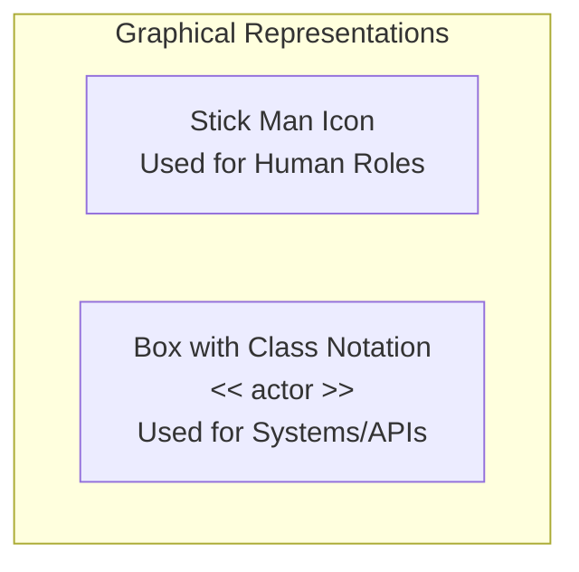

### 2.4. Relationship Between Actors: Generalization (Inheritance)
UML allows you to define a **Generalization/Specialization** relationship between actors. This is represented by a solid line with a hollow triangle pointing to the more general actor (the parent).

*   **Rule of Substitution:** If Actor B is a specialization of Actor A, B inherits all of A's interactions. This means B can perform every use case that A can perform, plus its own specialized use cases.
*   **When to Use:** Use actor generalization to simplify diagrams and avoid drawing duplicate association lines from different actors to the same set of use cases.

#### Example: Bank Staff
An `Agent` can perform basic actions like "Lend books" (*Prêter livres*). A `Responsable` (Manager) inherits from `Agent`. Therefore, the `Responsable` can do everything the `Agent` does, but is uniquely authorized to perform "Register members" (*Inscrire abonnés*).

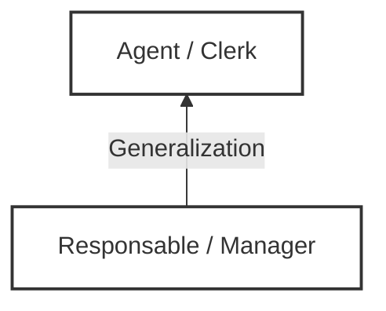

---

## 3. Use Cases and Scenarios

To construct a robust use case diagram, you must master the relationship between use cases and their underlying scenarios.

### 3.1. Definitions
*   **Scenario (*Scénario*):** A scenario is a specific, concrete sequence of interactions (steps) between an actor and the system, executing from start to finish. It is a single path of execution.
*   **Use Case (*Cas d'utilisation*):** A use case is a **collection/family of related scenarios** (both successful and unsuccessful) that describe a user attempting to achieve a specific business goal. 

### 3.2. Mapping the Relationship
A use case represents a generic level (class level), while a scenario represents an instance level.

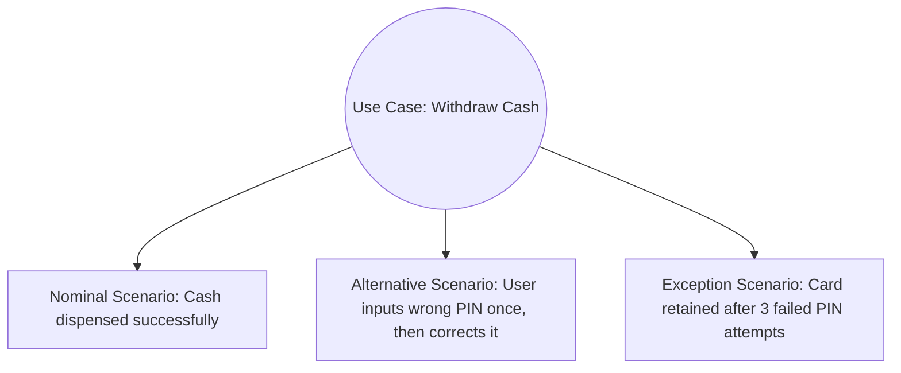

### 3.3. Key Characteristics of a Use Case
*   **Identified by an Action Verb:** A usecase must always be named using an active verb in the infinitive followed by a noun (e.g., *S'identifier*, *Retirer de l'argent*, *Consulter solde*).
*   **Identified Start and End:** A use case must have a clearly defined initiating event and a clear termination point.
*   **Delivers a Tangible Result:** The execution must produce a measurable, observable result of value for the initiating actor. Functions that are too small and do not provide value on their own should not be modeled as independent use cases (e.g., "Enter PIN" is not a use case; it is a step within "Withdraw Cash").

---

## 4. Use Case Diagram Components and Boundary

A use case diagram consists of four core elements:

| Component | Visual Representation | Description |
| :--- | :--- | :--- |
| **System Boundary** | Rectangular Frame | Represents the physical or logical limit of the software. Use cases are enclosed inside; actors remain outside. |
| **Actor** | Stick man or `<<actor>>` box | External entity interacting with the system. |
| **Use Case** | Oval / Ellipse | Enclosed inside the boundary, representing a system service. |
| **Association** | Solid Line | Connects an actor to a use case, representing communication. |

### System Boundary Example
```mermaid
rect rgb(240, 240, 240)
graph LR
    Client[Client / Cardholder] --- UC1
    
    subgraph ATM_System [System: ATM / GAB]
        UC1((Retirer de l'argent <br> Withdraw Cash))
        UC2((Consulter son solde <br> Check Balance))
    end
    
    UC1 --- AuthSys[Systeme d'autorisation <br> Authorization Server]
    
    style ATM_System fill:#fff,stroke:#333,stroke-width:2px;
    style UC1 fill:#eee,stroke:#333;
    style UC2 fill:#eee,stroke:#333;
```

*Note on Associations:* Standard UML associations do not have arrows. They indicate that a communication channel exists between the actor and the usecase. If an arrow is used, it points to the usecase to indicate the **initiator** of the interaction.

---

## 5. Relationships in Use Case Diagrams

UML defines three types of relationships between use cases to structure, decompose, and promote reuse:

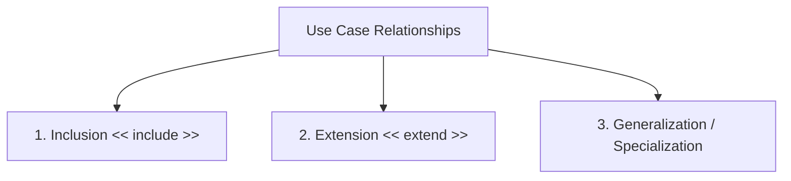

---

### 5.1. The Inclusion Relationship (`<<include>>`)
A base use case ($X$) includes an included use case ($Y$) if the behavior described in $Y$ is systematically, obligatorily, and unconditionally executed as part of $X$.

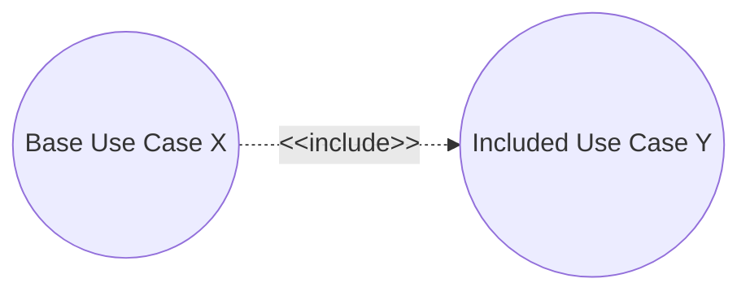

*   **Syntax:** The dashed arrow points **from the base use case to the included use case**.
*   **Properties:**
    *   **Unconditional:** The included use case *must* execute every single time the base use case runs.
    *   **Reusability:** It allows developers to factor out common behaviors that appear in multiple use cases to avoid repeating the steps in text.
*   **Slide Rule / Traps:** Do not overuse inclusions to break down your system into a procedural flowchart. Only use an inclusion if the factored behavior is shared by **multiple** use cases.

#### Example: Authentication in Banking
Both "Withdraw Cash" (*Retirer de l'argent*) and "Consult Account" (*Consulter son compte*) require the user to authenticate. We extract the authentication steps into an independent use case called "Authenticate" (*S'identifier*).

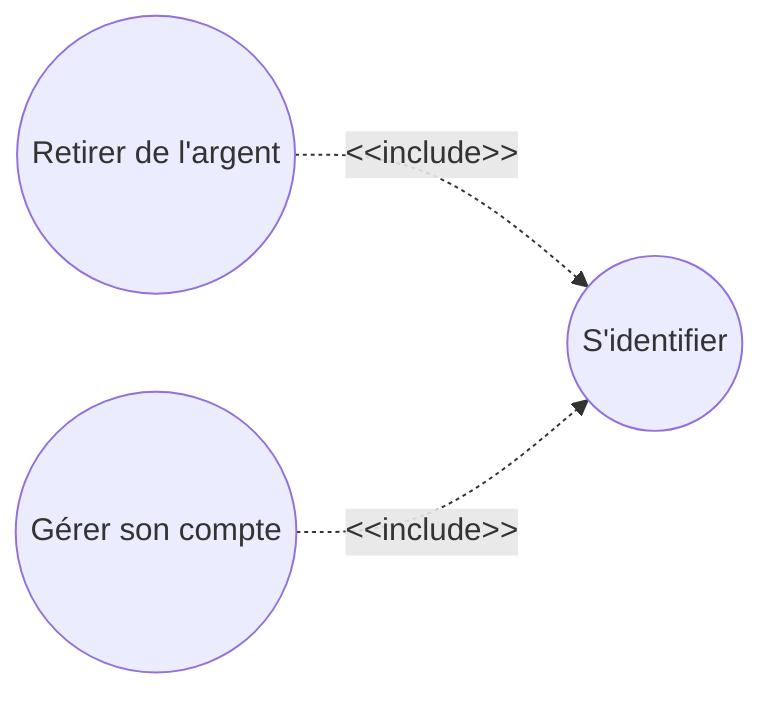

---

### 5.2. The Extension Relationship (`<<extend>>`)
An extending usecase ($Y$) extends a base usecase ($X$) if the behavior of $Y$ may be optionally inserted into $X$, depending on an explicit condition and at a specific location called an **Extension Point**.

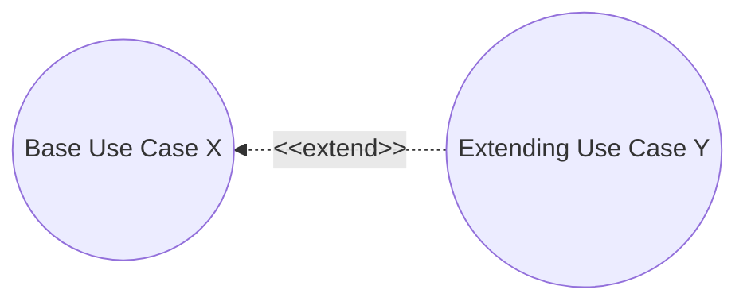

*   **Syntax:** The dashed arrow points **from the extending use case (the option) back to the base usecase**.
*   **Properties:**
    *   **Optional:** The extending use case only executes under specific circumstances (e.g., if a limit is crossed, or if the user explicitly requests it).
    *   **Extension Point:** The base usecase must declare an explicit hook (extension point) where this insertion can occur.
    *   **Guard Condition:** A note must be attached to the extension line specifying the exact boolean condition that triggers the extension.

#### Example: Receipt Printing or Balance Checks
During "Perform Transfer" (*Effectuer un virement*), checking the account balance (*Vérifier solde*) is optional and only occurs if the transfer amount exceeds a threshold (e.g., $> 20€$).

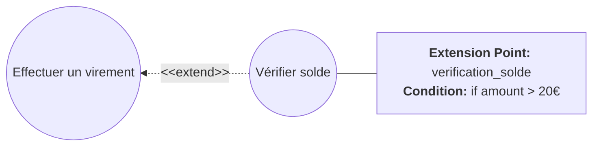

---

### 5.3. Generalization / Specialization
A child usecase ($B$) generalizes a parent usecase ($A$) if $B$ is a specialized, concrete variation of $A$. 

*   **Syntax:** A solid line with a hollow triangle pointing from the specialized use case to the general parent use case.
*   **Properties:**
    *   The child use case inherits all the scenarios, preconditions, and postconditions of the parent.
    *   The child use case can add new steps or override existing steps of the parent.
    *   The parent use case is frequently **abstract** (it cannot be executed directly; only its child use cases can be executed).

#### Example: Payment Methods
"Pay" (*Payer*) is a general use case. It can be specialized into "Pay Cash" (*Payer en liquide*) or "Pay by Card" (*Payer par carte*).

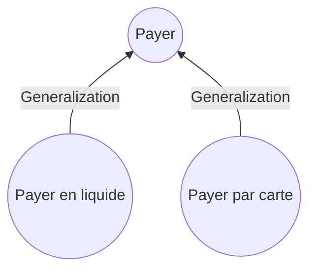

---

### Summary Table of Relationships

| Relationship Type | Graphical Arrow Direction | Mandatory or Optional? | Main Purpose |
| :--- | :--- | :--- | :--- |
| **Inclusion (`<<include>>`)** | From Base to Included | **Mandatory** | Factoring out common behavior for reuse. |
| **Extension (`<<extend>>`)** | From Extension to Base | **Optional** | Modeling exceptional, rare, or optional behaviors. |
| **Generalization** | From Child to Parent | N/A | Modeling inheritance, abstraction, and polymorphism. |

---

## 6. Textual Description of Use Cases

A use case diagram is not sufficient on its own. The real business requirements are captured in the **Textual Description** (*Description textuelle*), also known as a Use Case Specification Sheet.

### 6.1. Essential (Logical) vs. Real (Physical) Use Cases
This is a critical distinction introduced by Craig Larman and highlighted in your course materials:

*   **Essential Use Case (*Cas d'utilisation essentiel*):** Describes the process in a technology-independent manner. It avoids any mention of specific hardware, user interface designs, or software controls.
    *   *Example Step:* "The user identifies themselves to the system."
*   **Real Use Case (*Cas d'utilisation réel*):** Describes the process in terms of the concrete design, referencing specific UI widgets, button clicks, and physical devices.
    *   *Example Step:* "The user enters their 4-digit code using the numeric keypad and clicks the green 'Validate' button."

### 6.2. Standard Use Case Template
While UML does not enforce a strict format, your course recommends the following standardized structure:

```
================================================================================
USE CASE SPECIFICATION SHEET
================================================================================

1. IDENTIFICATION SECTION (SOMMAIRE D'IDENTIFICATION)
--------------------------------------------------------------------------------
- Title: [Action Verb + Object]
- Use Case Type: [Essential / Real]
- Primary Actor: [Initiates the goal]
- Secondary Actor(s): [System / databases consulted]
- Goal/Summary: [Brief description of the expected business value]
- Creation Date: [DD/MM/YYYY] | Last Updated: [DD/MM/YYYY]
- Version: [e.g., 1.0]
- Author/Responsible: [Name]

2. SCENARIO SECTION (DESCRIPTION DES SCÉNARIOS)
--------------------------------------------------------------------------------
- Preconditions: [Must be true before launching. If false, UC cannot start]
- Postconditions: [Must be true after successful completion]

- Nominal Scenario (Happy Path):
  1. Actor action...
  2. System reaction/validation...
  3. Actor action...
  [Must be sequenced numerically]

- Alternative Scenarios (Success variations):
  [Step Number]a. [Condition triggering the variation]
    - Steps representing the alternative flow
    - Return to Step [X] of the Nominal Scenario

- Exception Scenarios (Failure paths):
  [Step Number]b. [Error Condition]
    - Steps handling the error (e.g., "Display error message")
    - Terminate use case in a state of FAILURE

3. NON-FUNCTIONAL REQUIREMENTS SECTION (EXIGENCES NON-FONCTIONNELLES)
--------------------------------------------------------------------------------
- Performance: [e.g., response time < 2 seconds]
- Security: [e.g., data must be encrypted]
- Availability: [e.g., 24/7 access]

4. HUMAN-MACHINE INTERFACE (HMI) REQUIREMENTS (BESOINS D'IHM)
--------------------------------------------------------------------------------
- Input/Output devices required (keypad, touchscreen, printer, etc.)
================================================================================
```

---

## 7. Step-by-Step Construction Process

To build high-quality Use Case Diagrams without overcomplicating them, follow this step-by-step methodology:

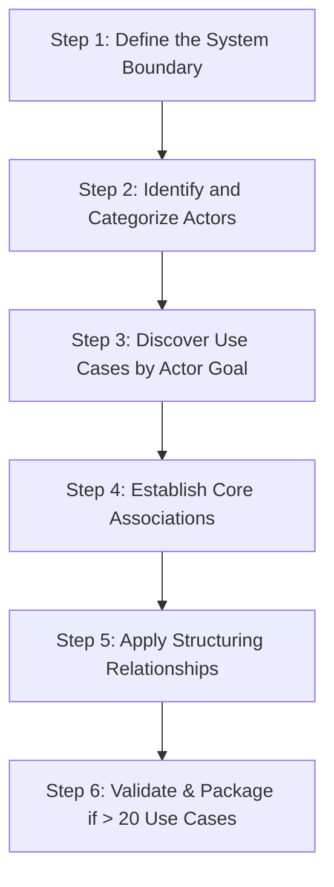

### 7.1. Detailed Step Instructions

#### Step 1: Define the System Boundary
Determine the limits of what you are building. This prevents you from mistakenly modeling internal modules as actors. Write down the name of the system and draw a rectangular frame.

#### Step 2: Identify and Categorize Actors
Ask these clarifying questions:
*   Who uses the main functions of the system? (Primary Actors)
*   Who maintains, starts, or stops the system? (Maintenance Operators)
*   What external hardware devices must the software control? (External Hardware Actors)
*   What external databases or third-party APIs must the system call? (Secondary System Actors)
*   *Rule of Thumb:* Use stick men for humans, and class boxes stereotyped with `<<actor>>` for computer systems.

#### Step 3: Discover Use Cases by Actor Goal
For each actor, list their business goals.
*   Avoid a granular, step-by-step breakdown. If a task does not yield a complete, observable result of value on its own, do not create a use case for it.
*   Name every use case starting with an active verb in the infinitive.

#### Step 4: Establish Core Associations
Draw solid lines connecting actors to the use cases they participate in. Ensure every use case is connected to at least one actor.

#### Step 5: Apply Structuring Relationships
Review your use cases and look for opportunities to simplify:
*   *Inclusion:* Are there common interaction sequences (like login or payment) that occur in multiple use cases? Factor them out with a `<<include>>` relationship.
*   *Extension:* Are there optional or exceptional paths in a use case? Factor them out with an `<<extend>>` relationship, and remember to define the extension point and the condition.
*   *Generalization:* Are there different ways to execute a generic use case? Create a parent use case and draw inheritance arrows from the specialized child use cases.

#### Step 6: Validate and Organize (Agile & Iterative)
*   **The Rule of 20:** A single, readable diagram should not contain more than 15 to 20 use cases. If your system is larger, group related use cases into folders called **Packages**.
*   You can organize packages either **by Actor** (e.g., "Client Operations", "Admin Operations") or **by Functional Domain** (e.g., "Account Management", "Payment Processing").

---

## 8. Comprehensive Case Studies and Exercises

Below are the complete, detailed solutions to the case studies and exercises found in your course slides and TD documents.

---

### Case Study A: The Automated Teller Machine (GAB / ATM)

This case study is based on the GAB specification sheets and slides from multiple source documents.

#### Problem Specification
We want to design a simplified Automated Teller Machine (GAB - *Guichet Automatique de Banque*).
1.  **Cash Withdrawal:** Any cardholder (with a bank card or credit card) can withdraw money via a card reader and a banknote dispenser.
2.  **Bank Clients:** Clients of the specific bank adossed to the ATM can additionally consult their account balance, deposit cash, and deposit checks.
3.  **Security:** All transactions are secured. The client must enter their PIN code. If they fail three consecutive times, the machine retains the card.
4.  **Maintenance:** A maintenance operator must recharge the banknote dispenser, collect retained cards, and collect deposited checks.
5.  **External Connections:** The ATM must connect to an external Inter-bank Authorization System (*Systeme d'autorisation global*) for cardholder validation, and to the bank's internal information system (*S.I. Banque*) to check balances and log bank client transactions.

---

#### Step 1: Identification of Actors
*   **Porteur de carte (Cardholder) [Primary Actor]:** Any user holding a valid credit card. Can only perform cash withdrawals.
*   **Client banque (Bank Client) [Primary Actor]:** A specialized user who has an account with this specific bank. Inherits from `Porteur de carte` (he can do everything a cardholder can do, plus balance inquiries and deposits).
*   **Opérateur de maintenance (Maintenance Operator) [Primary Actor]:** Responsible for re-supplying banknotes, retrieving retained cards, and collecting checks.
*   **Système d'autorisation global / Sys. Auto (Authorization System) [Secondary Actor / System]:** External system invoked to approve withdrawals for external cardholders. Labeled as `<<actor>>`.
*   **S.I. Banque / SI Banque (Bank Information System) [Secondary Actor / System]:** The bank's database, called to verify balances, execute bank-client deposits, and perform bank-client withdrawals. Labeled as `<<actor>>`.

*Note on System Boundaries:* The card reader and banknote dispenser are internal physical components of the GAB system. They are not actors.

---

#### Step 2: Use Case Identification
1.  **Retirer de l'argent (Withdraw Cash):** Initiated by `Porteur de carte`.
2.  **Consulter son solde (Consult Balance):** Initiated by `Client banque`.
3.  **Déposer du numéraire (Deposit Cash):** Initiated by `Client banque`.
4.  **Déposer des chèques (Deposit Checks):** Initiated by `Client banque`.
5.  **S'authentifier (Authenticate):** Factorized usecase containing card reading and PIN check. Included by withdrawal, balance inquiries, and deposits.
6.  **Recharger le distributeur (Recharge Banknotes):** Initiated by `Opérateur de maintenance`.
7.  **Récupérer les cartes avalées (Retrieve Retained Cards):** Initiated by `Opérateur de maintenance`.
8.  **Récupérer les chèques déposés (Collect Deposited Checks):** Initiated by `Opérateur de maintenance`.

---

#### Step 3: Complete GAB Use Case Diagram
This diagram groups the use cases into structured packages for readability:

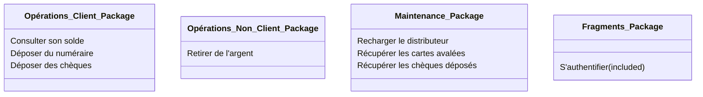

Here is the corresponding Use Case Diagram built with Mermaid:

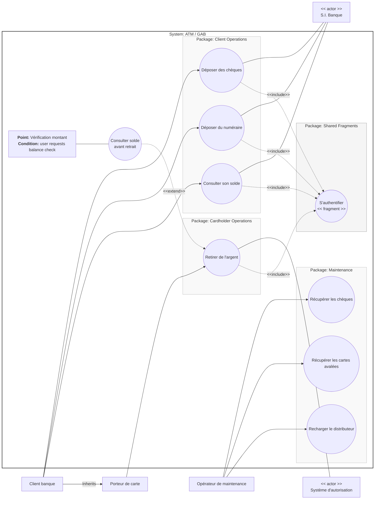

---

#### Step 4: Textual Specification Sheet of "Withdraw Cash" (*Retirer de l'argent*)

Below is the complete textual description for a cardholder who is not a client of the host bank:

```
================================================================================
USE CASE: Retirer de l'argent (Withdraw Cash)
================================================================================

1. SOMMAIRE D'IDENTIFICATION
--------------------------------------------------------------------------------
- Title: Retirer de l'argent (Withdraw Cash)
- Use Case Type: Essential Detailed
- Primary Actor: Porteur de carte (Cardholder)
- Secondary Actor: Système d'autorisation global (Authorization System)
- Goal: Allow a cardholder to safely withdraw a desired amount of cash from 
  their account using the ATM.
- Version: 5.0
- Responsible: Pascal Roques

2. DESCRIPTION DES SCÉNARIOS
--------------------------------------------------------------------------------
- Preconditions:
  1. The ATM's banknote dispenser contains at least one bill.
  2. No card is currently stuck inside the card reader.
  3. The connection with the external Authorization System is online and active.

- Postconditions:
  - Cash is successfully dispensed to the cardholder.
  - The card is returned to the cardholder.
  - The ATM's cash reserve is decremented by the withdrawn amount.
  - The transaction is logged successfully in the system.

- Nominal Scenario (Happy Path):
  1. The Cardholder inserts their card into the card reader.
  2. The ATM verifies that the inserted card is valid.
  3. [Included: S'authentifier] The cardholder is authenticated (PIN entered and verified).
  4. The ATM requests authorization from the external Authorization System.
  5. The Authorization System approves the transaction and returns the user's weekly withdrawal limit.
  6. The ATM requests the cardholder to select or enter the desired cash amount.
  7. The Cardholder selects the withdrawal amount.
  8. The ATM verifies that the requested amount is within the weekly limit.
  9. The ATM asks the Cardholder if they want a transaction receipt (ticket).
  10. The Cardholder requests a receipt.
  11. The ATM ejects the card.
  12. The Cardholder retrieves their card.
  13. The ATM dispenses the cash and prints the receipt.
  14. The Cardholder retrieves the cash and the receipt.

- Alternative Scenarios:
  - A1: Cardholder does not want a receipt (Step 10):
    10a. The Cardholder declines the receipt.
    11a. The ATM returns the card.
    12a. The Cardholder retrieves the card.
    13a. The ATM dispenses the cash without printing a receipt.
    14a. The Cardholder retrieves the cash. Use case ends in success.

- Exception Scenarios:
  - E1: Invalid Card (Step 2):
    2a. The ATM detects an unreadable, expired, or blocked card.
    2b. The ATM displays an error message, ejects (or swallows) the card, and terminates the session in FAILURE.
    
  - E2: Transaction Rejected by the Authorization System (Step 5):
    5a. The external system declines authorization (e.g., suspected fraud or bank block).
    5b. The ATM displays a rejection message, ejects the card, and terminates in FAILURE.
    
  - E3: Amount requested exceeds the weekly limit (Step 8):
    8a. The ATM detects that the requested amount exceeds the limit returned by the system.
    8b. The ATM displays an "insufficient limit" message and returns to Step 6 (amount selection).
    
  - E4: Card Not Retrieved (Step 12):
    12a. The Cardholder fails to pull their card out within 10 seconds.
    12b. The ATM swallows the card to prevent theft, alerts the main office, and terminates in FAILURE.
    
  - E5: Banknotes Not Retrieved (Step 14):
    14a. The Cardholder leaves the cash in the dispenser for more than 10 seconds.
    14b. The ATM pulls the cash back into a secure internal storage compartment, logs the event, and terminates in FAILURE.

3. NON-FUNCTIONAL REQUIREMENTS
--------------------------------------------------------------------------------
- Performance: The user interface must respond to any button press within 2 seconds.
- Security: PIN input must be masked on screen with asterisks (*). Card data must be encrypted during transport.
- Usability: Text displayed must be readable in bright daylight conditions.
================================================================================
```

---

### Case Study B: The Point of Sale Terminal (TPV / POS)

Based on the Point of Sale Terminal specification sheets and exercises.

#### Problem Specification
We want to design the software for an in-store Point of Sale (POS - *Terminal Point de Vente / TPV*) cash register.
*   **Checkout:** A customer arrives at the checkout counter with items they wish to purchase. The cashier scans each item's barcode. The system retrieves the item description and price from the database and updates the running total.
*   **Coupons:** The customer can present discount coupons for scanned items.
*   **Payment:** Once the sale is finalized, the customer can pay using three methods:
    1.  *Cash:* The cashier enters the cash received, and the register calculates the change to return.
    2.  *Check:* The register calls an external Check Verification System to authorize the payment.
    3.  *Credit Card:* The POS connects to an external Card Payment Gateway to authorize and capture funds.
*   **Inventory Integration:** At the end of a successful checkout, the register transmits the list of sold items to an external Inventory System to update stock levels.
*   **Daily Initialization:** Every morning, the store manager must log in and initialize the register database.

---

#### Step 1: Identification of Actors
*   **Caissier (Cashier) [Primary Actor]:** Initiates the checkout process and enters payments.
*   **Responsable Magasin (Store Manager) [Primary Actor]:** Initiates the daily register initialization.
*   **Client (Customer) [Secondary Actor]:** Participates in the checkout process by presenting items, coupons, and payments.
*   **Gestionnaire de Stock (Inventory System) [Secondary Actor / System]:** Receives sales data to update inventory.
*   **Centre d'autorisation Cartes / Chèques (Payment Gateways) [Secondary Actor / System]:** Invoked to authorize credit card and check payments.

---

#### Step 2: Use Case Identification
1.  **Traiter le passage en caisse (Process Checkout):** The main use case containing the scan loop, coupon processing, and payment.
2.  **Initialiser la caisse (Initialize Register):** The setup process run by the manager.
3.  **Traiter le paiement (Process Payment) [Abstract Parent Use Case]:** Included obligatorily by "Process Checkout".
4.  **Traiter paiement en liquide (Process Cash Payment) [Child Use Case]:** Specialization of "Process Payment".
5.  **Traiter paiement par chèque (Process Check Payment) [Child Use Case]:** Specialization of "Process Payment".
6.  **Traiter paiement par carte (Process Card Payment) [Child Use Case]:** Specialization of "Process Payment".
7.  **Prendre en compte les coupons (Apply Coupons):** Optionally extends "Process Checkout".

---

#### Step 3: Use Case Diagram for the POS (TPV) System

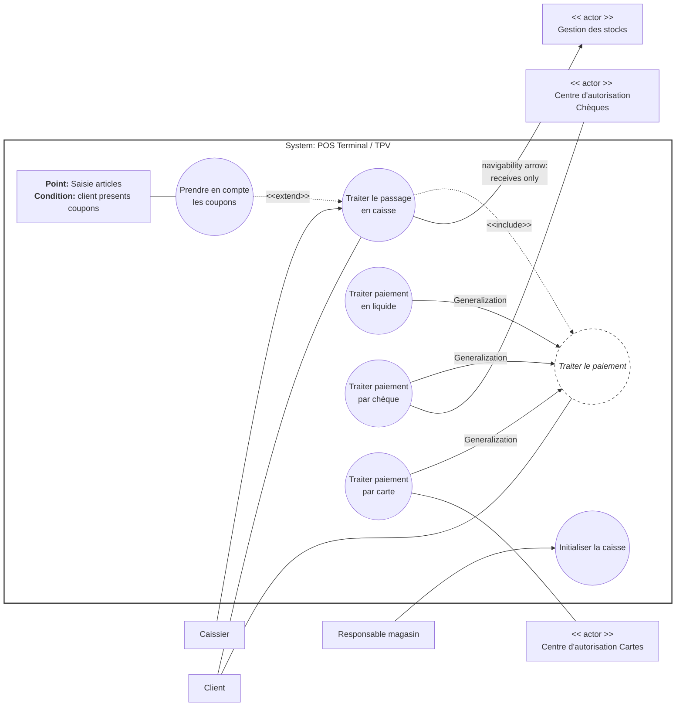

*Navigability Arrow Note:* The association between `Process Checkout` and `Stock` features a navigability arrow pointing to `Stock` (labeled as *Gestion des stocks*). This indicates that the POS system only sends notifications to the inventory database and does not expect any return queries or actions initiated by the inventory system.

---

### Exercise 1: School Classroom and Equipment Reservation System

This exercise is derived from the classroom and pedagogical material reservation system problem statement (Slide 48).

#### Problem Specification
In a school, we want to manage the reservation of classrooms and pedagogical equipment (such as laptops and video projectors).
*   **Reservations:** Only authorized teachers (*Enseignants habilités*) can make a reservation, which is subject to the availability of both the requested room and the equipment.
*   **Consulting the Planning:** Anyone (both teachers and students) can consult the classroom planning.
*   **Hourly Report per Teacher:** The system automatically calculates a weekly/monthly hourly summary report for each teacher based on classroom scheduling. Only teachers are authorized to view their own reports.
*   **Responsible Teachers:** Each academic course has a designated "Course Coordinator" (*Enseignant responsable*). Only this coordinator is authorized to generate and print the hourly report for all teachers in their course.

---

#### Step-by-Step Analysis and Modeling

##### Step 1: Identify Actors
1.  **Enseignant (Teacher):** Authorized to make room/material reservations and consult their own hourly report.
2.  **Etudiant (Student):** Authorized only to consult the classroom planning.
3.  **Enseignant responsable (Course Coordinator):** A specialized teacher who has the extra authority to generate hourly reports for the entire course. (Inherits from `Enseignant`).
4.  **Tout le monde (Anyone):** An abstract parent actor representing both `Enseignant` and `Etudiant`, used to simplify the "Consult Planning" association.

##### Step 2: Identify Use Cases
1.  **Réserver une salle / du matériel (Reserve Room/Equipment):** Initiated by `Enseignant`.
2.  **Consulter le planning (Consult Planning):** Initiated by `Tout le monde` (Anyone).
3.  **Consulter son récapitulatif horaire (Consult Personal Hourly Report):** Initiated by `Enseignant`.
4.  **Éditer le récapitulatif horaire de la formation (Edit Course Hourly Report):** Initiated by `Enseignant responsable`.

---

#### Use Case Diagram: Classroom & Equipment Reservation

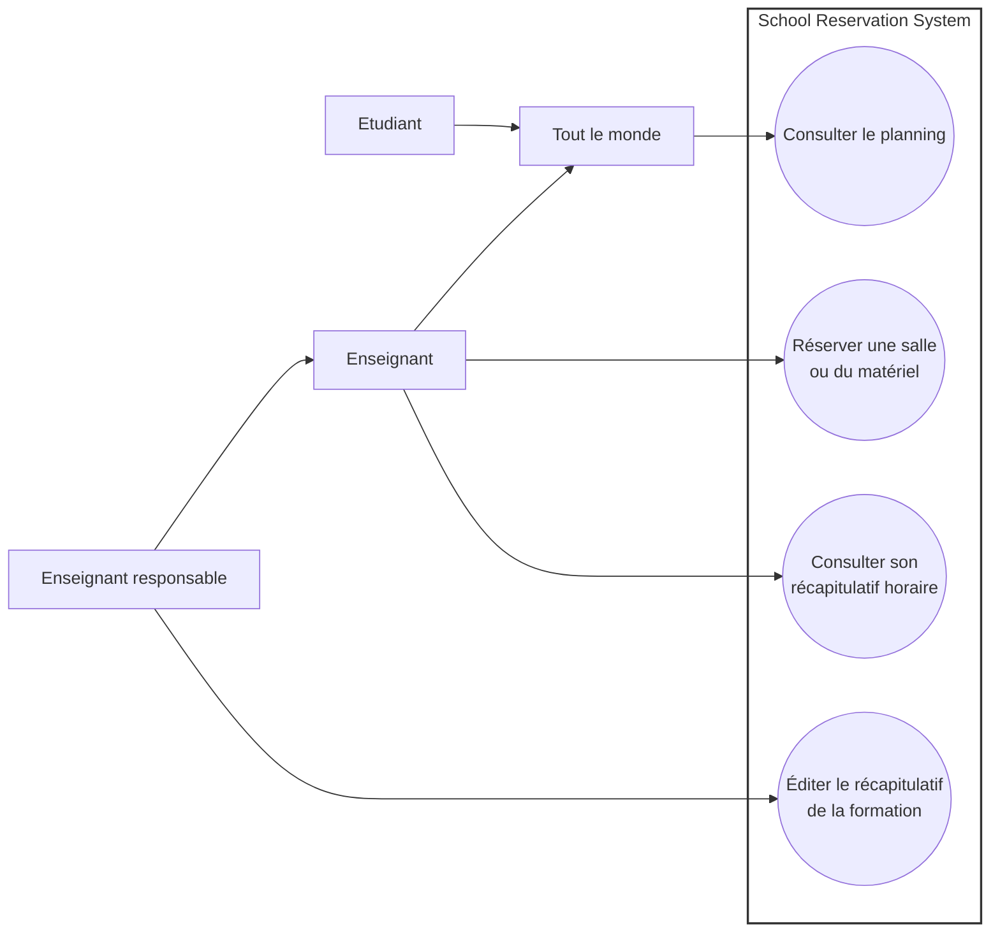

---

### Exercise 2: In-Store Customer Purchase Process

Based on the retail store sales process problem statement (Slide 49).

#### Problem Specification
In a retail store, the purchase process flows as follows:
*   A customer enters the store, browses the aisles, and can optionally ask a sales assistant for assistance or product trials.
*   The customer selects items and takes them to the checkout counter, provided there is sufficient stock.
*   At the checkout register, the customer pays for their purchases using cash, check, or credit card.
*   The customer can optionally apply a loyalty card discount or coupon to the sale.

---

#### Step-by-Step Analysis and Modeling

##### Step 1: Identify Actors
1.  **Client (Customer):** The primary actor who selects items and pays.
2.  **Vendeur (Sales Assistant):** A secondary actor who helps with product trials or inquiries.
3.  **Caissier (Cashier):** Operates the register to scan items and process the payment.
4.  **Système d'autorisation (Payment Gateway):** Secondary actor used to validate card or check payments.

##### Step 2: Identify Use Cases
1.  **Faire des achats (Shop & Buy):** The main process encompassing selection, checkout, and payment.
2.  **Essayer un article (Try Out / Test Item):** Optionally extends the shopping process.
3.  **Demander des renseignements (Request Product Info):** Optionally extends the shopping process.
4.  **Bénéficier d'une réduction (Apply Discount):** Optionally extends the final checkout phase.

---

#### Use Case Diagram: In-Store Purchase

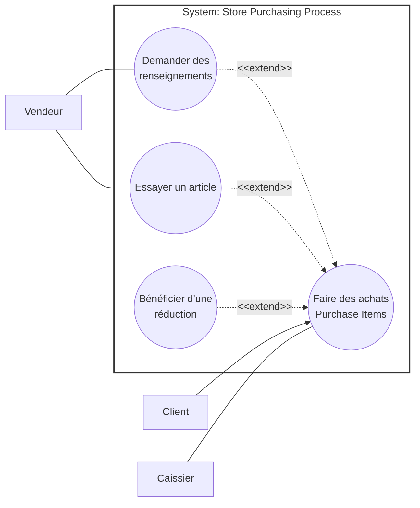

---

## 9. Common Pitfalls and Pro-Tips for Exams

Avoid these common mistakes to ensure high marks on exams:

1.  **Reversing Include/Extend Arrows:**
    *   *Include:* Points **from the base** to the shared sub-task. (Think of it as the base use case pointing to what it needs).
    *   *Extend:* Points **from the extension (the optional task)** back to the base use case. (Think of it as the option pointing to the parent to declare where it hooks in).
2.  **Functional Decomposition / Flowcharting:**
    *   Do not create use cases for individual, minor steps (e.g., "Enter PIN", "Print Receipt", "Open Drawer"). If it doesn't provide a complete, valuable business result to an actor, it is a scenario step, not a usecase.
3.  **Modeling Internal System Classes as Actors:**
    *   An actor must be external. Never create an actor for an internal database, a display screen, or a local system module.
4.  **Omitting Verb Infinitives in Names:**
    *   UML requires use cases to represent actions. Always use a verb in the infinitive followed by an object (e.g., *S'authentifier*, *Modifier panier*). Do not use noun-only titles like "Database" or "Identification Panel".
5.  **Using UML `extends` in Java Code:**
    *   *UML Warning:* The Java keyword `extends` represents inheritance (generalization). However, in UML use case diagrams, the `<<extend>>` relationship represents an **optional extension**, which is completely different. Do not confuse UML extensions with object-oriented class inheritance! Use class generalization instead to represent object-oriented inheritance.