# Course: UML Software Engineering and Functional Analysis

---

## Chapter 1: Foundations of Use Case Modeling

### 1.1 Intuitive Definition of a Use Case

A **Use Case** (French: *Cas d'Utilisation*) is a core UML modeling element used during the functional analysis phase of software engineering. It describes a complete unit of functionality provided by a system to its users.

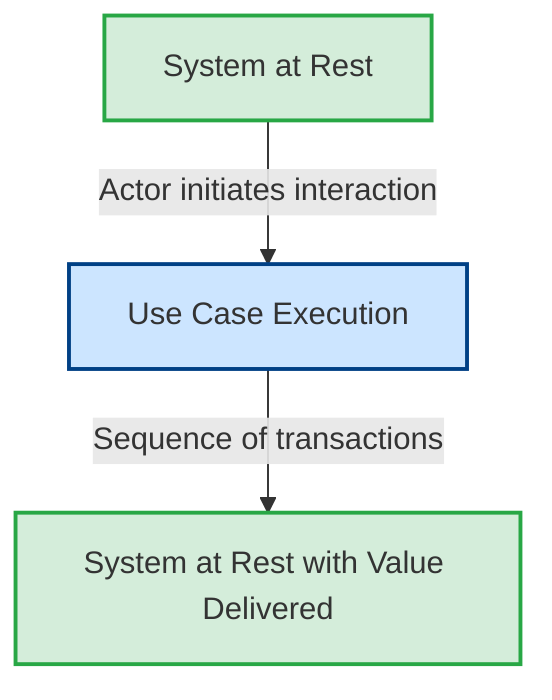

#### Key Characteristics
* **Completeness**: A use case must represent a complete, atomic transaction. It is not an individual action or step. It goes from a state where the system is at rest, through a series of interactions, and returns the system to a state of rest, having delivered a measurable, valuable result to an external actor.
* **User Perspective**: It describes *what* the system does from the point of view of an external observer (actor), rather than *how* the system implements it internally.
* **Abstract vs. Concrete**: 
  * A **Use Case Class** (or abstraction) defines the set of all possible behaviors, scenarios, and paths (nominal, alternative, and exceptional) for a specific system transaction.
  * A **Use Case Instance** (or Scenario) is a single, concrete execution path through those behaviors (e.g., withdrawing money with an incorrect PIN vs. withdrawing money successfully).

---

### 1.2 Defining and Categorizing Actors

An **Actor** represents an entity external to the system under development that interacts directly with it. An actor defines a *role* that a user, device, or external system plays when interacting with the system, rather than a specific physical individual.

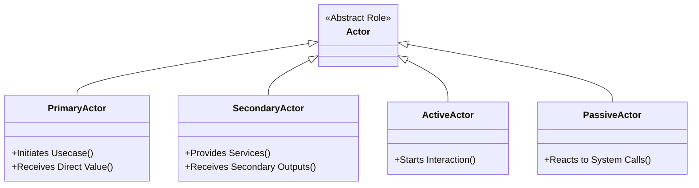

#### Categorization of Actors
UML distinguishes actors along several dimensions to ensure thorough boundary definitions:

##### 1. Primary vs. Secondary (French: *Acteur Principal vs. Acteur Secondaire*)
* **Primary Actor**: The actor who initiates the use case to achieve a specific business goal. The system is built primarily to deliver value to this actor.
* **Secondary Actor**: An actor from whom the system needs help to complete the use case. They provide supporting services (e.g., an external authentication server, a hardware printer, or a payment gateway).

##### 2. Active vs. Passive (French: *Acteur Actif vs. Acteur Passif*)
* **Active Actor**: Initiates the interaction.
* **Passive Actor**: Does not initiate the interaction but is called upon or notified by the system during the execution of a use case. In UML notation, an association arrow can point from the use case to a passive actor to represent this direction of information flow.

##### 3. Human vs. Non-Human (Mechanical/System/Peripheral)
* **Human Actors**: People playing roles (e.g., `Client`, `Chef d'exploitation`, `Enseignant`).
* **Non-Human Actors**: External hardware devices, legacy IT systems, or software services (e.g., `Lecteur de carte`, `Serveur Central`, `SGBD`). Under UML 2, non-human actors are stereotyped as `<<System>>` or `<<actor>>` and can be represented as structured rectangles.

---

### 1.3 The System Boundary and Visual Notation

The **System Boundary** (also called the *Subject* or *Classifier*) is represented by a solid rectangle enclosing all use cases. It clearly separates what is internal to the application (the software components being built) from what is external (the actors).

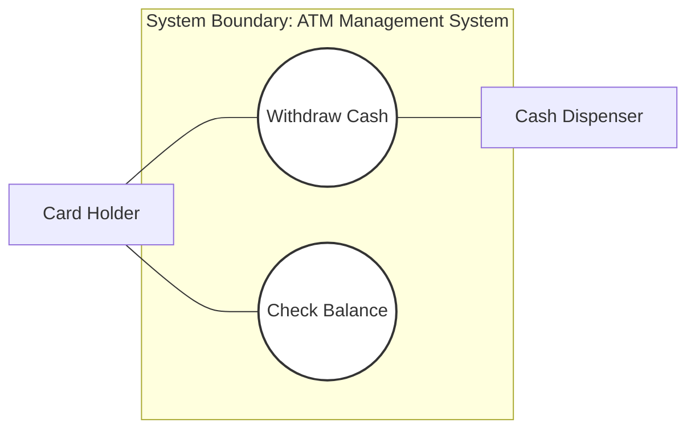

#### Notation Rules
* **Inside the Boundary**: Use Cases are represented as ovals or ellipses containing short, action-oriented verb phrases (e.g., `Rechercher Ouvrage`, `Saisir BDD`).
* **Outside the Boundary**: Actors are represented as stick figures (or rectangles with the `<<actor>>` or `<<System>>` stereotype) and must reside strictly outside the system boundary.
* **Associations**: Solid lines (with optional arrowheads for navigability) connect actors to the use cases they interact with. No lines can connect actors directly to other actors, nor can associations cross without structural meaning.

---

## Chapter 2: Use Case Relationships and Formal Rules

UML defines four main relationships within Use Case Diagrams: **Association**, **Generalization**, **Inclusion**, and **Extension**. Following these rules prevents common layout errors.

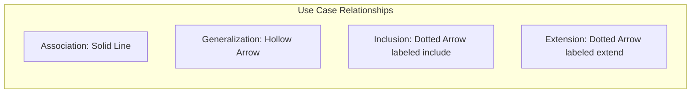

---

### 2.1 Associations (Actor-to-Use Case) and Navigability

An **Association** represents a communication path between an actor and a usecase.

* **Symmetric (Two-Way) Association**: Represented as a solid, non-directional line. This is the default. It indicates that the actor and the use case exchange information during the execution of the transaction.
* **Directional Association (Navigability)**: Represented as a solid line with an arrowhead. 
  * An arrow pointing **from an actor to a use case** indicates that the actor is the initiator of the usecase (the primary actor).
  * An arrow pointing **from a usecase to an actor** indicates that the actor is secondary or passive (the system initiates communication with this external actor during execution).

---

### 2.2 Use Case Generalization (Inheritance)

**Generalization** represents a taxonomic relationship between a more general use case (super-usecase) and a more specialized use case (sub-usecase).

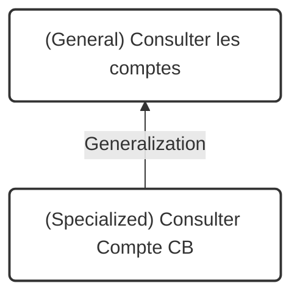

* **Concept**: The sub-usecase inherits all the behaviors, relationships (inclusions, extensions), and associations of the super-usecase. It can override, specialize, or add steps to the inherited flows.
* **Notation**: A solid line with a hollow triangular arrowhead pointing from the specialized use case (source) to the generalized use case (destination/parent).
* **Example**: `Consulter le compte de Carte Bleue` is a specialization of the more general use case `Consulter les comptes`.

---

### 2.3 Use Case Inclusion (`<<include>>`)

The **Inclusion** relationship defines a mandatory dependency where a base usecase explicitly incorporates the behavior of another use case at a specified location.

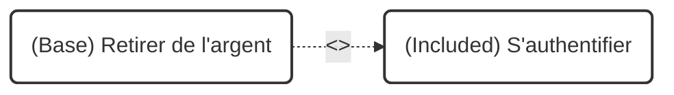

#### Structural Rules
* **Mandatory Execution**: The base use case *cannot* complete successfully without executing the included usecase. It represents an unconditional part of the base flow.
* **Direction of Arrow**: A dashed arrow with an open arrowhead pointing **from the base usecase to the included usecase**, decorated with the stereotype `<<include>>` (historically `<<uses>>`).
* **Design Criteria**: Inclusion is used in three scenarios:
  1. **Factoring (Decomposition)**: Extracting common, redundant behaviors shared across multiple use cases (e.g., `S'authentifier` is included by both `Retirer de l'argent` and `Faire virement`).
  2. **Simplification**: Breaking down an excessively complex use case into smaller, manageable chunks.
  3. **Encapsulation**: Isolating a distinct sub-goal that can also stand alone as a use case.

---

### 2.4 Use Case Extension (`<<extend>>`)

The **Extension** relationship specifies that a usecase (the extension) may optionally or conditionally insert its behavior into another usecase (the base).

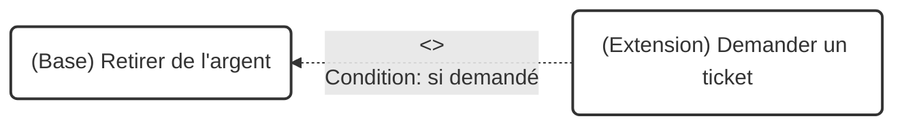

#### Structural Rules
* **Conditional Execution**: The extending usecase executes *only* if the extension condition is met during the execution of the base usecase.
* **Direction of Arrow**: A dashed arrow with an open arrowhead pointing **from the extending usecase to the base usecase**, decorated with the stereotype `<<extend>>`.
* **Independence**: The base usecase is fully functional on its own. It is completely independent of the extending usecase and remains unaware of the extension's existence. The extension points must be declared in the base use case, but the rules and conditions are defined in the extending relationship.
* **Notation**: The extension condition (e.g., `Condition: si demandé`) must be documented alongside the dependency arrow.

---

### 2.5 Actor Generalization

Like use cases, **Actors** can be organized into generalization hierarchies to simplify associations and represent shared permissions.

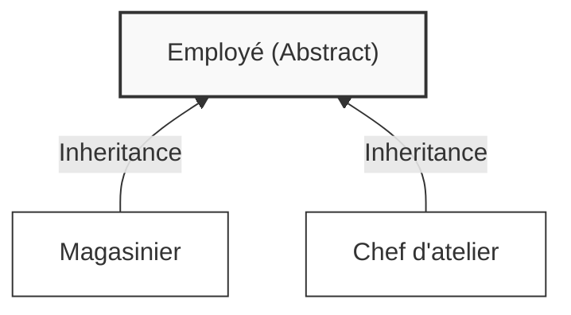

* **Concept**: The sub-actor inherits all associations and use cases of the super-actor. Any usecase accessible to `Employé` is automatically accessible to `Magasinier` and `Chef d'atelier` without drawing redundant association lines.
* **Abstract Actors**: An actor can be declared abstract (often modeled by writing its name in italics, e.g., *`Internaute`*), meaning it cannot be directly instantiated by a physical user but serves as a common parent for concrete roles (e.g., `Visiteur` and `Client`).

---

## Chapter 3: Methodology for Use Case Identification and Optimization

### 3.1 Event-Driven Identification of Use Cases

To systematically identify all use cases and avoid missing system requirements, use an **Event-Driven Analysis** approach based on system stimuli.

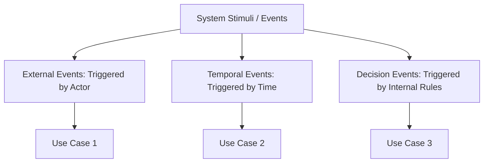

1. **Identify the Actors**: Map out every physical person, legacy system, device, and department that interacts with the system boundary.
2. **List External Events**: Identify all messages and stimuli sent to the system by external actors (e.g., "Customer inserts card", "Mechanic requests spare part"). Each unique external event typically maps to a usecase.
3. **List Temporal Events**: Identify scheduled batch jobs or state-driven events triggered by time (e.g., "End-of-month report generation", "Weekly inventory cleanup").
4. **List Decision Events**: Identify occurrences triggered by business policy changes or internal criteria (e.g., "Overdraft limit reached").

---

### 3.2 Analysis Patterns: "Administrateur" and "Gestion"

When optimizing a raw Use Case Diagram, apply two industry-standard modeling patterns:

#### 1. The "Administrateur" Pattern
Suggests the introduction of an abstract or concrete `Administrateur` (or `Gestionnaire`) actor. This actor is dedicated to managing system metadata, user directories, configurations, and reference tables, freeing up operational actors to focus purely on core business workflows.

#### 2. The "Gestion" Pattern
Avoids the anti-pattern of creating a single, massive use case named "Gérer [Object]" (e.g., "Gérer les comptes"). Instead, decouple the generic management usecase into discrete, specialized CRUD (Create, Read, Update, Delete) and lifecycle operations:

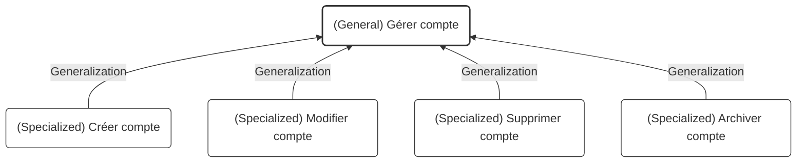

---

### 3.3 Organizing Use Cases with Packages (Architectural View 4+1)

UML use cases should be structured into **Packages** to keep large systems organized. This approach aligns with the **Krutchen 4+1 View Model**, where the **Use Case View** (or Scenario View) serves as the central driver for all other engineering views.

```mermaid
graph TD
    subgraph Use Case View (Scenario View)
        direction TB
        subgraph Package: Cible 1 (Operational Core)
            direction LR
            subgraph Package: Front-Office (Internaute)
                UC_Search(Search Book)
                UC_Cart(Manage Basket)
            end
            subgraph Package: Back-Office (Employé)
                UC_Catalog(Maintain Catalog)
                UC_Order(Process Order)
            end
        end
        subgraph Package: Cible 2 (Secondary/Infrastructure)
            UC_Auth(Authenticate)
            UC_Help(Online Help)
        end
    end
```

* **Cible 1 (Primary Target / Core Business)**: Contains high-value business use cases directly matching the primary actors' goals (divided into Front-Office and Back-Office).
* **Cible 2 (Secondary Target / Technical Infrastructure)**: Houses auxiliary use cases (e.g., `S'authentifier`, `Consulter l'aide en ligne`) that support core workflows but do not provide standalone business value on their own.

---

## Chapter 4: Textual Specification of Use Cases

While a Use Case Diagram shows the relationships between actors and use cases, it does not explain the step-by-step logic of the transaction. A complete functional specification requires a structured **Textual Description** for every usecase.

### 4.1 Structural Template of a Use Case Description

A professional usecase description follows a strict template:

| Section | Description |
| :--- | :--- |
| **Use Case Title** | The unique name of the use case, starting with an active verb. |
| **Summary** | A concise paragraph describing the main business goal of the transaction. |
| **Actors** | Primary and secondary actors involved in the use case. |
| **Pre-conditions** | The exact state the system must be in before the usecase can start. |
| **Nominal Flow** | The standard, error-free path of interactions between the actor and the system. |
| **Alternative Flows** | Variations of the nominal path that still lead to a successful outcome. |
| **Exception Flows** | Paths triggered by errors or system failures that prevent the use case from succeeding. |
| **Post-conditions** | The guaranteed state of the system after the use case runs successfully. |

---

### 4.2 Textual Specification: "S'identifier" (Authentication)

* **Use Case Title**: `S'identifier` (Authenticate)
* **Summary**: Allow the system to verify the identity of an actor (e.g., mechanic, stockkeeper, administrator) before giving them access to secure features.
* **Actors**: `Chef d'atelier`, `Magasinier`, `Comptable`, `Administrateur`.
* **Pre-conditions**: The user is on the login screen, and the system is connected to the user database.
* **Nominal Flow**:
  1. The user enters their username and password.
  2. The system checks the login credentials against the user database.
  3. The system confirms the credentials and redirects the user to the secure dashboard.
* **Alternative Flows**:
  * **3a. Alternative Flow: Incorrect Credentials**:
    * 3a1. The system detects an incorrect username or password.
    * 3a2. The system displays an error message and prompts the user to try again.
    * 3a3. The flow returns to step 1 of the Nominal Flow.
* **Exception Flows**:
  * **3b. Exception Flow: Account Locked (3 consecutive failed attempts)**:
    * 3b1. The system detects three consecutive failed login attempts on the same username.
    * 3b2. The system locks the account and displays a security notification to the user.
    * 3b3. The use case ends unsuccessfully (Post-conditions are not met).
* **Post-conditions**: The user is authenticated and authorized to access features mapped to their role.

---

### 4.3 Textual Specification: "Save As" (Sauvegarder Sous)

* **Use Case Title**: `Sauvegarder Sous` (Save As)
* **Summary**: Allow a user to save an active document under a different filename or in a different directory.
* **Actors**: `Utilisateur` (User).
* **Pre-conditions**: A document is open and active in the system memory.
* **Nominal Flow**:
  1. The user selects the "Save As" option from the file menu.
  2. The system displays a dialog box prompting for a filename, file format, and destination directory.
  3. The user enters a new filename, selects the folder, and clicks "Save".
  4. The system verifies that the directory is writable and that no file with that name already exists.
  5. The system writes the file to disk and updates the active document's name in the interface.
* **Alternative Flows**:
  * **4a. Alternative Flow: File already exists**:
    * 4a1. The system detects that a file with the chosen name already exists in the destination folder.
    * 4a2. The system asks the user if they want to overwrite the existing file.
    * 4a3. The user selects "Yes".
    * 4a4. The flow returns to step 5 of the Nominal Flow.
* **Exception Flows**:
  * **4b. Exception Flow: Insufficient Disk Space**:
    * 4b1. The system detects that there is not enough disk space to write the file.
    * 4b2. The system displays an error message and prompts the user to select another storage location.
    * 4b3. The use case ends without saving.
* **Post-conditions**: A copy of the active document is saved under the new name, and the open document is updated to refer to the new file.

---

### 4.4 Textual Specification: "Retirer de l'argent" (ATM Cash Withdrawal)

* **Use Case Title**: `Retirer de l'argent` (Withdraw Cash)
* **Summary**: Allow a cardholder to securely withdraw physical cash from their bank account using an ATM.
* **Actors**: 
  * Primary: `Tout porteur de carte` (Card Holder).
  * Secondary/Systems: `Lecteur de carte` (Card Reader), `Distributeur de billets` (Cash Dispenser), `Serveur Central` (Central Authorization Server).
* **Pre-conditions**: The ATM has cash in its vault, and the network connection to the Central Server is online.
* **Nominal Flow**:
  1. The cardholder inserts their debit card into the card reader.
  2. The system prompts the user to enter their PIN.
  3. The cardholder enters their PIN.
  4. The system validates the PIN locally or via the Central Server.
  5. The system asks the cardholder to select a withdrawal amount.
  6. The cardholder enters the desired amount.
  7. The system sends a secure authorization request to the Central Server.
  8. The Central Server approves the request and updates the account balance.
  9. The system ejects the cardholder's debit card.
  10. The cardholder removes their card from the reader.
  11. The cash dispenser dispenses the requested cash.
* **Alternative Flows**:
  * **9a. Alternative Flow: Print Receipt Option**:
    * 9a1. Before ejecting the card, the system asks if the user wants a receipt.
    * 9a2. The cardholder selects "Yes".
    * 9a3. The system prints and dispenses the receipt along with the cash in step 11.
* **Exception Flows**:
  * **8b. Exception Flow: Insufficient Funds**:
    * 8b1. The Central Server rejects the transaction due to insufficient funds.
    * 8b2. The system displays an error message and ejects the card.
    * 8b3. The use case ends without dispensing cash.
* **Post-conditions**: Cash is dispensed to the cardholder, the account balance is updated on the Central Server, and the card is safely returned to the user.

---

## Chapter 5: Step-by-Step Exercise Solutions and Analysis

### 5.1 Exercise 1: School Room and Pedagogical Resource Reservation

#### Problem Statement
An educational institution needs a system to manage reservations for classrooms and pedagogical equipment (laptops, projectors). Only teachers are authorized to make reservations, subject to resource availability. The room schedule can be viewed by anyone (teachers and students). However, a teacher's schedule summary can only be viewed by teachers. For each curriculum, there is a designated lead teacher (*Responsable formation*) who can generate and print the schedule summary for the entire curriculum.

#### Identification of Actors
* `Utilisateur salle` (Room User): Abstract parent actor representing anyone who can view the schedules.
* `Enseignant` (Teacher): Inherits from `Utilisateur salle`. He has the authority to make reservations and view his personal schedule summary.
* `Responsable formation` (Curriculum Lead): Inherits from `Enseignant`. He has specialized permissions to print the overall curriculum schedule summary.
* `Étudiant` (Student): Inherits from `Utilisateur salle` (implicit, can view general schedules).

#### Use Case Identification
* `Consulter planning` (View Schedule): Associated with `Utilisateur salle`.
* `Consulter récap horaire enseignant` (View Personal Schedule Summary): Associated with `Enseignant`.
* `Réserver` (Reserve): Base abstract usecase associated with `Enseignant`.
* `Vérification disponibilité` (Check Availability): Included unconditionally by `Réserver`.
* `Réservation salle` (Reserve Room) and `Réserver matériel` (Reserve Equipment): Specialize the parent use case `Réserver`.
* `Réserver vidéo` (Reserve Projector) and `Réserver portable` (Reserve Laptop): Specialize `Réserver matériel`.
* `Editer récap formation` (Print Curriculum Summary): Associated with `Responsable formation`.

#### UML Use Case Diagram

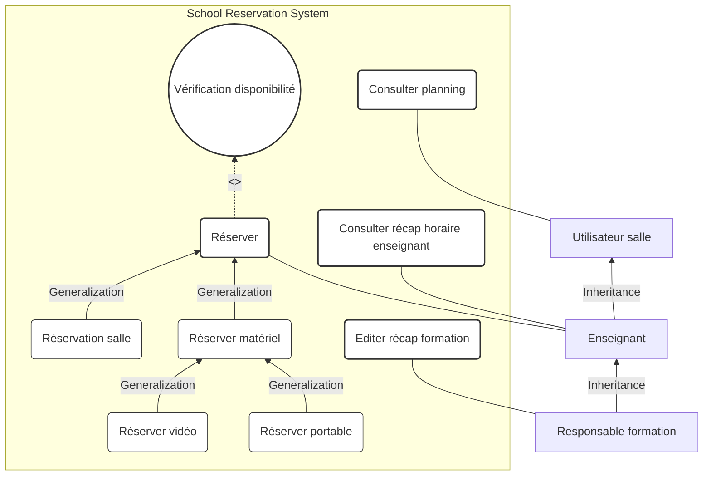

---

### 5.2 Exercise 2: Viticulture Research Project

#### Problem Statement
A research project in viticulture collects labor times on pilot farms, with a focus on pest control (phytosanitary) operations. Farm workers do not have access to computers. They write down their work hours on a paper logbook, using a standard reference glossary to identify the task type. For pest control tasks, they must record extra details: target diseases, growth stage, treatment methods, and observations. At the end of the month, the farm manager (*Chef d'exploitation*) checks and corrects the paper logs. He then inputs the monthly logs into a web-based database application. The researcher receives an automated email. After checking the logs, the researcher notifies the manager that the data is valid. The manager then prints two reports: the monthly labor report for each employee, and the phytosanitary report. At the end of the year, the researcher analyzes all data, writes a report, and sends it to all farm managers.

#### Identification of Actors
* `Ouvrier Agricole` (Farm Worker): Fills in the paper logbook.
* `Chef d'exploitation` (Farm Manager): Inherits from `Ouvrier Agricole` (can also record work hours). He is responsible for verifying, correcting, entering data into the database, and printing reports.
* `Chercheur` (Researcher): Verifies entered data and writes the annual synthesis.

#### Use Case Identification
* `Saisie opération` (Record Operation): Base usecase associated with `Ouvrier Agricole`.
* `Consultation du glossaire` (Consult Glossary): Optionally extends `Saisie opération`.
* `Opération phyto` (Pest Control Operation) and `Autre opération` (Other Operation): Specialize `Saisie opération`.
* `Vérification saisie cahier` (Verify Paper Log) and `Correction éventuelle` (Correct Log): Associated with `Chef d'exploitation`.
* `Saisie BDD` (Input into Database): Associated with `Chef d'exploitation`, includes `Identification` (Authentication).
* `Etat terravitis` (Print Reports): Associated with `Chef d'exploitation`.
* `Vérification données BDD` (Verify DB Data), `Correction données BDD` (Correct DB Data), `Notification saisie ok` (Notify Validation), `Analyse résultats` (Analyze Results), and `Rédaction synthèse` (Write Annual Synthesis): Associated with `Chercheur`.

#### UML Use Case Diagram

```mermaid
graph BT
    subgraph Viticulture Research System
        direction TB
        UC_Saisie(Saisie opération)
        UC_Phyto(Opération phyto)
        UC_Autre(Autre opération)
        UC_Glossaire(Consultation du glossaire)
        
        UC_VerifyC(Vérification saisie cahier)
        UC_CorrectC(Correction éventuelle)
        UC_SaisieBDD(Saisie BDD)
        UC_Ident((Identification))
        UC_Report(Etat terravitis)
        
        UC_VerifyD(Vérification données BDD)
        UC_CorrectD(Correction données BDD)
        UC_Notify(Notification saisie ok)
        UC_Analyze(Analyse résultats)
        UC_Synth(Rédaction synthèse)
        
        UC_Phyto -->|Generalization| UC_Saisie
        UC_Autre -->|Generalization| UC_Saisie
        UC_Glossaire -.->|<<extend>>| UC_Saisie
        UC_SaisieBDD -.->|<<include>>| UC_Ident
    end
    
    A_Worker[" Ouvrier Agricole"] --- UC_Saisie
    A_Manager[" Chef d'exploitation"] -->|Inheritance| A_Worker
    
    A_Manager --- UC_VerifyC
    A_Manager --- UC_CorrectC
    A_Manager --- UC_SaisieBDD
    A_Manager --- UC_Report
    
    A_Researcher[" Chercheur"] --- UC_VerifyD
    A_Researcher --- UC_CorrectD
    A_Researcher --- UC_Notify
    A_Researcher --- UC_Analyze
    A_Researcher --- UC_Synth
    
    style UC_Saisie fill:#fff,stroke:#333,stroke-width:2px;
    style UC_Phyto fill:#fff,stroke:#333,stroke-width:1px;
    style UC_Autre fill:#fff,stroke:#333,stroke-width:1px;
    style UC_Glossaire fill:#fff,stroke:#333,stroke-width:2px;
    style UC_VerifyC fill:#fff,stroke:#333,stroke-width:2px;
    style UC_CorrectC fill:#fff,stroke:#333,stroke-width:2px;
    style UC_SaisieBDD fill:#fff,stroke:#333,stroke-width:2px;
    style UC_Ident fill:#fff,stroke:#333,stroke-width:2px;
    style UC_Report fill:#fff,stroke:#333,stroke-width:2px;
    style UC_VerifyD fill:#fff,stroke:#333,stroke-width:2px;
    style UC_CorrectD fill:#fff,stroke:#333,stroke-width:2px;
    style UC_Notify fill:#fff,stroke:#333,stroke-width:2px;
    style UC_Analyze fill:#fff,stroke:#333,stroke-width:2px;
    style UC_Synth fill:#fff,stroke:#333,stroke-width:2px;
```

---

### 5.3 Exercise 3: Store Sales Process

#### Problem Statement
A store sales process is defined as follows: A client enters the store, browses the aisles, can request information from a salesperson or try out items. If inventory is sufficient, the customer takes the items, goes to the checkout counter, and pays using any accepted payment method. Customers may also be eligible for discounts.

#### Identification of Actors
* `Client` (Customer): Primary actor who initiates browsing, trying items, buying, and paying.
* `Vendeur` (Salesperson): Supporting actor who provides information.
* `Caisse` (Cashier/POS System): Supporting actor that handles checkout and payment.
* `Groupement des banques` (Bank Network): Supporting actor involved in credit card authorization.

#### Use Case Identification
* `Prospecter` (Browse): Base usecase associated with `Client`.
* `Renseigner` (Provide Info): Associated with `Vendeur`, extends `Prospecter`.
* `Essayer` (Try Items): Extends `Prospecter`.
* `Acheter` (Purchase): Associated with `Client`. Includes `Vérification stock` and `Payer`.
* `Bénéficier réduction` (Apply Discount): Optionally extends `Acheter`.
* `Payer` (Pay): Associated with `Caisse`, serves as parent usecase.
* `Payer CB` (Pay by Card), `Payer liquide` (Pay by Cash), `Payer chèque` (Pay by Check): Specialize `Payer`.
* `Groupement des banques` is associated with `Payer CB`.

#### UML Use Case Diagram

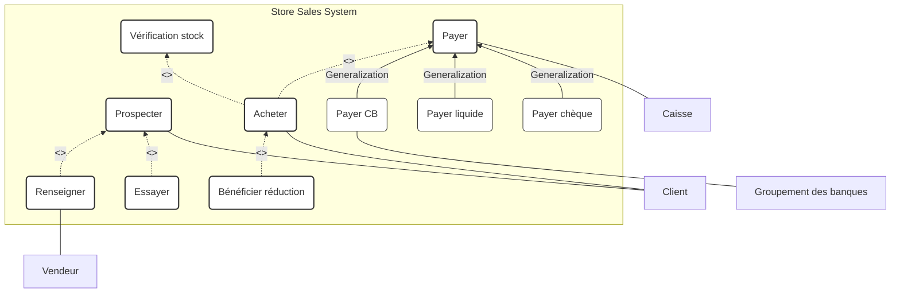

---

### 5.4 Exercise 4: Bank ATM (DAB) System

#### Problem Statement
An ATM (DAB) handles cash withdrawals for cardholders (both Visa and bank-specific cards). For bank customers, it supports checking account balances and depositing cash or checks. All transactions require secure authentication. If a card is swallowed by the machine, a maintenance technician is responsible for retrieving it. The technician also collects deposits and replenishes cash in the machine.

#### Identification of Actors
* `Porteur de carte` (Cardholder): Abstract primary actor representing anyone with a compatible card.
* `Client de la banque` (Bank Customer): Inherits from `Porteur de carte`.
* `SI Banque` (Bank IT System) and `SI gestion CB` (Card Processor System): Secondary actors involved in verification.
* `Opérateur de maintenance` (Maintenance Operator): Handles physical machine servicing.

#### Use Case Identification
* `Retirer argent` (Withdraw Cash): Associated with `Porteur de carte`. Includes `S'authentifier`.
* `Retirer argent avec visa` (Withdraw Cash with Visa): Associated with `Porteur de carte`, includes `S'authentifier`.
* `Consulter solde` (Check Balance): Associated with `Client de la banque`, includes `S'authentifier`.
* `Déposer argent` (Deposit Cash/Check): Base usecase associated with `Client de la banque`, includes `S'authentifier`.
* `Déposer numéraire` (Deposit Cash) and `Déposer chèques` (Deposit Checks): Specialize `Déposer argent`.
* `S'authentifier` (Authenticate): Associated with `SI Banque` and `SI gestion CB`.
* `Recharger DAB` (Replenish ATM), `Récupérer cartes avalées` (Retrieve Swallowed Cards), `Récupérer chèque` (Retrieve Checks): Associated with `Opérateur de maintenance`.

#### UML Use Case Diagram

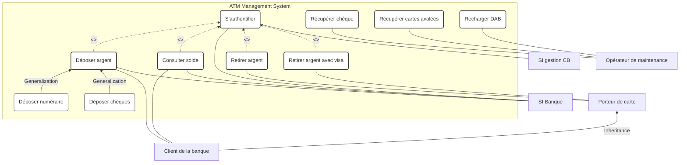

---

### 5.5 Exercise 5: Inventory Management System for a Merchant

#### Problem Statement
A merchant has an inventory management system with the following functions: printing/editing a supplier profile, adding a new item (which automatically creates or opens the corresponding supplier profile), and printing/viewing the inventory. From the inventory screen, the user can choose to print the inventory, delete an item, or edit/print an item's details.

#### Identification of Actors
* `Commerçant` (Merchant): The primary actor who manages the inventory.

#### Use Case Identification
* `Affichage inventaire` (Display Inventory): Associated with `Commerçant`.
* `Impression inventaire` (Print Inventory), `Effacement article` (Delete Item), `Edition article` (Edit Item): Optionally extend `Affichage inventaire`.
* `Edition fournisseur` (Edit Supplier): Associated with `Commerçant`. Optionally extended by `Edition article`.
* `Ajouter article` (Add Item): Associated with `Commerçant`. Includes `Edition fournisseur`.
* `Ajout fournisseur` (Add Supplier): Optionally extends `Ajouter article`.

#### UML Use Case Diagram

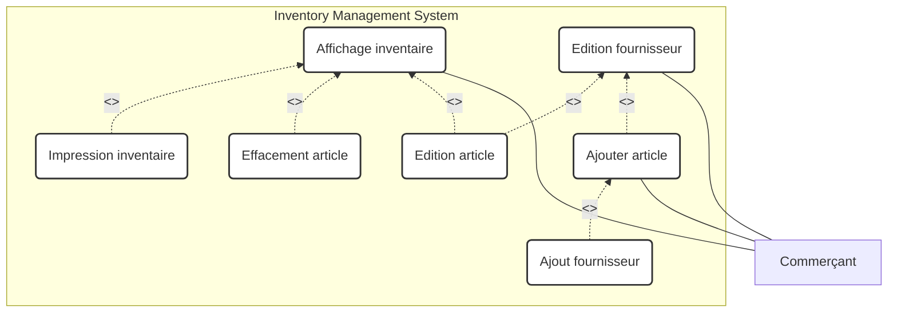

---

### 5.6 Exercise 6: Gas Station (Station-Service) System

#### Problem Statement
A system manages a self-service gas station:
1. When a client pumps fuel, they remove the nozzle, press the trigger, and dispense the fuel.
2. The station manager uses the system for administrative tasks.
3. The manager can also pump fuel for their own car.
4. The station has a small maintenance workshop. The manager is also the mechanic.

#### Analysis of Constraints and Anti-Patterns
* **Decomposition Anti-Pattern**: Do not model steps like "Unscrew fuel cap", "Remove nozzle", or "Press trigger" as individual use cases. These are simple actions in a workflow, not standalone business goals.
* **Actor Roles**: The manager plays multiple roles. We represent these as distinct actors (`Client`, `Gérant`, `Mécanicien`). The physical manager is a specialized user who can assume any of these roles.

#### UML Use Case Diagram

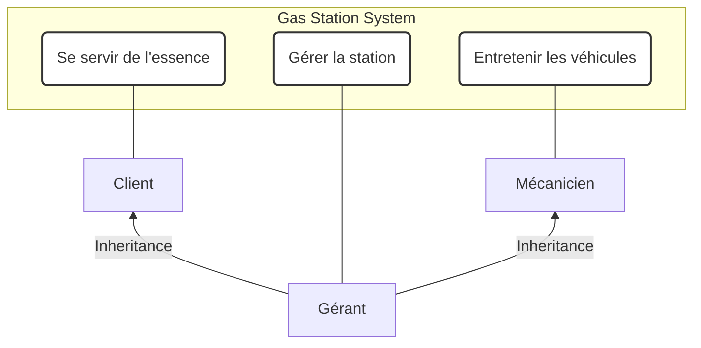

---

### 5.7 Exercise 7: MonAuto Garage Repair Management

#### Problem Statement
MonAuto sells, services, and repairs cars. The management software runs on the company intranet. It must interface with an existing accounting software to export repair invoices. The system is designed mainly for the workshop manager (*Chef d'atelier*), who enters repair logs and records work hours. Spare parts are managed in the stockroom. Stockkeepers (*Magasiniers*) only issue parts for cars with an open repair log. They record issued parts in the system via a terminal in the stockroom. Once a repair is complete, the workshop manager test drives the car and closes the repair log. Closed repair logs must be imported into the accounting software by the accountant (*Comptable*).

#### Initial vs. Optimized Analysis
* **Initial Model**: Directly maps explicit tasks mentioned in the requirements to use cases.
* **Optimized Model**: Implements the **"Administrateur"** pattern to manage user access and introduces an abstract actor **`Employé`** to handle shared tasks like searching logs.

#### Initial UML Use Case Diagram

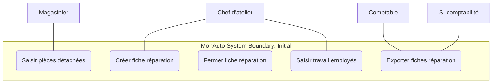

#### Optimized UML Use Case Diagram

```mermaid
graph BT
    subgraph MonAuto System Boundary: Optimized
        direction TB
        UC_Print(Imprimer fiche)
        UC_Read(Consulter fiche)
        UC_Search(Rechercher fiche)
        UC_Parts(Saisir pièces détachées)
        UC_Modify(Modifier fiche)
        UC_Labor(Saisir travail effectué)
        UC_Create(Créer fiche)
        UC_Close(Fermer fiche)
        UC_ManageUsers(Gérer comptes utilisateurs)
        UC_Archive(Archiver fiches)
        UC_Export(Exporter fiches)
        UC_Auth(S'identifier)
        
        UC_Print -.->|<<extend>>| UC_Read
        UC_Read -.->|<<extend>>| UC_Search
        
        UC_Parts -.->|<<include>>| UC_Auth
        UC_Labor -.->|<<include>>| UC_Auth
        UC_Modify -.->|<<include>>| UC_Auth
        UC_Create -.->|<<include>>| UC_Auth
        UC_Close -.->|<<include>>| UC_Auth
        UC_ManageUsers -.->|<<include>>| UC_Auth
        UC_Archive -.->|<<include>>| UC_Auth
        UC_Export -.->|<<include>>| UC_Auth
    end
    
    A_Employe[" Employé (Abstract)"] --- UC_Search
    A_Stock[" Magasinier"] -->|Inheritance| A_Employe
    A_Workshop[" Chef d'atelier"] -->|Inheritance| A_Employe
    A_Admin[" Administrateur"] -->|Inheritance| A_Employe
    
    A_Stock --- UC_Parts
    A_Stock --- UC_Modify
    
    A_Workshop --- UC_Modify
    A_Workshop --- UC_Create
    A_Workshop --- UC_Close
    A_Workshop --- UC_Labor
    
    A_Admin --- UC_ManageUsers
    A_Admin --- UC_Archive
    
    A_Accountant[" Comptable"] --- UC_Export
    A_AccSys[" SI comptabilité"] --- UC_Export
    
    style UC_Print fill:#fff,stroke:#333,stroke-width:2px;
    style UC_Read fill:#fff,stroke:#333,stroke-width:2px;
    style UC_Search fill:#fff,stroke:#333,stroke-width:2px;
    style UC_Parts fill:#fff,stroke:#333,stroke-width:2px;
    style UC_Modify fill:#fff,stroke:#333,stroke-width:2px;
    style UC_Labor fill:#fff,stroke:#333,stroke-width:2px;
    style UC_Create fill:#fff,stroke:#333,stroke-width:2px;
    style UC_Close fill:#fff,stroke:#333,stroke-width:2px;
    style UC_ManageUsers fill:#fff,stroke:#333,stroke-width:2px;
    style UC_Archive fill:#fff,stroke:#333,stroke-width:2px;
    style UC_Export fill:#fff,stroke:#333,stroke-width:2px;
    style UC_Auth fill:#fff,stroke:#333,stroke-width:2px;
```