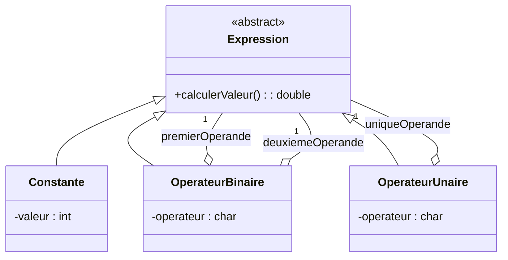

# 3. [[502 [[504 [[505 TD Deep Dive Reading Complex Diagrams|TD]] Deep Dive File System and Shortcuts|TD]] Identification Exercise|TD]] Deep Dive: The Arithmetic Expression Trap (TD 4)

This exercise (PDF 3 & PDF 22, Ex 3/4) is a famous application of the **[[306 Recursive Composition Pattern Trap|Composite Pattern]]**. You are asked to model mathematical expressions like `( ( 4 + 6 ) + ( 5 * 2 ) ) + 4 ) - 3 ) * 9`.

### 1. The Initial Setup (Binary Operators)
The TD gives you a base diagram:
* `Expression` (Abstract Superclass) with method `calculerValeur()`.
* `Constante` (Inherits Expression, has an `integer` value).
* `Variable` (Inherits Expression, has a `string` name).
* `OperateurBinaire` (Inherits Expression, has a `char` operator like '+', '-').
  * **The Trap:** `OperateurBinaire` has an **[[109 [[302 Inheritance and Generalization|Inheritance]] [[301 Aggregation vs Composition|Aggregation]] and Composition|Aggregation]]** pointing back to `Expression` for the `premier opérande` (Left) and another for the `deuxième opérande` (Right). 

### 2. The Exam Question: Adding Unary Operators
**The Task:** *"Modifiez ce diagramme pour prendre en compte les opérateurs unaires (comme -x ou 5!). Les expressions unaires ne doivent compter qu'un seul opérande."*

**How to solve it flawlessly:**
1. You must create a new class called `OperateurUnaire`.
2. `OperateurUnaire` must **inherit** from the [[304 Abstract Classes Interfaces and Realization|abstract class]] `Expression` (because a unary operation *is* an expression itself).
3. It must have an attribute for the operator symbol (e.g., `operateur : char`).
4. **The Critical Step:** It must have exactly **ONE Aggregation** line pointing back to `Expression` with the role `opérande` and [[107 UML [[202 Associations Roles and Navigability|Associations]] Navigability Roles and [[203 Multiplicity and Cardinality in Depth|Multiplicity]]|multiplicity]] `1`.

> [!TIP] Why Aggregation and not Composition here?
> [[106 Parameter Directions and Enumerations|In]] mathematical trees, if you delete the `+` node, you might still want to evaluate or keep the `(5 * 2)` sub-tree. Therefore, weak aggregation `o--` is structurally safer than strict composition `*--`, though both are accepted if justified.

---
**Keywords:** #td, #arithmetic-expression
