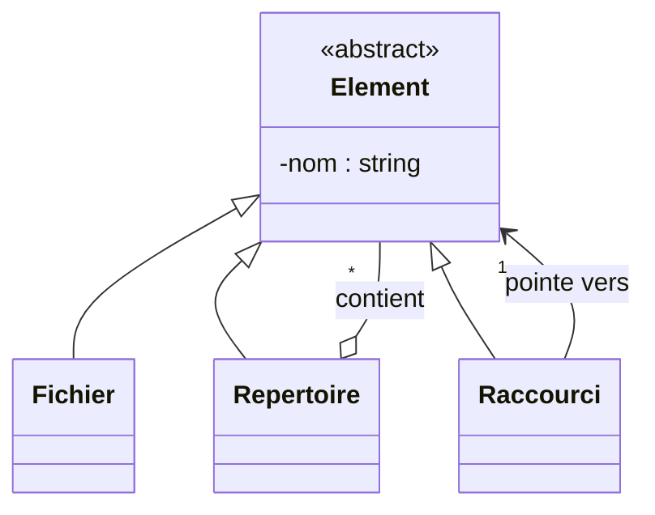

# 4. [[502 [[503 [[505 TD Deep Dive Reading Complex Diagrams|TD]] Deep Dive Arithmetic Expression Trap|TD]] Identification Exercise|TD]] Deep Dive: The File System and Shortcuts (TD 4 Ex 5)

**The Text:** *"Proposer une solution élégante... les fichiers, les raccourcis et les répertoires sont contenus dans des répertoires... un raccourci peut concerner un fichier ou un répertoire."*

This exercise tests your ability to push the **[[306 Recursive Composition Pattern Trap|Composite Pattern]]** to its absolute limit by adding a "Pointer/Reference" class (the Shortcut).

### Step-by-Step Resolution:
1. **The Abstract Base:** Create an [[304 Abstract Classes Interfaces and Realization|abstract class]] `Element` (or `Composant`). It has a `-nom : string`.
2. **The Leaves:** `Fichier` inherits from `Element`.
3. **The Composite:** `Repertoire` inherits from `Element`.
    * A `Repertoire` *contains* `Elements`. Draw an **[[109 [[302 Inheritance and Generalization|Inheritance]] [[301 Aggregation vs Composition|Aggregation]] and Composition|Aggregation]]** from `Repertoire` to `Element` with [[107 UML [[202 Associations Roles and Navigability|Associations]] Navigability Roles and [[203 Multiplicity and Cardinality in Depth|Multiplicity]]|multiplicity]] `*`.
4. **The Shortcut (Raccourci) Curveball:**
    * A shortcut is an item [[106 Parameter Directions and Enumerations|in]] a folder, so it must inherit from `Element`.
    * But a shortcut *points to* another file or folder.
    * Draw a simple **Association** (solid line, unidirectional arrow) from `Raccourci` to `Element` with multiplicity `1`. (A shortcut points to exactly one target element).

> [!DANGER] Common Student Mistake
> Students often draw the shortcut line pointing only to `Fichier`. But the text says "un raccourci peut concerner un fichier **ou un répertoire**." By making `Raccourci` point to the abstract `Element` class, polymorphism guarantees it can point to ANY of its subclasses (Files, Folders, or even other Shortcuts!). 

---
**Keywords:** #td, #file-system, #shortcuts
